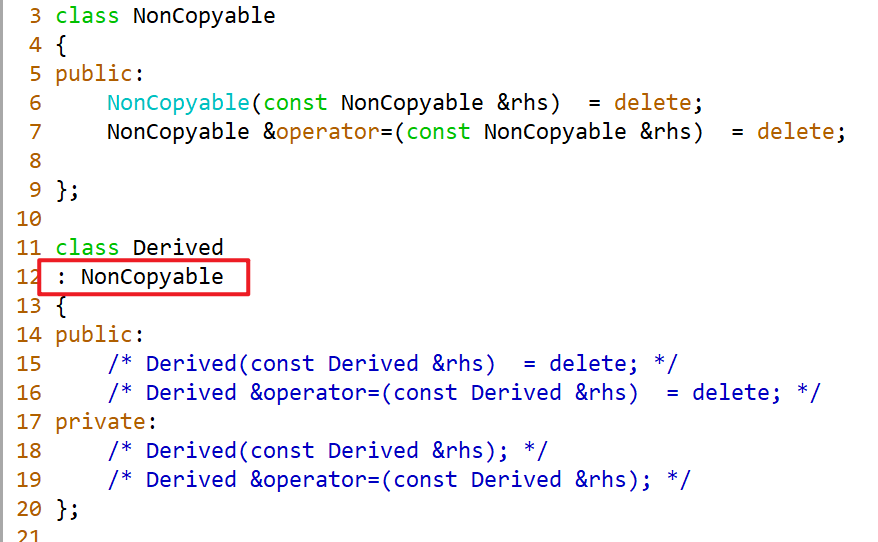
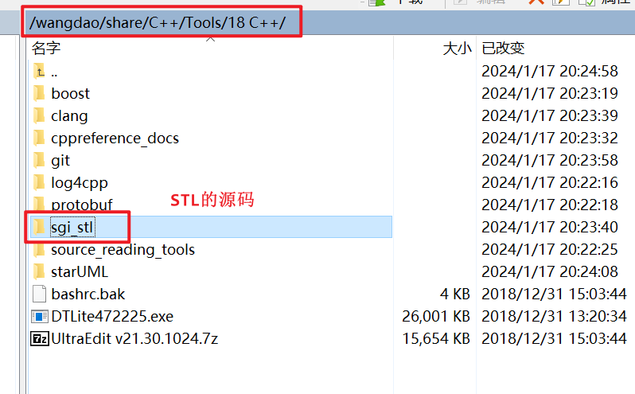
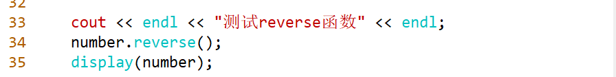
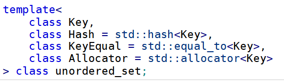
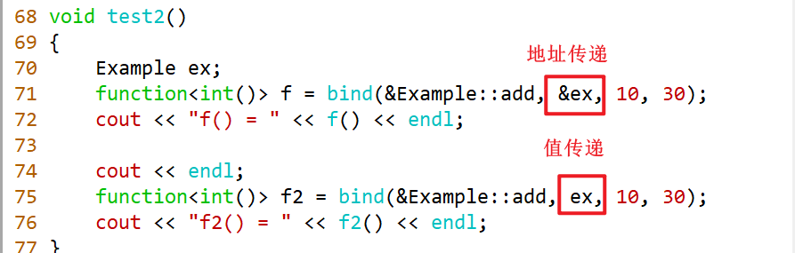

# STL标准模板库

## Day18

### 一、禁止复制




### 二、文本查询扩展作业解析

```C++
get_file函数的作用就是进行预处理操作，将文件中的每一行的内容放在shared_ptr<vector<string>> file里面进行存储；然后对每一个单词进行处理，将单词与行号放在map<string, shared_ptr<set<size_t>>> wm
```

```C++
查询某个单词sought的时候，会构建Query对象，在Query的构造函数中，会构建一个WordQuery对象，并且使用基类的指针shared_ptr<Query_base> q指向new出来的WordQuery对象。然后再调用Query的eval方法与rep方法的时候，都会走多态。在走WordQuery的eval方法的时候会走TextQuery的query方法，在TextQuery的query函数中将待查询的单词、行号、每一行的内容放在QueryResult中，交给QueryResul的数据成员，最后调用print函数将结果打出来。
```

查询两个单词同时出现的情况

```C++
Query andq = Query(sought1) & Query(sought2);
查询sought1的时候会构建Query对象，在Query的构造函数中，会构建一个WordQuery对象，并且使用基类的指针shared_ptr<Query_base> q指向new出来的WordQuery对象。
查询sought2的时候会构建Query对象，在Query的构造函数中，会构建一个WordQuery对象，并且使用基类的指针shared_ptr<Query_base> q指向new出来的WordQuery对象。
andq也是一个Query对象，在Query的构造函数中，会构建一个AndQuery对象，并且使用基类的指针shared_ptr<Query_base> q指向new出来的AndQuery对象

//const Query &lhs = Query(sought1);
//const Query &rhs = Query(sought2);
inline Query operator&(const Query &lhs, const Query &rhs)
{
    std::shared_ptr<Query_base>  tmp(new AndQuery(lhs, rhs));
    return tmp;
    //return std::shared_ptr<Query_base>(new AndQuery(lhs, rhs));//隐式转换
    //shared_ptr<Query_base>  t(new AndQuery(lhs, rhs));
    //return t;  Query(t)
}
Query(std::shared_ptr<Query_base> t)
Point pt = 10;//10--->Point(10, 0)

Query(std::shared_ptr<Query_base> query)
: q(query)
{ 

}

QueryResult
AndQuery::eval(const TextQuery& text) const
{ 
    QueryResult left = lhs.eval(text), right = rhs.eval(text);
	
    shared_ptr<set<line_no> > ret_lines(new set<line_no>);  

   //取交集
    set_intersection(left.begin(), left.end(), right.begin(), right.end(),
                   inserter(*ret_lines, ret_lines->begin()));
    return QueryResult(rep(), ret_lines, left.get_file());
}

```

~hello

```C++
1 2 3 4 ...10
1 3 5 10
2 4 6 7 8 9
    
0 1 2 3 4 5 6 7 8 9
0 2 4 9
1 3 5 6 7 8
QueryResult
NotQuery::eval(const TextQuery& text) const
{
    QueryResult result = query.eval(text);
	
    shared_ptr<set<line_no> > ret_lines(new set<line_no>);

	QueryResult::line_it beg = result.begin(), end = result.end();

	vector<string>::size_type sz = result.get_file()->size();
    for (size_t n = 0; n != sz; ++n) 
    {
		if (beg == end || *beg != n) 
			ret_lines->insert(n); 
		else if (beg != end) 
			++beg; 
	}
	return QueryResult(rep(), ret_lines, result.get_file());
}
                 n
0 1 2 3 4 5 6 7 8 9
    
    
    
        end
0 2 4 9
        beg

ret:1 3 5  6 7 8
```


### 三、标准模板库概述

STL的六大组件

1、容器：用来存放数据的，数据结构。

- 序列式容器  vector、list
- 关联式容器  set、map
- 无序关联式容器 unordered_set

2、迭代器：看成是一种指针，广义指针（具备指针的功能）。可以访问容器中的元素。

3、算法：操作容器中的元素。

4、适配器：起到适配的作用。

- 容器适配器  stack、queue
- 迭代器适配器
- 函数适配器

5、函数对象（仿函数）：定制化操作。

6、空间配置器：进行空间的申请与释放操作的。==使用 +原理+源码==

### 四、序列式容器

#### 1、迭代器的形式


#### 2、初始化（==掌握==）


==总结：对于三种序列式容器而言，五种初始化的方式都是一样的，无参、count个value、迭代器范围、拷贝或者移动、大括号的。==

#### 3、遍历（==掌握==）


==总结：三种序列式容器，遍历的方法基本一样，对于vector与deque而言，可以使用下标、迭代器、for与auto。但是对于list而言，不能使用下标。，但是另外两个遍历方式是可以的==

==注意：list是没有下标访问的。==




#### 4、在尾部进行插入与删除

~~~c++
push_back()
pop_back()
/*示例*/
    vector<Person> vec;
    Person p("Tom", 20);
    vec.push_back(p);               // 拷贝构造
    vec.push_back(Person("Jerry", 18)); // 临时对象 + 移动构造
emplace_back()
    vec.emplace_back("Alice", 22); // 直接在 vector 内构造，无拷贝/移动
~~~


==总结：三种序列式容器在尾部进行插入与删除是完全一样的。==

#### 5、在头部进行插入与删除

~~~c++
push_front()
pop_front()
~~~


==总结：对于deque与list是可以在头部进行插入与删除，但是vector不行==


#### 6、vector源码阅读（==了解==）

##### 6.1、类之间的继承图


##### 6.2、源码

```C++
class  vector
{
public:
  typedef _Tp value_type;
  typedef value_type* pointer;
  typedef const value_type* const_pointer;
  typedef value_type* iterator;
  typedef const value_type* const_iterator;
  typedef value_type& reference;
  typedef const value_type& const_reference;
  typedef size_t size_type;
  typedef ptrdiff_t difference_type;
    
};

const map<int, string>  number = {{1, "hello"}};
number[1];
```

注意：对于vector而言，下标与at都可以随机访问，但是at比下标更加安全一些，at有范围检查。


#### 7、deque源码阅读（==了解==）

##### 7.1、类的继承图


## Day19

### 一、问题回顾

1、序列式容器的初始化方式有哪五种？遍历的方式有哪三种？

2、vector为何不能在头部进行插入与删除元素？

3、迭代器都是内置类型的指针吗？

>不是，**迭代器不都是内置类型的指针**，但**在某些情况下（如原始数组或 `vector` 的简单实现中）确实可以是原始指针**。标准库中的迭代器大多数是类类型，特别是容器（如 `list`、`map`、`set`）的迭代器。
>
>STL 容器如 `std::list`, `std::map`, `std::set` 的迭代器都是**自定义类对象**，并非原生指针。
>
>它们通常重载了 `*`, `++`, `--`, `==`, `!=` 等运算符，使行为“看起来像”指针，但其实是一个封装结构。

4、deque中的元素是连续的吗？

>`std::deque`（双端队列）中的**元素在逻辑上是连续的，但在内存中**——**并不保证物理连续**。
>
>`deque` 并不像 `vector` 一样申请一大块连续内存。它采用一种叫 **“分段数组”**（segment array 或 block list）的结构：
>
>- 内部维护一个**指针数组（map）**，每个指针指向一个固定大小的内存块（如 512 字节或多个元素）。
>- 每个块里存放一部分元素。
>- 所有块加起来构成“逻辑上连续”的元素序列。
>- 每个 Block 是连续的，但 Block 与 Block 之间是不连续的。
>
>~~~c++
>std::deque<int> dq = {1,2,3,4,5,6,7,8,9};
>/*
>其内部可能是：
>Block1: [1 2 3 4]
>Block2: [5 6 7 8]
>Block3: [9 - - -]
>*/
>~~~

### 二、序列式容器

#### 1、insert操作操作


总结：三种序列式容器都有四种插入的方法。

#### 2、vector的迭代器失效（==重要，坑==）


#### 3、vector的erase操作（==重要==）

~~~c++
erase()
~~~


#### 4、容器的清空

~~~c++
clear()//清空元素
shrink_to_fit()//回收多余的空间
~~~


==总结：三种序列式容器都有clear函数与size函数。deque与list是没有capacity函数的。对于vector与deque都有shrink_to_fit函数。==

#### 5、其他操作

swap函数：三个序列式容器都有，进行两个容器之间内容的交换。

resize函数：三个序列式容器都有，可以改变容器中元素的个数。

front与back函数：三个序列式容器都有，可以获取第一个元素与最后一个元素。

#### 6、emplace_back函数


### 三、list的特殊操作

#### 1、链表的逆置



#### 2、链表的排序

默认情况下使用`sort()`可以从小到大排序元素。

也可以自定义排序函数，`list::sort(Compare comp)` 接受一个**可调用对象**（函数指针、函数对象、lambda 表达式等），它的签名应为：

~~~c++
bool comp(const T& a, const T& b);
~~~

它要实现的语义是：
>如果你希望 **`a` 出现在 `b` 之前**，那么 `comp(a, b)` 应该返回 `true`。
>
>`std::list` 是链表，不能随机访问，所以不能用快速排序、堆排序等——它采用的是**归并排序（Merge Sort）**，原因是归并排序适合链表结构，效率高，且稳定。
>
>1. 将链表不断地**拆分为子链表**，直到每个子链表只有一个节点；
>2. 然后调用 `cmp(a, b)` 合并这些链表；
>3. 如果 `cmp(a, b)` 返回 `true`，则把 `a` 放在前面，否则 `b` 放前面；
>4. 最终合并成一个整体有序链表。

~~~c++
bool cmp(int a, int b) {
    return a > b; // 降序排列：大的排在前面,实现从大到小排序
}

list<int> l = {5, 2, 9, 1};
l.sort(cmp);
~~~


注意：如果想使用比较大小，可以直接使用std::less与std::greater。

~~~c++
#include<iostream>
#include<list>
using namespace std;

struct CompareList{
    bool operator()(const int &lhs,const int &rhs)const{//实现从大到小排序
        return lhs > rhs;
    }
};
void display(list<int> l){
    for(auto &elem:l){
        cout<<elem<<" ";
    }
    cout<<endl;
}
/* List特殊操作 */
void test0(){
    list<int> l = {1,3,5,7,6,6,9};
    cout<<"原链表："<<endl;
    display(l);
    l.reverse();//链表逆置
    cout<<"链表逆置后："<<endl;
    display(l);
    cout<<"链表默认从大到小排序："<<endl;
    l.sort();
    display(l);
    cout<<"链表从小到大排序："<<endl;
    l.sort(CompareList());
    display(l);
}
int main(){
    test0();
    return 0;
}
~~~


#### 3、去除连续重复元素


#### 4、链表的合并

链表和并是移动元素而不是拷贝，合并后被合并的链表会为空。

~~~c++
#include<iostream>
#include<list>
using namespace std;

struct CompareList{
    bool operator()(const int &lhs,const int &rhs)const{//实现从大到小排序
        return lhs > rhs;
    }
};

void display(list<int> l){
    for(auto &elem:l){
        cout<<elem<<" ";
    }
    cout<<endl;
}
/* List特殊操作 */
void test0(){
    list<int> l = {1,3,5,7,6,6,9};
    cout<<"原链表："<<endl;
    display(l);
    list<int> l2 = {2,4,6,10,8};
    cout<<"链表2:"<<endl;
    display(l2);
    cout<<"链表合并："<<endl;
    l.merge(l2);
    display(l);
    cout<<"l2.size():"<<l2.size()<<endl;//合并后链表2为空
}
int main(){
    test0();
    return 0;
}
~~~


**合并时会进行链表间排序但不会进行链表内排序！**


#### 5、splice操作


### 四、set的使用

#### 1、基本特性


#### 2、查找操作

~~~c++
count()//判断元素是否在集合中如果在则返回1不在返回0
find()//查找一个元素，如果元素存在则返回其迭代器，如果元素不存在则返回set.end()
~~~


#### 3、insert操作

~~~c++
insert()
/*
insert函数的返回类型是pair类型，包含两个对象成员，第一个是对应set的迭代器，第二个 是bool值。
如果插入成功，则返回“ 插入元素对应迭代器和true” ；
如果插入失败，则返回 “阻止插入的元素（原本就有的这个元素）对应迭代器和false”.
*/
~~~


#### 4、erase操作


#### 5、不支持修改


防止破坏红黑树的稳定性。

#### 6、不支持下标操作


## Day20

### 一、问题回顾

1、序列式容器的基本操作：初始化、遍历、尾部插入与删除、头部插入与删除、任意位置插入与删除、交换、获取头部与尾部元素、清空元素等是哪些函数？

2、vector在进行插入的时候，为何会出现迭代器实现问题？如何解决？

3、emplace系列函数的特点？

4、list的特殊操作有哪些？

### 二、set针对于自定义类型(==重要==)


~~~c++
#include<iostream>
#include<set>
#include<math.h>
using namespace std;

template<typename Container>
void display(const Container &con){
    for(auto &elem:con){
        cout<<elem<<" ";
    }
    cout<<endl;
}


class Point{
public:
    Point(int x, int y)
    :x(x)
    ,y(y){};
    ~Point()=default;
    float getDistance() const{
        return hypot(x,y);
    }
    int getX() const{
        return x;
    }
    int getY() const{
        return y;
    }
    friend ostream &operator<<(ostream &os,const Point &rhs);
    friend bool operator<(const Point &lhs,const Point &rhs);
    friend struct ComparePoint;
private:
    int x;
    int y;
};
ostream& operator<<(ostream& os,const Point& rhs){
    os<<"("<<rhs.x<<","<<rhs.y<<")";
    return os;
}
bool operator<(const Point &lhs,const Point &rhs){//比较运算符重载
    cout<<"operator"<<endl;
    if(lhs.getDistance()<rhs.getDistance()){
        return true;
    }else if(lhs.getDistance() == rhs.getDistance()){
        if(lhs.x<rhs.x){
            return true;
        }else if(lhs.x == rhs.x){
            if(lhs.y<rhs.y){
                return true;
            }else{
                return false;
            }
        }else{
            return false;
        }
    }else{
        return false;
    }
}

struct ComparePoint{
    bool operator()(const Point &lhs,const Point &rhs) const{
        cout<<"comparePoint struct"<<endl;
        if(lhs.getDistance()<rhs.getDistance()){
            return true;
        }else if(lhs.getDistance() == rhs.getDistance()){
            if(lhs.x<rhs.x){
                return true;
            }else if(lhs.x == rhs.x){
                if(lhs.y<rhs.y){
                    return true;
                }else{
                    return false;
                }
            }else{
                return false;
            }
        }else{
            return false;
        }
    }
};

//命名空间的扩展
namespace std{
    template<>//模板特化
    struct less<Point>{
        bool operator()(const Point &lhs,const Point &rhs) const{
            cout<<"template<>"<<endl;
            if(lhs.getDistance()<rhs.getDistance()){
                return true;
            }else if(lhs.getDistance() == rhs.getDistance()){
                if(lhs.getX()<rhs.getX()){
                    return true;
                }else if(lhs.getX() == rhs.getX()){
                    if(lhs.getY()<rhs.getY()){
                        return true;
                    }else{
                        return false;
                    }
                }else{
                    return false;
                }
            }else{
                return false;
            }
        }
    };
}

void test0(){
    set<Point> points = {
    // set<Point,ComparePoint> points = {
        Point(1,2),
        Point(-1,2),
        Point(1,2),
        Point(3,2),
        Point(1,-2),
        Point(4,2),
    };
    display(points);
}
int main(){
    test0();
    return 0;
}
~~~


### 三、multiset的使用

#### 1、基本特性


#### 2、查找

查找函数与set中的count以及find完全一样。

#### 3、bound函数


#### 4、插入操作

基本与set中的插入操作是一样，但是对于multiset而言，元素可以重复，所以插入肯定是可以成功的，返回类型不会像set一样，有pair类型。

#### 5、其他操作

erase操作与set是一样的。也不支持修改、也不支持下标。

#### 6、针对于自定义类型

自定义类型的三种写法：模板的特化、函数对象的形式、运算符重载与set针对于自定义类型是完全一样的。

#### 总结：

1、元素都是有序的，默认都使用从小到大进行排序

2、底层使用的都是红黑树数据结构。

3、set中的元素是唯一的，但是multiset中元素是可以重复的。


### 四、map的使用

#### 1、基本特征


#### 2、查找操作

~~~c++
count()//按key值查找map中有没有key值为hello的元素，如果有返回1否则返回0
~~~


#### 3、insert操作


#### 4、map的下标（==重要==）

~~~c++
map<string,int> m = {
    {"hello",1},
    {"world",2},
    {"c++",3},
    {"c",4}
};
cout<<"[hello"<<","<<m["hello"]<<"]"<<endl;//map可以通过下标访问下标为key值
m["c++"]=10;//也可以通过下标修改
~~~


## Day21

### 一、multimap的使用

#### 1、基本特征


#### 2、其他基本操作

查找操作count与find与map一样，插入操作insert基本与map一致。插入操作由于multimap的key值可以重复，所以插入不会失败。

#### 3、不支持下标

由于multumap的key值可以重复，所以不支持下标访问


#### 总结：

1、key值都是有序的，默认都使用从小到大进行排序

2、底层使用的都是红黑树数据结构。

3、map中的元素key值是唯一的，但是multimap中key值是可以重复的。

### 二、哈希

#### 1、哈希函数

```C++
index = H(key)
```

通过哈希函数找到key值对应的位置。

#### 2、构建哈希函数的方法


#### 3、哈希冲突

```C++
H(key1) = H(key2),  key1 != key2
```

不同的key值通过哈希函数运算之后，位置值是一样的。

#### 4、解决哈希冲突的方法

开放定址法、**链地址法** (推荐使用这种，这也是STL中使用的方法)、再散列法、建立公共溢出区  


#### 5、装载因子

装载因子 = 元素的个数/表长  [0.5,0.75].装载因子值越低，代表冲突的概率越低，内存的使用率越低；装载因子的值越大，代表冲突的概率越高，内存的使用率也越高。数组其实就是一个完美的哈希。


### 三、unordered_set的使用

#### 1、模板参数


#### 2、基本特征


#### 3、其他操作

查找操作count与find、插入操作insert、删除操作erase与set完全一样，也不支持修改、不支持下标访问。

#### 4、针对于自定义类型



~~~c++
#include<iostream>
#include<unordered_set>
#include<math.h>
using namespace std;

template <typename Container>
void display(const Container con){
    for(auto &elem:con){
        cout<<elem<<" ";
    }
    cout<<endl;
}
class Point{
public:
    Point(int x, int y)
    :x(x)
    ,y(y){};
    ~Point()=default;
    float getDistance() const{
        return hypot(x,y);
    }
    int getX() const{
        return x;
    }
    int getY() const{
        return y;
    }
    friend ostream &operator<<(ostream &os,const Point &rhs);
    friend bool operator<(const Point &lhs,const Point &rhs);
    friend bool operator==(const Point &lhs,const Point &rhs);
private:
    int x;
    int y;
};
ostream& operator<<(ostream& os,const Point& rhs){
    os<<"("<<rhs.x<<","<<rhs.y<<")";
    return os;
}
bool operator==(const Point &lhs,const Point &rhs){//==运算符重载处理unordered_set中元素重复
    cout<<"bool operator=="<<endl;
    return ((lhs.getX()==rhs.getX())
            &&(lhs.getY()==rhs.getY()));
}
//命名空间扩展
namespace std{
    template<>//模板刻化
    struct hash<Point>{//自定义hash函数
        size_t operator()(const Point &rhs) const{//调用运算符重载
            cout<<"template<>"<<endl;
            return ((rhs.getX() << 2)^(rhs.getY() << 2));
        }
    };
}
void test0(){
    unordered_set<Point> points = {
    // set<Point,ComparePoint> points = {
        Point(1,2),
        Point(-1,2),
        Point(1,2),
        Point(3,2),
        Point(1,-2),
        Point(4,2),
    };
    display(points);
}
int main(){
    test0();

    return 0;
}
~~~

##### 针对于std::hash进行改造


##### std::equal_to的改造


### 四、unordered_multiset的使用

#### 1、基本特征


#### 2、针对于自定义类型

~~~c++
#include<iostream>
#include<unordered_set>
#include<math.h>
using namespace std;

template <typename Container>
void display(const Container con){
    for(auto &elem:con){
        cout<<elem<<" ";
    }
    cout<<endl;
}
class Point{
public:
    Point(int x, int y)
    :x(x)
    ,y(y){};
    ~Point()=default;
    float getDistance() const{
        return hypot(x,y);
    }
    int getX() const{
        return x;
    }
    int getY() const{
        return y;
    }
    friend ostream &operator<<(ostream &os,const Point &rhs);
    friend bool operator<(const Point &lhs,const Point &rhs);
private:
    int x;
    int y;
};
ostream& operator<<(ostream& os,const Point& rhs){
    os<<"("<<rhs.x<<","<<rhs.y<<")";
    return os;
}

struct PointEqual{
    bool operator()(const Point &lhs, const Point &rhs) const {
        cout<<"struct PointEqual"<<endl;
        return ((lhs.getX()==rhs.getX()) && (lhs.getY()==rhs.getY()));
    }
};

struct PointHash{
    size_t operator()(const Point &rhs) const{//调用运算符重载
        cout<<"struct PointHash"<<endl;
        return ((rhs.getX() << 2)^(rhs.getY() << 2));
    }
};
void test0(){
    unordered_multiset<Point,PointHash,PointEqual> points = {
    // set<Point,ComparePoint> points = {
        Point(1,2),
        Point(-1,2),
        Point(1,2),
        Point(3,2),
        Point(1,-2),
        Point(4,2),
    };
    display(points);
}
int main(){
    test0();

    return 0;
}
~~~

与unordered_set针对于自定义类型是完全一样的。

### 五、unordered_map的使用

#### 1、基本特征


#### 2、其他的操作

包括查找count与find、插入insert、删除erase、下标与map完全一样。

==注意：unordered_map是支持下标==

### 六、unordered_multimap的使用

#### 1、基本特征


#### 2、其他操作

包括查找count与find、插入insert、删除erase与multimap完全一样。

unordered_multimap不支持下标。

#### 总结

1、元素是没有顺序的。

2、底层使用的是哈希。


### 七、容器的选择（==重要==）

#### 1、有没有顺序

首先选择的是，关联式容器，元素都是有序的。最不应该想到的是，无序关联式容器，元素是没有顺序的。
备选方案，可以选择序列式容器。list有成员函数sort，vector与deque在算法库中有sort函数。

#### 2、下标操作

vector、deque、map、unordered_map是具备下标。

#### 3、查找时间复杂度

序列式容器，时间复杂度O(N)。

关联式容器，时间复杂度O(logN)。

无序关联式容器，时间复杂度O(1)。

#### 4、迭代器的类型

序列式容器vector与deque，是随机访问迭代器。

关联式容器以及list，是双向迭代器。

无序关联式容器，是前向迭代器。

#### 5、是不是所有的容器都有迭代器

容器适配器stack、queue、priority_queue是没有迭代器的。

### 八、优先级队列

#### 1、模板类型


#### 2、基本使用


#### 3、针对于自定义类型

需要改写std::less，可以使用三种方式：模板的特化、函数对象的形式、运算符重载。

~~~c++
#include<iostream>
#include<queue>
#include<vector>
#include<math.h>
using namespace std;

class Point{
public:
    Point(int x, int y)
    :x(x)
    ,y(y){};
    ~Point()=default;
    float getDistance() const{
        return hypot(x,y);
    }
    int getX() const{
        return x;
    }
    int getY() const{
        return y;
    }
    friend ostream &operator<<(ostream &os,const Point &rhs);
    friend bool operator<(const Point &lhs,const Point &rhs);
    friend bool operator==(const Point &lhs,const Point &rhs);
    friend struct ComparePoint;
private:
    int x;
    int y;
};
ostream& operator<<(ostream& os,const Point& rhs){
    os<<"("<<rhs.x<<","<<rhs.y<<")";
    return os;
}
bool operator<(const Point &lhs,const Point &rhs){//比较运算符重载
    // cout<<"operator"<<endl;
    if(lhs.getDistance()<rhs.getDistance()){
        return true;
    }else if(lhs.getDistance() == rhs.getDistance()){
        if(lhs.x<rhs.x){
            return true;
        }else if(lhs.x == rhs.x){
            if(lhs.y<rhs.y){
                return true;
            }else{
                return false;
            }
        }else{
            return false;
        }
    }else{
        return false;
    }
}
struct ComparePoint{
    bool operator()(const Point &lhs,const Point &rhs) const{
        // cout<<"comparePoint struct"<<endl;
        if(lhs.getDistance()<rhs.getDistance()){
            return true;
        }else if(lhs.getDistance() == rhs.getDistance()){
            if(lhs.x<rhs.x){
                return true;
            }else if(lhs.x == rhs.x){
                if(lhs.y<rhs.y){
                    return true;
                }else{
                    return false;
                }
            }else{
                return false;
            }
        }else{
            return false;
        }
    }
};
#if 0
//命名空间的扩展
template<>//模板特化
struct std::less<Point>{
    bool operator()(const Point &lhs,const Point &rhs) const{
        if(lhs.getDistance()<rhs.getDistance()){
            return true;
        }else if(lhs.getDistance() == rhs.getDistance()){
            if(lhs.getX()<rhs.getX()){
                return true;
            }else if(lhs.getX() == rhs.getX()){
                if(lhs.getY()<rhs.getY()){
                    return true;
                }else{
                    return false;
                }
            }else{
                return false;
            }
        }else{
            return false;
        }
    }
};
#endif
void test(){
    vector<Point> vec = {
        Point(1,2),
        Point(-1,2),
        Point(1,-2),
        Point(1,2),
        Point(2,3),
        Point(3,4),
        Point(1,3),
    };
    // priority_queue<int> pque(vec.begin(),vec.end());
    // priority_queue<Point,vector<Point>,ComparePoint> pque;
    priority_queue<Point> pque;
    for(size_t idx = 0;idx != vec.size();++idx){
        pque.push(vec[idx]);
        cout<<"优先级最高的元素 "<<pque.top()<<endl;
    }
    while(!pque.empty()){
        cout<<pque.top()<<" ";
        pque.pop();
    }
    cout<<endl;
}
int main(){
    test();
    return 0;
}
~~~

### 九、迭代器

#### 1、基本概念

可以将迭代器看成是一种指针，但是不能完全等同于普通类型的指针，因为迭代器有可能是一个类类型，只是类类型中重载了指针一些运算符。

#### 2、分类

随机访问迭代器、双向迭代器、前向迭代器、输入迭代器、输出迭代器

#### 3、输出流迭代器

流对应有缓冲区，而缓冲区是可以用来存数据的，所以将流可以看成是容器。


```c++
class ostream_iterator
{
public:
    //ostream_iterator<int> osi(cout, "\n");
    //ostream_type& __s = cout;
    //const _CharT* __c = "\n"
    ostream_iterator(ostream_type& __s, const _CharT* __c) 
    : _M_stream(&__s)//_M_stream = &cout;
    , _M_string(__c) //_M_string = "\n"
    {
        
    }
     ostream_iterator<_Tp>& operator=(const _Tp& __value) 
     { 
         *_M_stream << __value;//cout << 1
         if (_M_string) *_M_stream << _M_string;//cout << "\n"
         return *this;
     }

    ostream_iterator<_Tp>& operator*() 
    {
        return *this;
    }
    ostream_iterator<_Tp>& operator++() 
    { 
        return *this; 
    } 
   ostream_iterator<_Tp>& operator++(int) 
   { 
       return *this; 
   } 
    
private:
   ostream_type* _M_stream;
   const _CharT* _M_string;
};
              last 
1, 3, 5, 7, 6
              f
//_InputIter __first = vec.bein();
//_InputIter __last = vec.end();
//_OutputIter __result = osi
inline _OutputIter __copy(_InputIter __first, _InputIter __last,
                          _OutputIter __result,
                          input_iterator_tag, _Distance*)
{
  for ( ; __first != __last; ++__result, ++__first)
    *__result = *__first;
  return __result;
}

operator=(const int &rhs)
*osi = 3;

Point pt = 10;
```


## Day22

### 一、问题回顾

1、关联式容器有那几个？有什么特点？

2、关联式容器中，针对于自定义类型该如何进行改写？

3、什么是哈希函数？如何构建哈希函数？哈希冲突？如何解决哈希冲突？装载因子？

4、无序关联式容器有哪些？有什么特点？

5、无序关联式容器中，针对于自定义类型而言，哪些模板参数需要进行改写？如何改写？

6、优先级队列底层使用什么？


### 二、迭代器

#### 1、输入流迭代器


```C++
class istream_iterator
{
public:
    //istream_iterator<int> isi(std::cin);
    //istream_type& __s = cin
    istream_iterator(istream_type& __s) 
    : _M_stream(&__s) //_M_stream = &cin
    { 
        _M_read(); 
    }
    
    istream_iterator() 
    : _M_stream(0)
    , _M_ok(false) 
    {}
    
     void _M_read() 
     {
         _M_ok = (_M_stream && *_M_stream) ? true : false;
         if (_M_ok) 
         {
             *_M_stream >> _M_value;//cin >> _M_value = 3
             _M_ok = *_M_stream ? true : false;
         }
     }
    
    reference operator*() const 
    { 
        return _M_value; 
    }
    
    bool _M_equal(const istream_iterator& __y) const
    { 
        return (_M_ok == __y._M_ok) && (!_M_ok || _M_stream == __y._M_stream); 
    }
    
    istream_iterator& operator++() 
    { 
        _M_read(); 
        return *this;
    }
  
    istream_iterator operator++(int) 
    {
        istream_iterator __tmp = *this;
        _M_read();
        return __tmp;
    }
private:
  istream_type* _M_stream;
  _Tp _M_value;
  bool _M_ok;
};

copy(isi, istream_iterator<int>(), std::back_inserter(vec));
//_InputIter __first = isi;
//_InputIter __last = istream_iterator<int>();
//_OutputIter __result = std::back_inserter(vec);
inline _OutputIter __copy(_InputIter __first, _InputIter __last,
                          _OutputIter __result,
                          input_iterator_tag, _Distance*)
{
  for ( ; __first != __last; ++__result, ++__first)
    *__result = *__first;
  return __result;
}

*result = 3;


inline bool operator!=(const istream_iterator& __x, const istream_iterator& __y) 
{
  return !__x._M_equal(__y);
}


class back_insert_iterator
{
public:
     back_insert_iterator<_Container>& operator=(const int& __value) 
     { 
         container->push_back(__value);
         return *this;
     }
    
    back_insert_iterator<_Container>& operator*() { return *this; }
    back_insert_iterator<_Container>& operator++() { return *this; }
    back_insert_iterator<_Container>& operator++(int) { return *this; }
};
```


#### 2、迭代器适配器

三组插入迭代器

函数模板back_inserter的返回结果是类模板back_insert_iterator类型，底层调用了push_back

函数模板front_inserter的返回结果是类模板front_insert_iterator类型，底层调用了push_front

函数模板inserter的返回结果是类模板insert_iterator类型，底层调用了insert


#### 3、反向迭代器


### 三、算法

#### 1、头文件

```C++
#include <algorithm>
```

算法库中的算法都是非成员函数。

#### 2、分类

- 非修改式的算法  **for_each**、count、find、search
- 修改式的算法  **copy**、**remove_if**、replace、swap
- 排序算法 **sort**
- 二分搜索  lower_bound、upper_bound
- 集合操作  **set_intersection**、set_union、set_difference
- 堆操作  make_heap、push_heap、pop_heap
- 取最值  max、min
- 数值操作 atoi
- 未初始化的内存操作  **uninitialized_copy**

#### 3、for_each算法

```C++
template< class InputIt, class UnaryFunction >
UnaryFunction for_each( InputIt first, InputIt last, UnaryFunction f );
```

一元函数：函数的参数是一个。二元函数：函数的参数是两个。

一元谓词：函数的参数是一个，并且返回类型是bool。二元谓词：函数的参数是两个，并且返回类型是bool。

#### 4、lambda表达式（==重要==）

~~~c++
[capture](params)opt -> returnType
{
    body;
};
~~~

其中capture是捕获列表，params是参数列表，opt是函数选项，returnType是返回类型，body是函数体。

##### 4.1、基本使用


##### 4.2、每个部分的名字


##### 4.3、捕获列表用法


#### 5、remove_if

```C++
template< class ForwardIt, class UnaryPredicate >
ForwardIt remove_if( ForwardIt first, ForwardIt last, UnaryPredicate p );
```

```C++
1, 3, 4, 6, 8, 5, 3, 2
//remove_if(vec.begin(), vec.end(), func)
               f        lst
1, 3, 4, 3, 2, 5, 3, 2
                         i
ForwardIt remove_if(ForwardIt first, ForwardIt last, UnaryPredicate p)
{
    first = std::find_if(first, last, p);
    if (first != last)
    {
        for(ForwardIt i = first; ++i != last; )
        {
            if (!p(*i))
            {
                *first++ = std::move(*i);
            }               
        }           
    }
        
    return first;
} 
                       lst
1, 3, 4, 6, 8, 5, 3, 2
         f
constexpr InputIt find_if(InputIt first, InputIt last, UnaryPredicate p)
{
    for (; first != last; ++first) {
        if (p(*first)) {
            return first;
        }
    }
    return last;
}
```

#### 6、vector扩容导致程序崩溃


#### 7、bind1st、bind2nd


## Day23

### 一、bind的使用（==重要==）

#### 1、模板形式


#### 2、引用折叠

```C++
& && = &;
&& && = &&;
& & = &;
&& & = &;
```

#### 3、函数指针


#### 4、bind的基本概念


#### 5、function的使用


#### 6、绑定的类型

可以绑定普通函数、成员函数、甚至还可以绑定数据成员。




==如果使用的是地址传递，开销小，使用值传递（传对象），开销大；但是使用传地址，那么对象是不能提前销毁的，但是传对象，那么可以提前销毁。==

#### 7、bind与function的结合使用

~~~c++
#include<iostream>
#include<string>
#include<math.h>
#include<functional>
#define PI 3.14
using namespace std;

class Figure{
public:
    using getNameCallBack = function<string()>;
    using getAreaCallBack = function<double()>;

    getNameCallBack _getNameCallBack;
    getAreaCallBack _getAreaCallBack;

    void setGetNameCallBack(getNameCallBack &&cb){
        _getNameCallBack = std::move(cb);
    }
    void setGetAreaCallBack(getAreaCallBack &&cb){
        _getAreaCallBack = std::move(cb);
    }

    string handleGetNameCallBack() const{
        if(_getNameCallBack){
            return _getNameCallBack();
        }else{
            return "";
        }
    }
    double handleGetAreaCallBack() const{
        if(_getAreaCallBack){
            return _getAreaCallBack();
        }else{
            return 0.0;
        }
    }
};
class Rectangle//矩形
{
public:
    Rectangle(double len,double wid)
    : _length(len)
    , _width(wid){}
    string getName() const
    {
        return "矩形";
    }
    double getArea() const
    {
        return _length * _width;
    }
private:
    double _length;
    double _width;
};
class Circle
{
public:
    Circle(double r)
    : _radius(r){}
    string getName() const
    {
        return "圆形";
    }
    double getArea() const
    {
        return PI * _radius * _radius;
    }
private:
    double _radius;
};
class Triangle
{
public:
    Triangle(double a,double b,double c)
    : _a(a)
    , _b(b)
    , _c(c)
    {}
    string getName() const
    {
        return "三角形";
    }
    double getArea() const
    {
        double p = (_a + _b + _c)/2;
        return sqrt(p * (p-_a) * (p- _b)* (p- _c));
    }
private:
    double _a,_b,_c;
};

void test(){
    Rectangle rectangle(5,10);
    Circle circle(5);
    Triangle triangle(3,4,5);

    Figure figure;
    figure.setGetNameCallBack(bind(&Rectangle::getName,&rectangle));
    cout<<figure.handleGetNameCallBack()<<endl;
    figure.setGetAreaCallBack(bind(&Rectangle::getArea,&rectangle));
    cout<<figure.handleGetAreaCallBack()<<endl;

    figure.setGetNameCallBack(bind(&Circle::getName,&circle));
    cout<<figure.handleGetNameCallBack()<<endl;
    figure.setGetAreaCallBack(bind(&Circle::getArea,&circle));
    cout<<figure.handleGetAreaCallBack()<<endl;

    figure.setGetNameCallBack(bind(&Triangle::getName,&triangle));
    cout<<figure.handleGetNameCallBack()<<endl;
    figure.setGetAreaCallBack(bind(&Triangle::getArea,&triangle));
    cout<<figure.handleGetAreaCallBack()<<endl;
}
int main(){
    test();
    return 0;
}
~~~


## Day24

### 一、成员函数适配器mem_fn

~~~c++
#include<iostream>
#include<vector>
#include<algorithm>
#include<functional>
using namespace std;

class Number{
public:
    Number(size_t data = 0)
    :_data(data){};

    void print(){
        cout<<_data<<" ";
    }

    bool isEven(){
        return (_data % 2 ==0);
    }

    bool isPrimer(){
        if(1 == _data){
            return false;
        }
        for(size_t idx = 2;idx <= _data/2; ++idx){
            if(_data % idx == 0){
                return false;
            }
        }
        return true;
    }
private:
    size_t _data;
};

void test(){
    vector<Number> vec;
    for(size_t idx = 1;idx != 30;++idx){
        vec.push_back(Number(idx));
    }
    // for_each(vec.begin(),vec.end(),mem_fn(&Number::print));//第一种写法
    using namespace std::placeholders;
    for_each(vec.begin(),vec.end(),bind(&Number::print,_1));//也可以使用bind绑定
    cout<<endl;

    //移除所有偶数
    vec.erase(remove_if(vec.begin(),vec.end(),mem_fn(&Number::isEven)),vec.end());
    for_each(vec.begin(),vec.end(),mem_fn(&Number::print));
    cout<<endl;

    //移除所有质数
    vec.erase(remove_if(vec.begin(),vec.end(),mem_fn(&Number::isPrimer)),vec.end());
    for_each(vec.begin(),vec.end(),mem_fn(&Number::print)); 
    cout<<endl;
}
int main(){
    test();
    return 0;
}
~~~


### 二、函数对象（仿函数）

所有与小括号进行结合展示函数含义的对象。

- 函数名
- 函数指针
- 重载了函数调用运算符的类创建的对象

### 三、空间配置器（==重要，难==）

#### 1、头文件与成员函数

```C++
#include <memory>

//申请原始的未初始化的空间
T* allocate( std::size_t n );

//释放空间
void deallocate( T* p, std::size_t n );

//在指定空间构建对象
void construct( pointer p, const_reference val );

//销毁对象
void destroy( pointer p );
```

#### 2、特点

空间配置器会将**空间的申请与对象的构建**严格分开。

因为在STL中，元素的个数一般是批量创建，如果此时还创建一个对象就申请对应的空间，可能空间的申请回非常的频繁，那么也有可能会频繁的回收，那么频繁申请空间与回收空间，会导致效率比较低，所以就一次申请一大段空间，然后在该空间上构建对象。

#### 3、应用

自定义vector实现

#### 4、原理图


```C++
//一级空间配置器（malloc）
# ifdef __USE_MALLOC
typedef malloc_alloc alloc;
typedef __malloc_alloc_template<0> malloc_alloc;
class __malloc_alloc_template 
{
public:
  static void* allocate(size_t __n)
  {
      void* __result = malloc(__n);
      if (nullptr == __result) 
        __result = _S_oom_malloc(__n);//oom = out of memory

      return __result;
  }
  
  static void deallocate(void* __p, size_t /* __n */)
  {
      free(__p);
  }

};

//二级空间配置器（默认的空间配置器）
#else
typedef __default_alloc_template<__NODE_ALLOCATOR_THREADS, 0> alloc;
class __default_alloc_template 
{
	enum {_ALIGN = 8};
    enum {_MAX_BYTES = 128};
    enum {_NFREELISTS = 16}; 
	
	union _Obj 
	{
        union _Obj* _M_free_list_link;
        char _M_client_data[1];    /* The client sees this.        */
	};
public:
	static void* allocate(size_t __n)
    {
		void* __ret = 0;
		
		if (__n > 128) 
		{
			__ret = malloc(__n);//调用的是malloc
		}
		else 
		{
			//16个自由链表 + 内存池
			//1、对于小空间而言，避免频繁申请空间与释放空间，也可以减少内存碎片的问题
			//2、在进行申请空间的时候，会涉及到用户态与内核态之间的频繁切换
		}

    return __ret;
  };
  
    static void deallocate(void* __p, size_t __n)
    {
    if (__n > 128)
      malloc_alloc::deallocate(__p, __n);
    else 
	{
      _Obj**  __my_free_list = _S_free_list + _S_freelist_index(__n);//_S_free_list[3]
      _Obj* __q = (_Obj*)__p;

    
      __q -> _M_free_list_link = *__my_free_list;
      *__my_free_list = __q;
    
    }
  }

};

#endif


class allocator 
{
	typedef alloc _Alloc;
public:
    _Tp* allocate(size_type __n, const void* = 0) 
	{
		return __n != 0 ? static_cast<_Tp*>(_Alloc::allocate(__n * sizeof(_Tp))) : 0;
	}
	
	void deallocate(pointer __p, size_type __n)
    { 
		_Alloc::deallocate(__p, __n * sizeof(_Tp)); 
	}
	
	void construct(pointer __p, const _Tp& __val) 
	{ 
		new(__p) _Tp(__val); //定位new表达式
	}
	
	
    void destroy(pointer __p) 
	{ 
	   __p->~_Tp(); 
	}
};


typename __default_alloc_template::_Obj* __default_alloc_template::_S_free_list[
# if defined(__SUNPRO_CC) || defined(__GNUC__) || defined(__HP_aCC)
    _NFREELISTS
# else
    __default_alloc_template::_NFREELISTS
# endif
] = {0, 0, 0, 0, 0, 0, 0, 0, 0, 0, 0, 0, 0, 0, 0, 0, };

static  size_t _S_freelist_index(size_t __bytes) 
{
	return ((32 + 8-1)/8 - 1); = 4 - 1 = 3
}

//向上取整，得到8的整数倍
static size_t _S_round_up(size_t __bytes) //__bytes = 32
{ 
    return ((32 + 8-1) & ~(8 - 1); 
	39 & ~7
	39 = 32 + 4 + 2 + 1 = 0010 0111
	7 = 0000 0111    1111 1000
	0010 0111
&	1111 1000
    0010 0000 = 32
}


40 = 32 + 8 = 0010 1000
	0010 1000
&	1111 1000
    0010 1000 = 40 
	
	0001 1111
&	1111 1000	
    0001 1000
	
32---->32    33---->40
31---->32    25---->32
[25,32]------32
3.x  4


char* __default_alloc_template::_S_start_free = nullptr;
char* __default_alloc_template::_S_end_free = nullptr;
size_t __default_alloc_template::_S_heap_size = 0;


//1、申请32字节，内存池与堆空间中有足够的空间
 static void* allocate(size_t __n)//__n = 32
 {
    void* __ret = 0;
    else 
	{
      _Obj** __my_free_list = _S_free_list + _S_freelist_index(__n);
    
      _Obj* __result = *__my_free_list;
      if (__result == nullptr)
        __ret = _S_refill(_S_round_up(__n));
      else {
        *__my_free_list = __result -> _M_free_list_link;
        __ret = __result;
      }
    }

    return __ret;
  };

//_S_refill切割
void* __default_alloc_template::_S_refill(size_t __n)//__n = 32
{
    int __nobjs = 20;
    char* __chunk = _S_chunk_alloc(__n, __nobjs);//640
    _Obj** __my_free_list;
    _Obj* __result;
    _Obj* __current_obj;
    _Obj* __next_obj;
    int __i;
	
	__my_free_list = _S_free_list + _S_freelist_index(__n);//_S_free_list[3]
	
	__result = (_Obj*)__chunk;
      *__my_free_list = __next_obj = (_Obj*)(__chunk + __n);
      for (__i = 1; ; __i++) 
	  {
        __current_obj = __next_obj;
        __next_obj = (_Obj*)((char*)__next_obj + __n);
        if (__nobjs - 1 == __i) {
            __current_obj -> _M_free_list_link = 0;
            break;
        } else {
            __current_obj -> _M_free_list_link = __next_obj;
        }
      }
    return (__result);
}

//__size = 32
//__nobjs = 20
//_S_chunk_alloc真正的进行申请空间
char* __default_alloc_template::_S_chunk_alloc(size_t __size, int& __nobjs)
{
    char* __result;
    size_t __total_bytes = __size * __nobjs = 32 * 20 = 640;
    size_t __bytes_left = _S_end_free - _S_start_free = 0;
	
	else {
        size_t __bytes_to_get = 2 * __total_bytes + _S_round_up(_S_heap_size >> 4)
		                         = 2 * 640 = 1280 ;
		 _S_start_free = (char*)malloc(1280);//申请堆空间
		 
		_S_heap_size += __bytes_to_get = 1280;
        _S_end_free = _S_start_free + __bytes_to_get;
        return (_S_chunk_alloc(__size, __nobjs));//递归调用
	}
	
	char* __result;
    size_t __total_bytes = __size * __nobjs = 32 * 20 = 640;
    size_t __bytes_left = _S_end_free - _S_start_free = 1280;
	
	if (__bytes_left >= __total_bytes) 
	{
        __result = _S_start_free;
        _S_start_free += __total_bytes;
        return(__result);
    }
}

//2、申请64字节，内存池与堆空间中有足够的空间
static void* allocate(size_t __n)//__n = 64
  {
    void* __ret = 0;

    else {
      _Obj* * __my_free_list= _S_free_list + _S_freelist_index(__n);//_S_free_list[7]
	  
	  _Obj*  __result = *__my_free_list;
      if (__result == nullptr)
        __ret = _S_refill(_S_round_up(__n));
      else {
        *__my_free_list = __result -> _M_free_list_link;
        __ret = __result;
      }
    }

    return __ret;
}

//__n = 64
void* __default_alloc_template::_S_refill(size_t __n)
{
    int __nobjs = 20;
    char* __chunk = _S_chunk_alloc(__n, __nobjs);
    _Obj* __STL_VOLATILE* __my_free_list;
    _Obj* __result;
    _Obj* __current_obj;
    _Obj* __next_obj;
    int __i;
	
	__my_free_list = _S_free_list + _S_freelist_index(__n);//_S_free_list[7]

  
      __result = (_Obj*)__chunk;
      *__my_free_list = __next_obj = (_Obj*)(__chunk + __n);
      for (__i = 1; ; __i++) {
        __current_obj = __next_obj;
        __next_obj = (_Obj*)((char*)__next_obj + __n);
        if (__nobjs - 1 == __i) {
            __current_obj -> _M_free_list_link = 0;
            break;
        } else {
            __current_obj -> _M_free_list_link = __next_obj;
        }
      }
    return (__result);
}

//__size = 64
//__nobjs = 20
char* __default_alloc_template::_S_chunk_alloc(size_t __size, int& __nobjs)
{
    char* __result;
    size_t __total_bytes = __size * __nobjs = 64 * 20 = 1280;
    size_t __bytes_left = _S_end_free - _S_start_free = 640;
	
	else if (__bytes_left >= __size) 
	{
        __nobjs = (int)(__bytes_left/__size) = 640/64 = 10;
        __total_bytes = __size * __nobjs = 64 * 10 = 640;
        __result = _S_start_free;
        _S_start_free += __total_bytes;
        return(__result);
    }
}

//3、申请96字节，内存池与堆空间中有足够的空间
//__n = 96
static void* allocate(size_t __n)
{
    void* __ret = 0;
	else {
      _Obj* * __my_free_list = _S_free_list + _S_freelist_index(__n);//_S_free_list[11]
	  _Obj*  __result = *__my_free_list;
      if (__result == nullptr)
        __ret = _S_refill(_S_round_up(__n));
      else {
        *__my_free_list = __result -> _M_free_list_link;
        __ret = __result;
      }
    }

    return __ret;
	}
}

//__n = 96
void* __default_alloc_template::_S_refill(size_t __n)
{
    int __nobjs = 20;
    char* __chunk = _S_chunk_alloc(__n, __nobjs);
    _Obj* __STL_VOLATILE* __my_free_list;
    _Obj* __result;
    _Obj* __current_obj;
    _Obj* __next_obj;
    int __i;
	
	 __my_free_list = _S_free_list + _S_freelist_index(__n);

      __result = (_Obj*)__chunk;//1920
      *__my_free_list = __next_obj = (_Obj*)(__chunk + __n);
      for (__i = 1; ; __i++) {
        __current_obj = __next_obj;
        __next_obj = (_Obj*)((char*)__next_obj + __n);
        if (__nobjs - 1 == __i) {
            __current_obj -> _M_free_list_link = 0;
            break;
        } else {
            __current_obj -> _M_free_list_link = __next_obj;
        }
      }
    return (__result);
	
	

}

//__size = 96
//__nobjs = 20
char* __default_alloc_template::_S_chunk_alloc(size_t __size, int& __nobjs)
{
    char* __result;
    size_t __total_bytes = __size * __nobjs = 96 * 20 = 1920;
    size_t __bytes_left = _S_end_free - _S_start_free = 0;
	
	else 
	{
        size_t __bytes_to_get = 2 * __total_bytes + _S_round_up(_S_heap_size >> 4)
		                         =  2 * 1920 + _S_round_up(1280 >> 4)
								 = 3920;
		_S_start_free = (char*)malloc(3920);
		
		_S_heap_size += __bytes_to_get = 1280 + 3920 = 5200;
        _S_end_free = _S_start_free + __bytes_to_get;
        return(_S_chunk_alloc(__size, __nobjs));//递归调用	
	}
	
	char* __result;
    size_t __total_bytes = __size * __nobjs = 96 * 20 = 1920;
    size_t __bytes_left = _S_end_free - _S_start_free = 3920;
	
	if (__bytes_left >= __total_bytes) {
        __result = _S_start_free;
        _S_start_free += __total_bytes;
        return(__result);
    }
}

//4、申请72字节，内存池与堆空间中没有连续的72字节
//__n = 72
static void* allocate(size_t __n)
{
    void* __ret = 0;
	else {
      _Obj* * __my_free_list = _S_free_list + _S_freelist_index(__n);//_S_free_list[8]
	  _Obj*  __result = *__my_free_list;
      if (__result == nullptr)
        __ret = _S_refill(_S_round_up(__n));
      else {
        *__my_free_list = __result -> _M_free_list_link;
        __ret = __result;
      }
    }

    return __ret;
	}
}


//__n = 72
void* __default_alloc_template::_S_refill(size_t __n)
{
    int __nobjs = 20;
    char* __chunk = _S_chunk_alloc(__n, __nobjs);
    _Obj* __STL_VOLATILE* __my_free_list;
    _Obj* __result;
    _Obj* __current_obj;
    _Obj* __next_obj;
    int __i;
	
	if (1 == __nobjs) return(__chunk);
}


//__size = 72
//__nobjs = 20
char* __default_alloc_template::_S_chunk_alloc(size_t __size, int& __nobjs)
{
    char* __result;
    size_t __total_bytes = __size * __nobjs = 72 * 20 = 1440;
    size_t __bytes_left = _S_end_free - _S_start_free = 0;
	
	
	else {
        size_t __bytes_to_get =  2 * __total_bytes + _S_round_up(_S_heap_size >> 4)
		                         > 2880 ;
		_S_start_free = (char*)malloc(__bytes_to_get);
		
		if (0 == _S_start_free) 
		{
            size_t __i;
            _Obj* * __my_free_list;
	        _Obj* __p;
			
			//72 80 88 96
			 for (__i = 72; __i <= 128;__i += 8) 
			 {
				 //_S_free_list[8] _S_free_list[9] _S_free_list[10] _S_free_list[11]
				 __my_free_list = _S_free_list + _S_freelist_index(__i);
                __p = *__my_free_list;
				
				if (nullptr != __p) 
				{
                    *__my_free_list = __p -> _M_free_list_link;
                    _S_start_free = (char*)__p;
                    _S_end_free = _S_start_free + __i;
                    return(_S_chunk_alloc(__size, __nobjs));//递归调用
                    
                }
			 }
		}
	}
	
	char* __result;
    size_t __total_bytes = __size * __nobjs = 72 * 20 = 1440;
    size_t __bytes_left = _S_end_free - _S_start_free = 96;
	
	else if (__bytes_left >= __size) 
	{
        __nobjs = (int)(__bytes_left/__size)  = 96/72 = 1;
        __total_bytes = __size * __nobjs = 72 * 1 = 72;
        __result = _S_start_free;
        _S_start_free += __total_bytes;
        return(__result);
    } 
}


总结：
allocate就是空间配置器进行申请空间的函数。
1、_S_freelist_index 取下标
2、_S_round_up 向上取整，得到8的整数倍
3、_S_refill 将申请回来的空间进行切割（按照指定大小切割多份，以链表的形式进行挂接）
4、_S_chunk_alloc 才是真正申请空间的函数，该函数有可能会调用malloc，该函数有可能会递归调用

空间配置器申请的空间都在堆上
```

