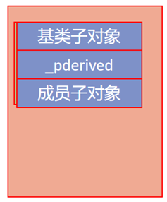
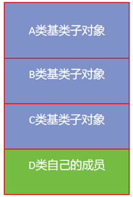
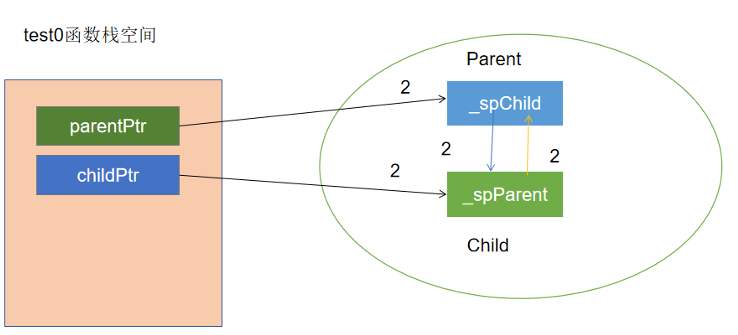
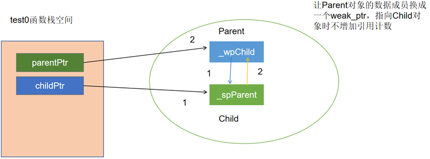
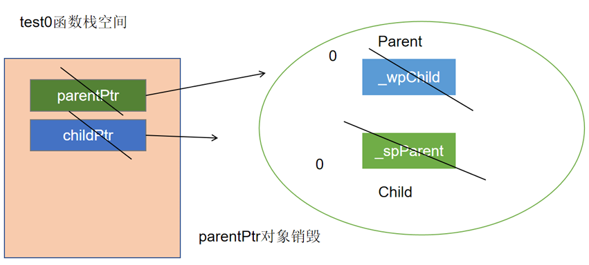

# C++

## C与C++

### 命名空间

#### 创建命名空间

~~~c++
namespace{
    //实体：变量、函数、类等
}
~~~

#### 使用命名空间

三种方式：

1. 作用域限定符：`std::cout`
2. using编译指令：`using namespace std`
3. using声明机制：`using std::cout`

命名空间中你可以定义实体可以声明实体，但不能使用实体。使用命名空间中的实体一定是在命名空间之外。命名空间只是用来存放实体的。

### const关键字

#### 修饰内置类型*

const修饰的数据类型不能修改。在c语言中通常使用`#define MAX 100`来定义常量。这样并不会对数据类型进行指定，在c++中通常使用`const int MAX =100`来指定一个常量这样就会对常量数据类型进行检查。**const常量必须进行初始化**。`int const MAX = 100`这种写法也是可以的。

~~~c
/*
const常量和宏定义常量的区别：
1.发生实际不同：c语言中的宏定义发生在预处理时，做字符串的替换。const常量是在编译时（const常量本质还是一个变量，只是用const关键字限定之后，赋予只读属性，使用时依然是以变量的形式去使用）
2.类型和安全检查不同：宏定义没有类型，不做任何类型检查；const常量有具体的类型，在编译期会执行类型检查。
在使用中，应尽量以const替换宏定义，可以减小犯错误的概率
*/
~~~

#### 修饰指针类型*

~~~c++
#include<iostream>
using namespace std;

int main(){
    int number1=3;
    int number2=4;

    int * const p1 = &number1;//指针常量，指向固定的地址可以改变存放地址中的值，不能指向别的地址
    *p1 = 30;
    //p1 = &number2;//不被允许

    const int * p2 = &number2;//常量指针，可以指向任意常量，但不能改变指向常量的值
    //*p2 = 40;//不被允许
    p2 = &number1;
}
~~~

#### 修饰函数

在 C++ 中，`const` 修饰函数通常出现在**成员函数的声明和定义**中，表示这个成员函数**不会修改类的成员变量**（即保证对象的状态不被改变）。这种用法只对**类的成员函数**有意义。

~~~c++
class MyClass {
public:
    MyClass(int val) : _value(val) {}

    int getValue() const {  // const 成员函数
        // _value = 5;      // ❌ 错误：不能修改成员变量
        return _value;
    }

    void setValue(int val) {
        _value = val;       // ✔️ 可以修改
    }

private:
    int _value;
};

~~~

### new/delete表达式

new和delete并不是函数而是表达式。

~~~c++
#include<iostream>
using namespace std;

int main(){
    int *pa = new int();//默认初始化为0
    cout<<*pa<<endl;
    int *pb = new int(3);//初始化为3
    cout<<*pb<<endl;
    int *pc = new int[5]();//默认初始化数组全为0
    for(int i=0;i<5;i++){
        cout<<pc[i]<<" ";
    }
    cout<<endl;
    int *pd = new int[5]{1,2,3,4,5};
    for(int i=0;i<5;i++){
        cout<<pd[i]<<" ";
    }
    cout<<endl;
    delete pa;
    delete pb;
    delete []pc;
    delete []pd;
    pa = nullptr;//安全回收
}
~~~

#### new/delete与malloc/free的区别*

~~~c
/*
new delete和malloc free的区别
1. malloc/free是库函数；new/delete是表达式，后两者使用时不是函数的写法；
2. new表达式的返回值是相应类型的指针，malloc返回值是void*；
3. malloc申请的空间不会进行初始化，获取到的空间是有脏数据的，但new表达式申请空间时可以直接初始化；
4. malloc的参数是字节数，new表达式不需要传递字节数，会根据相应类型自动获取空间大小。
*/
~~~

### 引用

引用是一个已定义变量的别名。

#### 引用的使用

~~~c++
int number = 2;
int & ref = number;
~~~

1.  &在这里不再是取地址符号，而是引用符号。
2.   引用的类型需要和其绑定的变量的类型相同（目前这样使用，学习继承后这一条有所不 同）。
3.   声明引用的同时，必须对引用进行初始化，否则编译时报错。
4.  引用一经绑定，无法更改绑定。

由于引用是被限制的指针，所以引用是占据内存的，占据的大小就是一个指针的大小。有 很多的说法，都说引用不会占据存储空间，其只是一个变量的别名，但这种说法并不准 确。引用变量会占据存储空间，存放的是一个地址，但是编译器阻止对它本身的任何访 问，从一而终总是指向初始的目标单元。

#### 引用和指针的区别*

~~~c
/*
联系：
1. 引用和指针都有地址的概念，都是用来间接访问变量；
2. 引用的底层还是指针来完成，可以把引用视为一个受限制的指针。
区别：
1. 引用必须初始化，指针可以不初始化；
2. 引用不能修改绑定，但是指针可以修改指向；
3. 在代码层面对引用本身取址取到的是变量的地址，但是对指针取址取到的是指针变量本身的地址
*/
~~~

### 强制转换

c++将强制转换分为不同的情况来讨论：

1. static_cast 最常用的，在指针之间转换。
2. const_cast 去除常量属性。
3. dynamic_cast 用基类和派生类之间做转换。
4. reinterpret_cast 在任意类型之间进行转换。

~~~c++
#include<iostream>
using std::cout;
using std::endl;

void test0(){
    //c语言风格
    int *p1 = (int*)malloc(sizeof(int));
    *p1 = 10;
    //c++static_cast强制转换
    int *p2 = static_cast<int*>(malloc(sizeof(int)));
    *p2 = 100;
    free(p1);
    free(p2);
    int iNumber = 100;
    float fNumber = 0;
    fNumber = static_cast<float>(iNumber);
}
int main(){
    test0();
    return 0;
}
~~~

### 函数重载

函数的名字相同返回值相同但参数不同称为函数的重载。

~~~c++
#include<iostream>
using std::cout;
using std::endl;

int add(int a,int b){
    return a+b;
}
int add(int a,int b,int c){
    return a+b+c;
}
int add(int a,double b){
    return a+b;
}
// float add(float x,int y){//返回值类型不同，不是add的重载
//     return x+y;
// }
int main(){
    cout<<add(2,3)<<endl;
    cout<<add(1,2,3)<<endl;
    cout<<add(1,3.14)<<endl;
    return 0;
}
~~~

~~~sh
g++ overload.c -c
nm overload.o #nm命令用于查看目标文件中的符号表信息
~~~

在 C++ 中，函数重载通过 **名称修饰（name mangling）** 实现，即同一个函数名在编译后会被编码为不同的名字（根据参数类型），所以编译器能区分它们。

### c与c++混合编程

在需要采用c的方式调用时，可以将方法和包裹在`extern "c"`中

~~~c++
extern "C"//c与c++混合编程
{
    int add(int a,double b){
        return a+b;
    }
}//end of C
~~~

或者用`extern "c"`修饰单个函数

~~~c
extern "C" void func(){
    
}
~~~

有些代码希望做到不管是在c的编译环境下还是c++的编译环境下都希望采用C的方式执行：

~~~c++
#ifdef __cplusplus
extern "C"//c与c++混合编程
{
#endif
    int add(int a,double b){//该函数都按c的方式调用
        return a+b;
    }
#ifdef __cplusplus
}//end of C
#endif
~~~

### 默认参数

C++可以给函数定义默认参数值。通常，调用函数时，要为函数的每个参数给定对应的实参。

~~~c++
#include<iostream>
using std::cout;
using std::endl;

int add(int a=0,int b=0,int c=0){
    return a+b+c;
}

int main(){
    cout<<add()<<endl;
    cout<<add(1)<<endl;
    cout<<add(2,3)<<endl;
    cout<<add(4,5,6)<<endl;
    return 0;
}
~~~

在函数声明时给出默认参数，实现时不用再给默认参数

~~~c++
int add(int a,int b,int c){
    return a+b+c;
}
int add(int a=0,int b=0,int c=0);
int main(){
    cout<<add()<<endl;
    cout<<add(1)<<endl;
    cout<<add(2,3)<<endl;
    cout<<add(4,5,6)<<endl;
    return 0;
}
~~~

### 内存布局

以32位系统为例，一个进程在执行时，能够访问的空间是虚拟地址空间。理论上为$2^{32}$， 即4G，有1G左右的空间是内核态，剩下的3G左右的空间是用户态。从高地址到低地址可 以分为五个区域：

- 栈区：操作系统控制，由高地址向低地址生长，编译器做了优化，显式地址时栈区和其 他区域保持一致的方向。 
- 堆区：程序员分配（malloc、new），由低地址向高地址生长，堆区与栈区没有明确的界限。 
- 全局/静态区：读写段（数据段），存放全局变量、静态变量。 
- 文字常量区：只读段，存放程序中直接使用的常量，如const char * p = "hello";  hello 这个内容就存在文字常量区。 
- 程序代码区：只读段，存放函数体的二进制代码。

### inline关键字(内联函数)

内联函数是C++的增强特性之一，用来降低程序的运行时间。当内联函数收到编译器的指示时，即可发生内联：编译器将使用函数的定义体来替代函数调用语句，这种替代行为发 生在编译阶段而非程序运行阶段。

—— 内联函数就是在普通函数定义之前加上inline关键字

（1）inline是一个建议，并不是强制性的，后面会学到inline失效的情况 

（2）inline的建议如果有效，就会在编译时展开，可以理解为是一种更高级的代码替换机 制（类似于宏——预处理）

（3）函数体内容如果太长或者有循环之类的结构，不建议inline，以免造成代码膨胀；比较短小的代码适合用inline。

如果要把inline函数声明在头文件中，则必须把函数定义也写在头文件中。若头文件中 只有声明没有实现，被认为是没有定义替换规则。

C++的函数内联机制既具备宏代码的效率，又增加了安全性，而且可以自由操作类的数据 成员，所以在C++中应尽可能的用内联函数取代宏函数。

~~~c++
inline int max(int x, y)//内联函数只适合简短且常用的功能代码
 {
 return x > y ? x : y;
 }
~~~

## 类与对象

### 类的定义

类的定义分为两个部分：

1. 数据，相当于现实世界中的属性，称为数据成员; 
2. 对数据的操作，相当于现实世界中的行为，称为成员函数。

从程序设计的观点来说，类就是数据类型，是用户定义的数据类型，对象可以看成某个类 的实例（某类的变量）。所以说类是对象的抽象，对象是类的实例。

~~~c++
class Computer {
	void setBrand(const char * brand){
 		strcpy(_brand, brand);
    }
	void setPrice(float price){
 		_price = price;
    }
	char _brand[20];
	float _price;
};
~~~

class中的所有的成员都拥有自己的访问权限，分别可以用以下的三个访问修饰符进行修饰

**public：**公有的访问权限，在类外可以通过对象直接访问公有成员.
**protected：**保护的访问权限，派生类中可以访问，在类外不能通过对象直接访问
**private：**私有的访问权限，在本类之外不能访问，比较敏感的数据设为private

class定义中如果在成员定义（或声明）之前没有任何访问修饰符，其默认的访问权限为私有。

~~~c++
class Computer {
public:
   void setBrand(const char * brand){
       strcpy(_brand, brand);
   }
   void setPrice(float price){
       price = price;
   }
private:
   char _brand[20];
   float _price;
};
int main(){
    Computer pc;
    pc.setPrice(10000); //ok
    //pc._price; //error,因为_price是私有的
    return 0;
}
~~~

### 成员函数的定义

成员函数可以在类内部完成定义，也可以在类内部只进行声明，在类外部完成定义。

~~~c++
class Computer {
public:
   void setBrand(const char * brand);
   void setPrice(float price);
private:
   char _brand[20];
   float _price;
};
void Computer::setBrand(const char * brand){

    strcpy(_brand, brand);
   
}
void Computer::setPrice(float price){
    price = price;
}
~~~

### 对象的创建

#### 构造函数

C++ 为类提供了一种 特殊的成员函数——构造函数来完成相同的工作。

构造函数的作用：就是用来初始化数据成员的。
构造函数的形式： 没有返回值，即使是void也不能有；函数名与类名相同，再加上函数参数列表。

当类中没有显式定义构造函数时 ，编译器会自动生成一个默认  (无参)  构造函数 ，但并不会初始化数据成员；
~~~c++
class Point{
public:
    void print(){
        cout<<"x="<<_ix<<"y="<<_iy<<endl;
    }
private:
    int _ix;
    int _iy;
};

int main(){
    Point point;
    point.print();//会初始化一个任意值
    return 0;
}
~~~

 一旦当类中显式提供了构造函数时 ，编译器就不会再自动生成默认的构造函数；

~~~c++
class Point{
public:
    Point(){
        _ix = 0;
        _iy = 0;
    }
    void print(){
        cout<<"x="<<_ix<<",y="<<_iy<<endl;
    }
private:
    int _ix;
    int _iy;
};

int main(){
    Point point;
    point.print();//会初始化一个任意值
    return 0;
}
~~~

构造函数也可以接收参数;

~~~c++
class Point{
public:
    Point(int x,int y){
        _ix = x;
        _iy = y;
    }
    void print(){
        cout<<"x="<<_ix<<",y="<<_iy<<endl;
    }
private:
    int _ix;
    int _iy;
};

int main(){
    //Point point;//error没有默认的无参构造函数调用
    Point point(2,3);
    point.print();//会初始化一个任意值
    return 0;
}
~~~

构造函数可重载；

~~~c++
class Point{
public:
    Point(){};//默认构造函数可重载
    Point(int x,int y){
        _ix = x;
        _iy = y;
    }
    void print(){
        cout<<"x="<<_ix<<",y="<<_iy<<endl;
    }
private:
    int _ix;
    int _iy;
};

int main(){
    Point point1;
    Point point2(2,3);
    point1.print();//会初始化一个任意值
    point2.print();
    return 0;
}
~~~

#### 对象的数据成员初始化

在C++中，对于类中数据成员的初始化，推荐使用初始化列表完成。初始化列表位于构造函数形参列表之后，函数体之前，用冒号开始，如果有多个数据成员，再用逗号分隔，初始值放在一对小括号中。

~~~c++
class Point{
public:
    Point(){};//默认构造函数可重载
    Point(int x,int y):
    _ix(x),_iy(y){
        _ix = x;
        _iy = y;
    }
    void print(){
        cout<<"x="<<_ix<<",y="<<_iy<<endl;
    }
private:
    int _ix;
    int _iy;
};

int main(){
    Point point1;
    Point point2(2,3);
    point1.print();//会初始化一个任意值
    point2.print();
    return 0;
}
~~~

 C++11之后，普通的数据成员也可以在声明时就进行初始化。但一些特殊的数据成员初始化只能在初始化列表中进行，故一般情况下统一推荐在初始化列表中进行数据成员初始化。

~~~c++
class Point{
public:
    Point(){};//默认构造函数可重载
    Point(int x,int y):
    _ix(x),_iy(y){
        _ix = x;
        _iy = y;
    }
    void print(){
        cout<<"x="<<_ix<<",y="<<_iy<<endl;
    }
private:
    int _ix=0;
    int _iy=0;
};

int main(){
    Point point1;
    Point point2(2,3);
    point1.print();//x=0,y=0
    point2.print();//x=2,y=3
    return 0;
}
~~~

#### 对象所占空间大小

成员函数并不影响对象的大小，对象的大小与数据成员有关（后面学习继承、多态，对象的内存布局会更复杂）；

现阶段，在不考虑继承多态的情况下，我们做以下测试。发现有时一个类所占空间大小就是其数据成员类型所占大小之和，有时则不是，这就是因为有 内存对齐的机制。

~~~c++
class A{
    int num;//4字节
    double price;//8字节
};
class B{
    int num;
    int price;
};
class C{
    int num1;
    int num2;
    double price;
};
class D{
    int num1;
    double price;
    int num2;
};
int main(){
    cout<<"sizeof(A)="<<sizeof(A)<<endl;//16
    cout<<"sizeof(B)="<<sizeof(B)<<endl;//8
    cout<<"sizeof(C)="<<sizeof(C)<<endl;//16
    cout<<"sizeof(D)="<<sizeof(D)<<endl;//24
    return 0;
}
~~~

如果数据成员中有数组类型,会按照除去数组以外的其他数据成员中最大的那一个的倍数对齐

~~~c++
class E{
    double num1;
    char Arr[20];
    double num2;
    int num3;
};
class F{
    char _gArr[20];
    int _g1;
    double _g2;
};
int main(){
    cout<<"sizeof(E)="<<sizeof(E)<<endl;//48
    cout<<"sizeof(F)="<<sizeof(F)<<endl;//32
    return 0;
}
~~~

#### 指针数据成员

类的数据成员中有指针时，意味着创建该类的对象时要进行指针成员的初始化，需要申请堆空间。

~~~c++
class Computer {
public:
   Computer(const char * brand,int price)
   :_brand(new char[strlen(brand) + 1]())
   ,_price(price){
        strcpy(_brand,brand);
   }
private:
   char * _brand;
   float _price;
};

int main(){
    Computer pc("Apple",15000);
    return 0;
}
~~~

有new表达式被执行，就要想到通过delete表达式来进行回收。如果没有对应的回收机制，对象被销毁时，它所申请的堆空间不会被回收，就会发生内存泄漏。

### 对象的销毁

1. 析构函数：对象在销毁时，一定会调用析构函数
2. 析构函数的作用：清理对象的数据成员申请的资源（堆空间）—— 析构函数并不负责清理数据成员(系统自动完成) 
3. 形式：【特殊的成员函数】
   没有返回值，即使是void也没有
   没有参数
   函数名与类名相同，在类名之前需要加上一个波浪号~ 
4. 析构函数只有一个（不能重载）
5. 析构函数默认情况下 ，系统也会自动提供一个
6. **当对象被销毁时 ，会自动调用析构函数【非常重要】**

#### 析构函数

当数据成员中有指针时，创建一个对象，会申请堆空间，销毁对象时默认析构不够用了 （造成内存泄漏），此时就需要我们自定义析构函数。在析构函数中定义堆空间上内存回 收的机制，就不会发生内存泄漏。

~~~c++
class Computer {
public:
   Computer(const char * brand,int price)
   :_brand(new char[strlen(brand) + 1]())
   ,_price(price){
        strcpy(_brand,brand);
   }
   ~Computer(){
        if(_brand){
            delete[] _brand;
            _brand = nullptr;
            cout<<"~Computer()"<<endl;
        }
   }
   void print();
private:
   char * _brand;
   float _price;
};
void Computer::print(){
    cout<<_brand<<" "<<_price<<endl;
}
int main(){
    Computer pc("Apple",15000);
    pc.print();
    return 0;
}
~~~

**对象被销毁，一定会调用析构函数； 调用了析构函数，对象并不会被销毁。**

不建议手动调用析构函数，因为容易导致各种问题，应该让析构函数自动被调用。

### 构造函数和析构函数的调用时机

### 拷贝构造函数

可以用一个已经创建的对象赋值给另一个对象。

~~~c++
class Point{
public:
    Point(){};
    Point(int x,int y):
    _ix(x),_iy(y){
        _ix = x;
        _iy = y;
    }
    void print(){
        cout<<"x="<<_ix<<",y="<<_iy<<endl;
    }
private:
    int _ix=0;
    int _iy=0;
};

int main(){
    Point point1(2,3);
    Point point2 = point1;
    return 0;
}
~~~

既然涉及到对象的创建，就必然需要调用构造函数，而这里会调用的就是**拷贝构造函数**(复制构造函数)。

拷贝构造函数的形式是固定的： `类名(const 类名 &) `  

1. 该函数是一个构造函数  —— 拷贝构造也是构造！ 
2. 该函数用一个已经存在的同类型的对象，来初始化新对象，即对对象本身进行复制      

默认的拷贝构造函数如下：

~~~c++
Point(const Point &rhs)
:_ix(rhs._ix)
,_iy(rhs._iy)
{}
~~~

当类中存在指针成员时事情就变得复杂了。
~~~c++
class Computer {
public:
   Computer(const char * brand,int price)
   :_brand(new char[strlen(brand) + 1]())
   ,_price(price){
        strcpy(_brand,brand);
   }
   ~Computer(){
        if(_brand){
            delete[] _brand;
            _brand = nullptr;
            cout<<"~Computer()"<<endl;
        }
   }
   void print();
private:
   char * _brand;
   float _price;
};
void Computer::print(){
    cout<<_brand<<" "<<_price<<endl;
}
int main(){
    Computer pc1("Apple",15000);
    Computer pc2 = pc1;
    pc1.print();
    pc2.print();
    return 0;
}
~~~

如果是默认的拷贝构造函数，pc2会对pc的_brand进行浅拷贝，指向同一片内存；pc2被销毁时，会调用析构函数，将这片堆空间进行回收；pc再销毁时，析构函数中又会试图回收这片空间，出现double free问题。

所以，如果拷贝构造函数需要显式写出时（该类有指针成员申请堆空间），在自定义的拷贝构造函数中要换成**深拷贝**的方式，先申请空间，再复制内容。

~~~c++
class Computer {
public:
   Computer(const char * brand,int price)
   :_brand(new char[strlen(brand) + 1]())
   ,_price(price){
        strcpy(_brand,brand);
   }
   Computer(const Computer & rhs)//手动定义拷贝构造函数
   :_brand(new char[strlen(rhs._brand)+1]())
   ,_price(rhs._price){
        strcpy(_brand,rhs._brand);
   }
   ~Computer(){
        if(_brand){
            delete[] _brand;
            _brand = nullptr;
            cout<<"~Computer()"<<endl;
        }
   }
   void print();
private:
   char * _brand;
   float _price;
};
void Computer::print(){
    cout<<_brand<<" "<<_price<<endl;
}
int main(){
    Computer pc1("Apple",15000);
    Computer pc2 = pc1;
    pc1.print();
    pc2.print();
    return 0;
}
~~~

#### 拷贝构造函数的调用时机

1. 当使用一个已经存在的对象初始化另一个同类型的新对象时。
2. 将对象作为参数传递给函数时。
3. 函数返回值是对象时。

#### 拷贝构造函数的形式*

**思考1：拷贝构造函数能否去掉引用符号**

不能，首先编译器不允许这样写，其次当你需要调用拷贝构造函数时，采用的调用方式是按值传递，也就是需要再次调用拷贝构造函数，这样就出现了递归调用拷贝构造函数的情况直到栈溢出。

**思考2：拷贝构造函数能否去掉const关键字**

这种写法编译器不会报错但不推荐，加const的第一个用意：为了确保右操作数的数据成员不被改变。加const的第二个用意：为了能够复制临时对象的内容，因为非const引用不能绑定临时变量（右值）。const引用可以绑定右值，非const引用不能绑定右值。

### 赋值运算符函数

对类可以执行如下操作：

~~~c++
Pont pt1(1,2),pt2(3,4);
pt1 = pt2;//赋值操作
~~~

在执行`pt1=pt2`时，该语句的`pt1`和`pt2`都存在，所有不存在对象的构造。

在上述例子中，当`=`作用于对象时，其实是把它当作一个函数来看待。在执行 `pt1 =  pt2;` 该语句时，需要调用的是赋值运算符函数。其形式如下：

~~~c++
ClassName& operator=(const ClassName &)
~~~

对Point类进行测试时，会发现我们不需要显式给出赋值运算符函数，就可以执行测试。这是因为如果类中没有显式定义赋值运算符函数时，编译器会自动提供一个缺省的赋值运算符函数。对于 Point 类而言，其实现如下:

~~~c++
Point & Point::operator=(const Point & rhs){
    _ix = rhs._ix;
    _iy = rhs._iy;
}
~~~

手动写出赋值运算符，再加上函数调用的提示语句。执行发现语句被输出，也就是说，当对象已经创建时，将另一个对象的内容复制给这个对象，会调用赋值运算符函数。

#### this指针

this指针的本质是一个指针常量 Type* const pointer; 它储存了调用它的对象的地址，不可被修改。这样成员函数才知道自己修改的成员变量是哪个对象的。

this是一个隐藏的指针，可以在类的成员函数中使用，它可以用来指向调用对象。当一个对象的成员函数被调用时，编译器会隐式地传递该对象的地址作为 this 指针。

编译器在生成程序时加入了获取对象首地址的相关代码，将获取的首地址存放在了寄存器中，这就是this指针。

this 指针的生命周期开始于成员函数的执行开始。当一个非静态成员函数被调用时，this 指针被自动设置为指向调用该函数的对象实例。在成员函数执行期间，this 指针一直有效。它可以被用来访问调用对象的成员变量和成员函数。this指针的生命周期结束于成员函数的执行结束。当成员函数返回时，this指针的作用范围就结束了。

理解一下问题：

1. 对象调用函数时，是如何找到自己本对象的数据成员的？ 通过this指针 
2. this指针代表的是什么？本对象
3. this指针在参数列表中的什么位置？参数列表的第一位
4. this指针的形式是什么？类名*const this

~~~c++
Point & operator=(const Point & rhs){
    this->_ix = rhs._ix;
    this->_iy = rhs._iy;
    cout << "Point & operator=(const Point &)" << endl;
    return *this;
}
~~~

如果对象的指针数据成员申请了堆空间，那么就不能使用默认的运算符函数。如果直接采用默认的赋值运算符函数，`_brand`指针成员就会进行浅拷贝。需要进行深拷贝：

~~~c++
class Computer {
public:
   Computer(const char * brand,int price)
   :_brand(new char[strlen(brand) + 1]())
   ,_price(price){
        strcpy(_brand,brand);
   }
   Computer(const Computer & rhs)//手动定义拷贝构造函数
   :_brand(new char[strlen(rhs._brand)+1]())
   ,_price(rhs._price){
        strcpy(_brand,rhs._brand);
   }
   ~Computer(){
        if(_brand){
            delete[] _brand;
            _brand = nullptr;
            cout<<"~Computer()"<<endl;
        }
   }
   Computer& operator=(const Computer &rhs){
        if(this!=&rhs){
            delete []this->_brand;
            this->_brand = new char[strlen(rhs._brand)+1]();
            strcpy(this->_brand,rhs._brand);
            this->_price = rhs._price;
        }
        return *this;
   }
   void print();
private:
   char * _brand;
   float _price;
};
int main(){
    Computer pc1("Apple",15000),pc2("huawei",8000);
    pc1.print();
    pc1 = pc2;
    pc1.print();
    pc2.print();
    return 0;
}
~~~

#### 三合成原则

**拷贝构造函数、赋值运算符函数、析构函数，如果需要手动定义其中的一个，那么另外两个也需要手动定义。**

### 特殊的数据成员

#### 常量数据成员

当数据成员用 const 关键字进行修饰以后，就成为常量成员。一经初始化，该数据成员便具有“只读属性”，在程序中无法对其值修改。事实上，在构造函数体内对const 数据成员赋值是非法的， **const数据成员需在初始化列表中进行初始化**（C++11之后也允许在声明时就初始化）。

const成员初始化后也不再允许修改值。

~~~c++
class Point {
public:
    Point(int ix, int iy)
    : _ix(ix)
    , _iy(iy)
    {}
private:
    const int _ix;
    const int _iy;
};
~~~

#### 引用数据成员

引用数据成员在初始化列表中进行初始化，C++11之后允许在声明时初始化（绑定）。 之前的学习中，我们知道了引用要绑定到已经存在的变量，引用成员同样如此。

~~~c++
class Point {
public:
    Point(int ix, int iy)
    : _ix(ix)
    , _iy(iy)
    , _iz(_ix)
    {}
private:
    const int _ix;
    const int _iy;
    int & _iz;
};
~~~

#### 对象成员

有时候，一个类对象会作为另一个类对象的数据成员被使用。比如一个直线类Line对象中 包含两个Point对象。

对象成员必须在初始化列表中进行初始化。

注意： 

1. 不能在声明对象成员时就去创建。
2. 初始化列表中写的是需要被初始化的对象成员的名称，而不是对象成员的类名。

~~~c++
class Line {
public:
    Line(int x1, int y1, int x2, int y2)
    : _pt1(x1, y1)
    , _pt2(x2, y2)
    {
    	cout << "Line(int,int,int,int)" << endl;
    }
private:
    Point _pt1;
    Point _pt2;
};
~~~

此例子中，创建一个Line类的对象，会首先调用Line的构造函数，在此过程中调用Point的构造函数完成Point类对象成员的初始化；Line对象销毁时会先调用Line的析构函数，析构函数执行完后，再调用Point的析构函数。

#### 静态数据成员

C++ 允许使用 static （静态存储）修饰数据成员，这样的成员在编译时就被创建并初始化 的（与之相比，对象是在运行时被创建的），且其实例只有一个，被所有该类的对象共享，就像住在同一宿舍里的同学共享一个房间号一样。静态数据成员和之前介绍的静态变 量一样，当程序执行时，该成员已经存在，一直到程序结束，任何该类对象都可对其进行访问，静态数据成员存储在全局/静态区，并不占据对象的存储空间。

**静态数据成员被整个类的所有对象共享。**

~~~c++
class Computer {
public:
	//...    
private:
    char * _brand;
    double _price;
    //数据成员的类型前面加上static关键字
    //表示这是一个static数据成员（共享）
    static double _totalPrice;
};
double Computer::_totalPrice = 0;
~~~

静态成员规则：

1. private的静态数据成员无法在类之外直接访问。
2. 对于于静态数据成员的初始化，必须放在类外。
3. 静态数据成员初始化时不能在数据类型前面加static，在数据成员名前面要加上类名+作用域限定符
4. 如果有多条静态数据成员，那么它们的初始化顺序需要与声明顺序一致（规范）

### 特殊成员函数

#### 静态成员函数

在某一个成员函数的前面加上static关键字，这个函数就是静态成员函数。静态成员函数具有以下特点：

1. **静态成员函数不依赖于某一个对象**。
2. 静态成员函数可以通过对象调用，但更常见的方式是**通过类名加上作用域限定符调用**。
3. 静态成员函数没有this指针。
4. **静态成员函数无法直接访问非静态的成员**，只能访问静态数据成员或调用静态成员函数（因为没有this指针）。

静态成员函数不能是构造函数/析构函数/赋值运算符函数/拷贝构造（因为这四个函数都 会访问所有的数据成员，而static成员函数没有this指针）

~~~c++
class Computer {
public:
   Computer(const char * brand,int price)
   :_brand(new char[strlen(brand) + 1]())
   ,_price(price){
        strcpy(_brand,brand);
   }
   Computer(const Computer & rhs)//手动定义拷贝构造函数
   :_brand(new char[strlen(rhs._brand)+1]())
   ,_price(rhs._price){
        strcpy(_brand,rhs._brand);
   }
   ~Computer(){
        if(_brand){
            delete[] _brand;
            _brand = nullptr;
            cout<<"~Computer()"<<endl;
        }
   }
   void print();
   static void printTotalPrice(){
        cout<<"total Price:"<<_totalPrice<<endl;
        //cout<<_price<<endl;//error
   }
private:
   char * _brand;
   float _price;
   static double _totalPrice;
};
double Computer::_totalPrice = 30000;  // 静态成员变量初始化

void Computer::print(){
    cout<<_brand<<" "<<_price<<endl;
}

int main(){
    Computer::printTotalPrice();

    return 0;
}
~~~

#### const成员函数

const 在类成员函数中还有种特殊的用 法。在成员函数的参数列表之后，函数执行体之前加上const关键字，这个函数就是const 成员函数。

~~~c++
class Computer{
public:
    //...
    void print const{
        cout << "brand:" << _brand << endl;
        cout << "price:" << _price << endl;
    }
    //...
};
~~~

const成员函数中，不能修改对象的数据成员；

当编译器发现该函数是const成员函数时，会自动将this指针设置为双重const限定的指针；

### 对象的组织

#### const对象

类对象也可以声明为 const 对象，一般来说，能作用于 const 对象的成员函数除了构造函 数和析构函数，就只有 const 成员函数了。因为 const 对象只能被创建、撤销和只读访 问，写操作是不允许的。

const对象与const成员函数的规则：

1. 当类中有const成员函数和非const成员函数重载时，const对象会调用const成员函数， 非const对象会调用非const成员函数；
2. 当类中只有一个const成员函数时，无论const对象还是非const对象都可以调用这个版本；
3. 当类中只有一个非const成员函数时，const对象就不能调用非const版本。 

**总结：如果一个成员函数中确定不会修改数据成员，就把它定义为const成员函数。**

#### 指向对象的指针

对象占据一定的内存空间，和普通变量一致， C++ 程序中采用如下形式声明指向对象的指针：

~~~c++
类名 *指针名 [=初始化表达式];
~~~

初始化表达式是可选的，既可以通过取地址（&对象名）给指针初始化，也可以通过申请动 态内存给指针初始化，或者干脆不初始化（比如置为 nullptr ），在程序中再对该指针赋 值。指针中存储的是对象所占内存空间的首地址。针对上述定义，则下列形式都是合法的：

~~~c++
Point pt(1, 2);
Point * p1 = nullptr;
Point * p2 = &pt;
Point * p3 = new Point(3, 4);
~~~

#### 对象数组

对象数组的声明

~~~c++
Point pts[2];
~~~

这种格式会自动调用默认构造函数或所有参数都是缺省值的构造函数。

对象数组的初始化

~~~c++
Point pts[2] = {Point(1, 2), Point(3, 4)};
Point pts[] = {Point(1, 2), Point(3, 4)};
Point pts[5] = {Point(1, 2), Point(3, 4)};
//或者
Point pts[2] = {{1, 2}, {3, 4}};
Point pts[] = {{1, 2}, {3, 4}};
Point pts[5] = {{1, 2}, {3, 4}};
~~~

#### 堆对象

和把一个简单变量创建在动态存储区一样，可以用 new 和 delete 表达式为对象分配动态 存储区，在拷贝构造函数一节中已经介绍了为类内的指针成员分配动态内存的相关范例， 这里主要讨论如何为对象和对象数组动态分配内存。如：

~~~c++
void test()
{
    Point * pt1 = new Point(11, 12);
    pt1->print();
    delete pt1;
    pt1 = nullptr;
    
    Point * pt2 = new Point[5]();//注意
    pt2->print();
    (pt2 + 1)->print();
    delete [] pt2;
    pt2 = nullptr;
}
~~~

#### new和delete表达式的工作步骤

使用new表达式发生的三个步骤：

1. 调用operator new标准库函数申请未类型化的空间
2. 在该空间上调用该类型的构造函数初始化对象
3. 返回指向该对象的相应类型的指针

使用delete表达式时发生的两个步骤：

1. 调用析构函数,回收数据成员申请的资源
2. 调用operator delete库函数回收本对象所在的空间

~~~c++
class Computer {
public:
    Computer():_brand(new char[10]()),_price(1000){
        strcpy(this->_brand,"Apple");
        cout<<"Computer()"<<endl;
    }
    Computer(const char * brand,int price)
    :_brand(new char[strlen(brand) + 1]())
    ,_price(price){
        strcpy(_brand,brand);
        cout<<"Computer(str,int)"<<endl;
    }
    Computer(const Computer & rhs)//手动定义拷贝构造函数
    :_brand(new char[strlen(rhs._brand)+1]())
    ,_price(rhs._price){
        strcpy(_brand,rhs._brand);
    }
    ~Computer(){
        if(_brand){
            delete[] _brand;
            _brand = nullptr;
            cout<<"~Computer()"<<endl;
        }
    }
    void print();
    void *operator new(size_t size){
        cout<<"operator new"<<endl;
        void * ret = malloc(size);
        return ret;
    }
    void operator delete(void * ptr){
        cout<<"operator delete"<<endl;
        free(ptr);
    }
private:
    char * _brand;
    float _price;
};
void Computer::print(){
    cout<<_brand<<" "<<_price<<endl;
}
int main(){
    Computer *cp = new Computer("Apple",10000);
    Computer *cArray = new  Computer[5]();
    cp->print();
    cArray->print();
    (cArray+1)->print();
    delete cp;
    cp = nullptr;
    delete[] cArray;
    cArray = nullptr;
    return 0;
}
~~~

### 单例模式*

单例模式是23种常用设计模式中最简单的设计模式之一，它提供了一种创建对象的方式， 确保只有单个对象被创建。这个设计模式主要目的是想在整个系统中只能出现类的一个实例，即一个类只有一个对象。

#### 将单例对象创建在静态区

~~~c++
class Point{
public:
    static Point & getInstance(){//返回值设为引用避免复制
        static Point pt(1,2);
        return pt;
    }
    void print() const{
        cout<<"x="<<_ix<<",y="<<_iy<<endl;
    }
private:
    Point(int x,int y)://构造函数私有
    _ix(x),_iy(y){
        _ix = x;
        _iy = y;
    }
    int _ix=0;
    int _iy=0;
};

int main(){
    Point &pt1 = Point::getInstance();
    pt1.print();
    Point &pt2 = Point::getInstance();
    pt2.print();
    cout<<&pt1<<endl;
    cout<<&pt2<<endl;//从输出可以看出，pt1和pt2绑定的是同一个对象
    return 0;
}
~~~

1. 构造函数私有化。
2. 通过`getInstance()`函数创建实例，该函数的返回值是一个引用避免复制，并且使用static关键字保证对象只创建一次。
3. `static Point pt(1,2);`声明了一个函数内部的静态局部变量，它有如下特性：第一次调用`getInstacnce()`时会执行构造函数来初始化它，之后再次调用`getInstance()`函数时不会创建这个对象，而是返回之前那个已经存在的实例。这个对象存储在静态区而不是栈区，不会随着函数的退出而销毁。

#### 将单例模式创建在堆区

~~~c++
class Point{
public:
    static Point* getInstance(){//返回值设为指针
        if(_pInstance == nullptr){
            _pInstance = new Point(1,2);
        }
        return _pInstance;
    }
    void print() const{
        cout<<"x="<<_ix<<",y="<<_iy<<endl;
    }
    static void destroy(){
        if(_pInstance){
            delete _pInstance;
            _pInstance = nullptr;
        }
    }
private:
    Point(int x,int y)://构造函数私有
    _ix(x),_iy(y){
        _ix = x;
        _iy = y;
    }
    int _ix=0;
    int _iy=0;
    static Point *_pInstance;
};
Point* Point::_pInstance = nullptr;//静态数据成员需要在类外初始化
int main(){
    Point *pt1 = Point::getInstance();
    pt1->print();
    Point *pt2 = Point::getInstance();
    pt2->print();
    cout<<pt1<<endl;
    cout<<pt2<<endl;//从输出可以看出，pt1和pt2绑定的是同一个对象
    return 0;
}
~~~

1. 构造函数私有化
2. 通过静态成员函数`getInstacnce()`创建堆对象，返回Point*类型的指针
3. 通过静态成员函数完成堆对象的回收

#### 单例模式的应用场景

1. 有频繁实例化然后销毁的情况，也就是频繁的 new 对象，可以考虑单例模式；
2. 创建对象时耗时过多或者耗资源过多，但又经常用到的对象；
3. 当某个资源需要在整个程序中只有一个实例时，可以使用单例模式进行管理（全局资源管理）。例如数据库连接池、日志记录器等；
4. 当需要读取和管理程序配置文件时，可以使用单例模式确保只有一个实例来管理配置文件的读取和写入操作（配置文件管理）；
5. 在多线程编程中，线程池是一种常见的设计模式。使用单例模式可以确保只有一个线程池实例，方便管理和控制线程的创建和销毁；
6. GUI应用程序中的全局状态管理：在GUI应用程序中，可能需要管理一些全局状态，例如用户信息、应用程序配置等。使用单例模式可以确保全局状态的唯一性和一致性。

### c++字符串

C++ 提供了 std::string （后面简写为 string ）类用于字符串的处理。 string 类定义在C++ 头文件< string > 中。完全可以把 string 当成是 C++ 的内置数据类型，放在和 int 、 double 等内置类型同等位置上。

#### 字符串常用操作

~~~c++
string str1 = "hello";//初始化一个字符串
string str2 = string(str1,3);//从已有的str1字符串开始构造一个新的字符串直到结尾
string str3 = string(str1);//拷贝str1字符串
string str4 = str1 + str3;//拼接字符串
string str5 = str1 + "world!";//拼接字符串
string str6 = string("hello world",5);//截取前五个字符构造字符串
cout<<str1<<endl;
cout<<str2<<endl;
cout<<str3<<endl;
cout<<str4<<endl;
cout<<str5<<endl;
cout<<str6<<endl;
string str = string();//创建空字符串
if(str.empty())
    cout<<"Empty string!"<<endl;
cout<<str1.size()<<endl;//获取字符数
cout<<str1.length()<<endl;
if(str1 == str3)//判断两个字符串是否一致
    cout<<"Same string!"<<endl;
~~~

#### 字符串遍历*

**string对象可以通过下标访问**

~~~c++
for(size_t idx = 0;idx < str3.size();++idx){//普通for循环变量
    cout<<str3[idx]<<" ";
}
cout<<endl;
~~~

需要注意的是操作符[]并不检查索引是否有效，如果索引超出范围，会引起未定义的行 为。而函数 at() 会检查，如果使用 at()的时候索引无效，会抛出 out_of_range 异常

**增强for循环遍历**

~~~c++
for(auto & ch: str3){//增强for循环遍历
    cout<<ch<<" ";
}
cout<<endl;
~~~

针对容器，可以使用增强for循环进行遍历其中的元素。增强for循环经常和auto关键字一起 使用，auto关键字可以自动推导类型。

**迭代器方式遍历**

~~~c++
auto it = str3.begin();//迭代器遍历
while(it != str3.end()){
    cout<<*it<<" ";
    ++it;
}
cout<<endl;
~~~

string字符串利用连续空间存储字符，所以可以利用地址遍历。这里我们提出一个概念——迭代器。迭代器可以理解为是广义的指针。它可以像指针一样进行解引用、移位等操作。 迭代器是容器用来访问元素的重要手段，容器都有相应的函数来获取特定的迭代器（此处可以简单理解为指向特定元素的指针）。

begin函数返回首迭代器（指向首个元素的指针）；end函数返回尾后迭代器（指向最后一个元素的后一位的指针）

### c++动态数组

C++中，std::vector（向量）是一个动态数组容器，能存放任意类型的数据。其动态性主要体现在以下几个方面：

1. 动态大小：` std::vector `可以根据需要自动调整自身的大小。它在内部管理一个动态 分配的数组，可以根据元素的数量进行自动扩容或缩减。当元素数量超过当前容量时， `std::vector`会重新分配内存，并将元素复制到新的内存位置。这使得`std::vector`能够根据需要动态地增长或缩小容量，而无需手动管理内存。
2.  动态插入和删除： `std::vector`允许在任意位置插入或删除元素，而不会影响其他元 素的位置。当插入新元素时，`std::vector`会自动调整容量，并将后续元素向后移动以腾出空间。同样地，当删除元素时，` std::vector` 会自动调整容量，并将后续元素 向前移动以填补空缺。
3. 动态访问： `std::vector`提供了随机访问元素的能力。可以通过索引直接访问容器中 的元素，而不需要遍历整个容器。这使得对元素的访问具有常数时间复杂度 （O(1)），无论容器的大小如何。

#### vector的构造

~~~c++
vector<int> numbers;//无参构造，仅指明vector存放元素的种类，没有存放元素
vector<long> numbers2(10);//存放10个0
vector<long> numbers3(10,20); //存放10个20
vector<int> numbers4{1,2,3,4,5,6,7};//直接指明存放的所有元素
vector<int> numbers5(numbers4.begin(),numbers4.end() - 3);//使用迭代器方式初始化
~~~

#### vector的常用操作

~~~c++
iterator begin();  //返回首位迭代器
iterator end();  //返回尾后迭代器
bool empty() const; //判空
size_type size() const; //返回容器中存放的元素个数
size_type capacity() const; //返回容器容量（最多可以存放元素的个数）
void push_back(const T& value); //在最后一个元素的后面再存放元素
void pop_back(); //删除最后一个元素
void clear(); //清空所有元素，但不释放空间
void shrink_to_fit();  //释放多余的空间（可以存放元素但没有存放运算的空间）
void reserve(size_type new_cap);//申请空间，不存放元素
~~~

**vector不仅能够存放内置类型变量，也能存放自定义类型对象和其他容器**

#### vector的动态扩容

当vector存放满后，仍然追加存放元素，vector会进行自动扩容。

~~~c++
vector<int> numbers;
cout << numbers.size() << endl;
cout << numbers.capacity() << endl;

numbers.push_back(1);
cout << numbers.size() << endl;
cout << numbers.capacity() << endl;

numbers.push_back(1);
cout << numbers.size() << endl;
cout << numbers.capacity() << endl;

numbers.push_back(1);
cout << numbers.size() << endl;
cout << numbers.capacity() << endl;

numbers.push_back(1);
numbers.push_back(1);
cout << numbers.size() << endl;
cout << numbers.capacity() << endl;
~~~

vector的容量是按照指数增长的：`0 -> 1 -> 2 -> 4 -> 8...`，每当存储的元素数量达到容器容量时再次添加元素就会将容量扩大到原来的一倍。

#### vector的底层实现

利用sizeof查看vector对象的大小时，发现无论存放的元素类型、数量如何，其大小始终为 24个字节（64位环境）因为vector对象是由三个指针组成：

**_start指向当前数组中第一个元素存放的位置**

**_finish指向当前数组中最后一个元素存放的下一个位置**

**_end_of_storage指向当前数组能够存放元素的最后一个空间的下一个位置**

可以得出：

**size() :  _finish - _start**

**capacity():  _end_of_storage - start**

## c++输入输出流

C++ 的输入与输出包括以下3方面的内容:

1. 对系统指定的标准设备的输入和输出。即从键盘输入数据，输出到显示器屏幕。这种输入输出称为标准的输入输出，简称标准 I/O 。
2.  以外存磁盘文件为对象进行输入和输出，即从磁盘文件输入数据，数据输出到磁盘文件。以外存文件为对象的输入输出称为文件的输入输出，简称文件 I/O 。
3. 对内存中指定的空间进行输入和输出。通常指定一个字符数组作为存储空间（实际上可以利用该空间存储任何信息）。这种输入和输出称为字符串输入输出，简称串 I/O 。

|     类名      |       作用       |  头文件  |
| :-----------: | :--------------: | :------: |
|    istream    |    通用输入流    | iostream |
|    ostream    |    通用输出流    | iostream |
|   iostream    |  通用输入输出流  | iostream |
|   ifstream    |    文件输入流    | fstream  |
|    oftream    |    文件输出流    | fstream  |
|    fstream    |  文件输入输出流  | fstream  |
| istringstream |   字符串输入流   | sstream  |
| ostringstream |   字符串输出流   | sstream  |
| stringstream  | 字符串输入输出流 | sstream  |

继承图：

### 流的四种状态

IO 操作与生俱来的一个问题是可能会发生错误，一些错误是可以恢复的，另一些是不可以 的。在C++ 标准库中，用 iostate 来表示流的状态，不同的编译器 iostate 的实现可能不一 样，不过都有四种状态：

**badbit**：表示发生**系统级的错误**，如不可恢复的读写错误。通常情况下一旦 badbit 被置 位，流就无法再使用了。

**failbit**：表示发生可恢复的错误，如期望读取一个数值，却读出一个字符等错误。这种问 题通常是可以修改的，流还可以继续使用。

**efobit**：表示**到达流结尾位置**， 此时eofbit 和 failbit 都会被置位。

**goodbit**：表示流处于**有效状态**。流在有效状态下，才能正常使用。如果 badbit 、 failbit  和 eofbit 任何一个被置位，则流无法正常使用。

判断流的状态：

~~~c++
bool good() const
bool bad() const
bool fail() const
bool eof() const
~~~

### 标准输入输出流

对系统指定的标准设备的输入和输出。即从键盘输入数据，输出到显示器屏幕。这种输入 输出称为标准输入输出，简称标准 I/O。 C++标准库定义了三个预定义的标准输入输出流对象，分别是  std::cin  、 std::cout 和 std::cerr  。它们分别对应于标准输入设备（通常是键盘）、标准输出设备（通常是显示 器）和标准错误设备（通常是显示器）。

#### 标准输入流

istream 类定义了一个全局输入流对象，即 cin , 代表的是标准输入，它从标准输入设备 (键盘)获取数据，程序中的变量通过流提取符 “>>”（输入流符号） 从流中提取数据。 流提取符 “>>” 从流中提取数据时通常跳过输入流中的空格、 tab 键、换行符等空白字符。 只有在输入完数据再按回车键后，该行数据才被送入键盘**缓冲区**，形成输入流，提取运算 符 “>>” 才能从中提取数据。需要注意保证从流中读取数据能正常进行。

~~~c++
void printStreamStatus(std::istream & is){
    cout << "is's goodbit:" << is.good() << endl;
    cout << "is's badbit:" << is.bad() << endl;
    cout << "is's failbit:" << is.fail() << endl;
    cout << "is's eofbit:" << is.eof() << endl;
}
int main(){
    printStreamStatus(cin);
    int num1 = 0,num2 = 0;
    cin >> num1 >> num2;
    cout<<"num1:"<<num1<<" num2:"<<num2<<endl;
    if(!cin.good()){
        cin.clear();//恢复流的状态
        cin.ignore(std::numeric_limits<std::streamsize>::max(),'\n');//清空缓冲区
        cout << endl;
        printStreamStatus(cin);
    }
    cin.ignore(std::numeric_limits<std::streamsize>::max(),'\n');//清空缓冲区
    string line;
    //cin>>line;//cin会跳过空格、table、换行符等空白字符
    getline(cin,line);//一般使用getline获取字符串
    cout<<"line:"<<line<<endl;
    if(!cin.good()){
        cin.clear();//恢复流的状态
        cin.ignore(std::numeric_limits<std::streamsize>::max(),'\n');//清空缓冲区
        cout << endl;
        printStreamStatus(cin);
    }
    printStreamStatus(cin);
    return 0;
}
~~~

#### 缓冲区

在标准输入输出流的测试中发现，流有着缓冲机制。缓冲区又称为缓存，它是内存空间的 一部分。也就是说，在内存空间中预留了一定的存储空间，这些存储空间用来缓冲输入或 输出的数据，这部分预留的空间就叫做缓冲区。缓冲区根据其对应的是输入设备还是输出 设备，分为输入缓冲区和输出缓冲区。

缓冲机制分为三种类型： **全缓冲、行缓冲和不带缓冲**。
全缓冲：在这种情况下，当填满缓冲区后才进行实际 I/O 操作。全缓冲的典型代表是对 磁盘文件的读写。
行缓冲：在这种情况下，当在输入和输出中遇到换行符时，执行真正的 I/O 操作。这 时，我们输入的字符先存放在缓冲区，等按下回车键换行时才进行实际的 I/O 操作。典 型代表是cin。
不带缓冲：也就是不进行缓冲，有多少数据就刷新多少。标准错误输出 cerr是典型代 表，这使得出错信息可以直接尽快地显示出来。

cout既有全缓冲的机制，又有行缓冲的机制；cin通常体现行缓冲机制；cerr属于不带缓冲 机制，通常用于处理错误信息。

#### 标准输出流

ostream 类定义了全局输出流对象 cout，即标准输出，在缓冲区刷新时将数据输出到终端。

如下几种情况会导致输出缓冲区内容被刷新：

1. 程序正常结束
   ~~~c++
   for(int i =0;i<1025;++i){
       cout<<'a';
   }
   ~~~

   1025个a会直接输出到屏幕上。

2. 缓冲区满
   ~~~c++
   for(int i =0;i<1025;++i){
       cout<<'a';
   }
   sleep(2);
   ~~~

   1024个a会输出到屏幕上，等过两秒后会输出第1025个a。因为缓冲区大小为1024个字节，当缓冲区满时直接输出，第1025个a就要等程序结束了再输出。

3. 使用操纵符显示地刷新缓冲区，如endl;
   ~~~c++
   for(int i =0;i<5;++i){
       cout<<'a';
   }
   sleep(2);
   ~~~

   过2秒后才输出5个a

   ~~~c++
   for(int i =0;i<5;++i){
       cout<<'a'<<endl;
   }
   sleep(2);
   ~~~

   直接输出5个a因为endl会刷新缓冲区。

关于操作符

endl : 用来完成换行，并刷新缓冲区
ends : 在输入后加上一个空字符('\0')，然后再刷新缓冲区
flush : 用来直接刷新缓冲区的 标准错误流，cout.flush();

#### 标准错误流

~~~c++
void test1(){
    cerr<<1;
    cout<<3;
    sleep(2);
}
~~~

标准错误流没有缓冲区，1会直接输出3会过两秒才输出。

### 文件输入输出流

文件输入流是从外存文件流向内存的数据，文件输出流是从内存流向外存文件的数据。每 一个文件流都有一个内存缓冲区与之对应。文件流本身不是文件，而只是以文件为输入输 出对象的流。若要对磁盘文件输入输出，就必须通过文件流来实现。

C++ 对文件进行操作的流类型有三个: 
`ifstream`（文件输入流）
`ofstream`（文件输出流）
`fstream` （文件输入输出流）

他们的构造函数形式如下：

补充：explicit关键字表示禁止隐式转换。

#### 文件输入流

我们可以将输入流对象的创建分为两类：

1. 可以使用无参构造创建ifstream对象，再使用open函数将这个文件输入流对象与文件绑 定（若文件不存在，则文件输入流进入failbit状态）；
   ~~~c++
   ifstream ifs;
   ifs.open("test.txt");
   ~~~

2. 也可以使用有参构造创建ifstream对象，在创建时就将流对象与文件绑定，后续操作这 个流对象就可以对文件进行相应操作。
   ~~~c++
   ifstream ifs = ifstream("text.txt");
   ~~~

   ~~~c++
   string filename = "text.txt";
   ifstream ifs = ifstream(filename);
   ~~~

默认以读的方式打开（`in`）

**文件模式**

in : 输入，文件将允许做读操作；如果文件不存在，打开失败
out : 输出，文件将允许做写操作；如果文件不存在，则直接创建一个
app : 追加，写入将始终发生在文件的末尾
ate : 末尾，写入最初在文件的末尾
trunc : 截断，如果打开的文件存在，其内容将被丢弃，其大小被截断为零
binary : 二进制，读取或写入文件的数据为二进制形式

#### 按行读取

方式一：使用ifstream类中的成员函数getline，这种方式是兼容C的写法

~~~c++
ifstream ifs = ifstream("test.txt");
char buf[1024] = {0};
while(ifs.getline(buf,sizeof(buf))){
    cout<<buf<<endl;
    memset(buf,0,sizeof(buf));
}
~~~

准备好一片空间存放一行的内容，但是有一个弊端就是我们并不知道一行的内容会有多少个字符，如果超过了设置的字符长度将无法完成该行的读取，也将跳出循环。

方式二（更常用）：使用`<string>`中的`getline()`方法
~~~c++
ifstream ifs = ifstream("test.txt");
string line;
while(getline(ifs,line)){
    cout<<line<<endl;
}
~~~

将一行的内容交给一个string对象去存储，不用再关心字符数了。

#### 读取指定字节数的内容

使用`read()`、`seekg()`、`tellg()`函数

~~~c++
read(char* buffer, streamsize n)//从输入流中读取n个字节的数据，放入指定的内存 buffer中。
~~~

~~~c++
//设置读取位置（get position）——即输入流的“光标”移动到某个位置。
seekg(pos)//设置绝对位置
seekg(offset,dir);//设置相对位置
//例如：
fin.seekg(0);  // 移动到文件开头
fin.seekg(0, ios::beg);  // 同上
fin.seekg(10, ios::cur); // 当前基础上向后移动10字节
fin.seekg(-5, ios::end); // 移动到文件末尾倒数第5字节
~~~

~~~c++
tellg()//获取当前输入流的读取位置。
streampos pos = fin.tellg();
cout << "当前位置: " << pos << endl;
~~~

#### 文件输出流

与文件输入流类似，文件输出流对象的创建也有两种方式：

~~~c++
ofstream ofs;
ofs = ofstream("test.txt");
~~~

~~~c++
ofstream ofs = ofstream("test.txt");
//或
string filename = "test.txt";
ifstream ofs = ofstream(filename);
~~~

通过输入流运算符写入内容

~~~c++
ofstream ofs = ofstream("test.txt",std::ios::app);//追加方式写入
string line = "nihao";
ofs<<line;
ofs.close();
~~~

## 日志系统

### 日志系统的设计

日志系统的设计，一般而言要抓住最核心的一条，就是**日志从产生到到达最终目的地期间的处理流程**。一般而言，为了设计一个灵活可扩展，可配置的日志库，主要将日志库分为4 个部分去设计，分别是：记录器、过滤器、格式化器、输出器四部分。

**记录器（日志来源）**：负责产生日志记录的原始信息，比如（原始信息，日志优先级，时间，记录的位置）等等信息。
**过滤器（日志系统优先级）**：负责按指定的过滤条件过滤掉我们不需要的日志。
**格式化器（日志布局）**：负责对原始日志信息按照我们想要的格式去格式化。
**输出器（日志目的地）**：负责将将要进行记录的日志（一般经过过滤器及格式化器的处理后）记录到日志目的地（例如：输出到文件中）。

### log4cpp的安装

下载地址：https://sourceforge.net/projects/log4cpp/files/

安装步骤

~~~sh
tar xzvf log4cpp-1.1.4rc3.tar.gz

cd log4cpp

./configure #进行自动化构建，自动生成makefile

make

sudo make install #安装把头文件和库文件拷贝到系统路径下

# 安装完后
# 默认头文件路径：/usr/local/include/log4cpp
# 默认lib库路径：/usr/local/lib
~~~

拷贝如下内容并编译运行。

~~~c++
// log4cppTest.cc

#include "log4cpp/Category.hh"
#include "log4cpp/Appender.hh"
#include "log4cpp/FileAppender.hh"
#include "log4cpp/OstreamAppender.hh"
#include "log4cpp/Layout.hh"
#include "log4cpp/BasicLayout.hh"
#include "log4cpp/Priority.hh"

int main(int argc, char** argv) {
    //创建日志输出器输出到控制台
	log4cpp::Appender *appender1 = new log4cpp::OstreamAppender("console", &std::cout);
	appender1->setLayout(new log4cpp::BasicLayout());
	//创建日志输出器输出到文件
	log4cpp::Appender *appender2 = new log4cpp::FileAppender("default", "program.log");
	appender2->setLayout(new log4cpp::BasicLayout());

	log4cpp::Category& root = log4cpp::Category::getRoot();//获取根日志器
	root.setPriority(log4cpp::Priority::WARN);//设置日志等级为WARN，即只显示警告、错误、致命的日志
	root.addAppender(appender1);//绑定appender1，输出到控制台

	log4cpp::Category& sub1 = log4cpp::Category::getInstance(std::string("sub1"));//获取sub1日志器
	sub1.addAppender(appender2);//绑定appender2，输出到文件

	// use of functions for logging messages
	root.error("root error");
	root.info("root info");//不会显示
	sub1.error("sub1 error");
	sub1.warn("sub1 warn");

	// printf-style for logging variables
	root.warn("%d + %d == %s ?", 1, 1, "two");

	// use of streams for logging messages
	root << log4cpp::Priority::ERROR << "Streamed root error";
	root << log4cpp::Priority::INFO << "Streamed root info";//不会显示
	sub1 << log4cpp::Priority::ERROR << "Streamed sub1 error";
	sub1 << log4cpp::Priority::WARN << "Streamed sub1 warn";

	// or this way:
	root.errorStream() << "Another streamed error";

	return 0;
}
~~~

可能报错：找不到动态库

~~~sh
# 解决方法
cd /etc
sudo vim ld.so.conf
#将/usr/local/lib添加到文件中
sudo ldconfig
~~~

运行实例代码：

### log4cpp核心组件

#### 目的地日志（Appender）

我们关注这三个目的地类，点开后查看它们的构造函数

- **OstreamAppender：c++通用输出流**
- **FileAppender：写入本地文件中**
- **RollingFileAppender：写到回卷文件中**

OstreamAppender的构造函数传入两个参数：目的地名、输出流指针。

~~~c++
//构造函数形式：
log4cpp::OstreamAppender::OstreamAppender(const std::string &name,std::ostream *stream) 
//使用
log4cpp::Appender *appender1 = new log4cpp::OstreamAppender("console", &std::cout)
~~~

FileAppender的构造函数传入两个参数：目的地名、保存日志的文件名（后面两个参数使用默认值即可，分别表示以结尾附加的方式的保存日志，当前用户读写-其他用户只读）。

~~~c++
//构造函数形式：
log4cpp::FileAppender::FileAppender(const std::string &name,const std::string &fileName,bool append=true,mode_t mode=00644) 
//使用
log4cpp::Appender *appender2 = new log4cpp::FileAppender("default", "program.log")
~~~

RollingFileAppender稍复杂一些，如果没有回卷文件，将所有的日志信息都保存在一个文件中，那么随着系统的运行，产生越来越多的日志，本地日志文件会越变越大，若不加限制，则会大量占用存储空间。所以通常的做法是使用回卷文件，比如只给日志文件 1G的空间，对于这1G的空间可以再次进行划分，比如使用10个文件存储日志信息，每 一个文件最多100M.

~~~c++
//构造函数形式：
log4cpp::RollingFileAppender::RollingFileAppender(const std::string &name,const std::string &fileName,size_t maxFileSize = 10 *1024 *1024,unsigned int maxBackupIndex = 1,bool append = true,mode_t mode = 00644) 
~~~

RollingFileAppender构造函数的参数如上图，其中要注意的是回卷文件个数，如果这一位传入的参数是9，那么实际上会有10个文件保存日志。 回卷的机制是：先生成一个wd.log文件，该文件存满后接着写入日志，那么wd.log文件改名为wd.log.1，然后再创建一个wd.log文件，将日志内容写入其中，wd.log文件存满后 接着写入日志，wd.log.1文件改名为wd.log.2，wd.log改名为wd.log.1，再创建一个 wd.log文件，将最新的日志内容写入。以此类推，直到wd.log和wd.log.1、 wd.log.2、... wd.log.9全都存满后再写入日志，wd.log.9（其中实际上保存着最早的日志内容）会被舍弃，编号在前的回卷文件一一进行改名，再创建新的wd.log文件保存最新的日志信息。

#### 日志布局（Layout）

示例代码中使用的是BasicLayout，也就是默认的日志布局，这样一条日志最开始的信息就是日志产生时距离1970.1.1的秒数，不方便观察。可以使用PatternLayout对象来定制化格式。

使用new语句创建日志布局对象，通过指针调用setConversionPattern函数来设置日志布局
~~~c++
PatternLayout * ptn1 = new PatternLayout();
ptn1->setConversionPattern("%d %c [%p] %m%n");
/*
setConversionPattern函数接收一个string作为参数，格式化字符的意义如下： 
	%d   %c   [%p]  %m      %n 
	时间 模块名 优先级 消息本身 换行符
*/
~~~

**当日志系统有多个日志目的地时，每一个目的地Appender都需要设置一个布局Layout （一对一关系）**

#### 日志记录器（Category）

创建Category对象时，可以用getRoot先创建root模块对象，对root模块对象设置优先级和目的地； 再用getInstance创建叶模块对象，叶模块对象会继承root模块对象的优先级和目的地，可以再去修改优先级、目的地补充：如果没有创建根对象，直接使用getInstance创建叶对象，会先隐式地创建一个Root 对象。**子Category可以继承父Category的信息：优先级、目的地**

示例代码先创建根对象再创建叶对象：

~~~c++
log4cpp::Category& root = log4cpp::Category::getRoot();//获取根日志器
root.setPriority(log4cpp::Priority::WARN);//设置日志等级为WARN，即只显示警告、错误、致命的日志
root.addAppender(appender1);//绑定appender1，输出到控制台

log4cpp::Category& sub1 = log4cpp::Category::getInstance(std::string("sub1"));//获取sub1日志器
sub1.addAppender(appender2);//绑定appender2，输出到文件
~~~

也可以一行语句创建叶对象：

~~~c++
log4cpp::Category& sub1 =log4cpp::Category::getRoot().getInstance("salesDepart"); //记录的日志来源会是salesDepart
sub1.setPriority(log4cpp::Priority::WARN);
sub1.addAppender(appender1);
~~~

这里需要注意的是，例子中sub1本质上是绑定Category对象的引用，在代码中利用sub1去 进行设置优先级、添加目的地、记录日志等操作； getInstance的参数salesDepart表示的是日志信息中记录的Category名称，也就是日志来源  —— 对应了布局中的%c 所以一般在使用时这两者的名称取同一个名称，统一起来，能够更清楚地知道该条日志是 来源于salesDepart这个模块。

#### 日志优先级（Priority）

对于 log4cpp 而言，有两个优先级需要注意，一个是日志记录器的优先级，另一个就是某 一条日志的优先级。Category对象就是日志记录器，在使用时须设置好其优先级；某一行 日志的优先级，就是Category对象在调用某一个日志记录函数时指定的级别，如  logger.debug("this is a debug message") ，这一条日志的优先级就是DEBUG级别的。简言之：

**日志系统有一个优先级A，日志信息有一个优先级B。只有B高于或等于A的时候，这条日志才会被输出（或保存），当B低于A的时候，这条日志会被过滤；**

### 定制日志系统

~~~c++
#include <iostream>
#include <log4cpp/Category.hh>
#include <log4cpp/Appender.hh>
#include <log4cpp/FileAppender.hh>
#include <log4cpp/OstreamAppender.hh>
#include <log4cpp/RollingFileAppender.hh>
#include <log4cpp/Layout.hh>
#include <log4cpp/BasicLayout.hh>
#include <log4cpp/Priority.hh>
#include <log4cpp/PatternLayout.hh>
using namespace std;
using namespace log4cpp;

int main(){
    //1.设置日志布局
    PatternLayout* ptn1 = new PatternLayout();
    ptn1->setConversionPattern("%d %c [%p] %m%n");

    PatternLayout* ptn2 = new PatternLayout();
    ptn2->setConversionPattern("%d %c [%p] %m%n");
    
    PatternLayout* ptn3 = new PatternLayout();
    ptn3->setConversionPattern("%d %c [%p] %m%n");

    //2.创建输出器对象
    OstreamAppender *pos = new OstreamAppender("console",&cout);
    //输出器与布局绑定
    pos->setLayout(ptn1);

    FileAppender *filePos = new FileAppender("file","wd.log");
    filePos->setLayout(ptn2);

    RollingFileAppender *rfPos = new RollingFileAppender("rollingfile","rollingfile.log",5*1024,9);
    rfPos->setLayout(ptn3);

    //3.创建日志记录器
    //引用名salesDepart是在代码中使用的，表示Category对象
    //参数中salesDepart实在获取日志来源是返回的记录器的名字
    //一般让两者相同，方便理解
    Category & salesDepart = Category::getInstance("salesDpart");

    //4.给Category设置优先级
    salesDepart.setPriority(Priority::ERROR);

    //5.给Category设置输出器
    salesDepart.addAppender(pos);
    salesDepart.addAppender(filePos);
    salesDepart.addAppender(rfPos);

    //6.记录日志
    int count = 100;
    while(count-->100){
        salesDepart.emerg("this is an emerge msg");
        salesDepart.fatal("this is an fatal msg");
        salesDepart.alert("this is an alert msg");
        salesDepart.crit("this is an crit msg");
        salesDepart.error("this is an error msg");
        salesDepart.warn("this is an warn msg");
        salesDepart.notice("this is an notice msg");
        salesDepart.info("this is an info msg");
    }
    Category::shutdown();

    return 0;
}
~~~

### 单例模式实现日志系统

~~~c++
//singleton_log.h
#ifndef __SINGLETONLOG__
#define __SINGLETONLOG__
#include <iostream>
#include <log4cpp/Category.hh>
#include <log4cpp/Appender.hh>
#include <log4cpp/FileAppender.hh>
#include <log4cpp/OstreamAppender.hh>
#include <log4cpp/RollingFileAppender.hh>
#include <log4cpp/Layout.hh>
#include <log4cpp/BasicLayout.hh>
#include <log4cpp/Priority.hh>
#include <log4cpp/PatternLayout.hh>
using namespace std;
using namespace log4cpp;

// 通用宏模板
#define LOG_FMT(level, fmt, ...) \
    MyLogger::getInstance().level(("[%s:%d][%s] " fmt), __FILE__, __LINE__, __FUNCTION__, ##__VA_ARGS__)

// 各级别宏
#define LOG_INFO(fmt, ...)   LOG_FMT(info, fmt, ##__VA_ARGS__)
#define LOG_ERROR(fmt, ...)  LOG_FMT(error, fmt, ##__VA_ARGS__)
#define LOG_WARN(fmt, ...)   LOG_FMT(warn, fmt, ##__VA_ARGS__)
#define LOG_DEBUG(fmt, ...)  LOG_FMT(debug, fmt, ##__VA_ARGS__)

class MyLogger{
public: 
    static Category & getInstance(){
        static MyLogger instance;
        return instance.category;
    }
private:
    MyLogger();
    ~MyLogger();
    Category & category;//日志记录器

};
#endif
~~~

~~~c++
//singleton_log.cc
#include <iostream>
#include "singleton_log.h"
using namespace std;
using namespace log4cpp;

MyLogger::MyLogger(): category(Category::getInstance("category")) {
    PatternLayout* layout1 = new PatternLayout();
    layout1->setConversionPattern("%d [%p] %m%n");
    PatternLayout* layout2 = new PatternLayout();
    layout2->setConversionPattern("%d [%p] %m%n");
    PatternLayout* layout3 = new PatternLayout();
    layout3->setConversionPattern("%d [%p] %m%n");
    
    OstreamAppender* osAppender = new OstreamAppender("console", &std::cout);
    osAppender->setLayout(layout1);
    FileAppender* fileAppender = new FileAppender("file", "mylog.log");
    fileAppender->setLayout(layout2);
    RollingFileAppender* rfAppender = new RollingFileAppender("rollingfile","rollingfile.log",5*1024,9);
    rfAppender->setLayout(layout3);

    category.setPriority(Priority::DEBUG);
    category.addAppender(osAppender);
    category.addAppender(fileAppender);
    category.addAppender(rfAppender);
}
MyLogger::~MyLogger(){
    category.shutdown();
}

~~~

## 运算符重载

### 友元

一般来说，类的私有成员只能在类的内部访问，类之外是不能访问它们的。但如果将其他类/函数设置为类的友元，那么友元类/函数就可以在前一个类的类定义之外访问其私有成 员了。 **用friend关键字声明友元**。

#### 友元之普通函数形式

将distance函数声明为Point类的友 元函数，之后就可以在distance函数中访问Point的私有成员了。

~~~c++
class Point{
public:
    Point(int x,int y)
    :_ix(x)
    ,_iy(y){}
    friend 
    float distance(const Point & lhs,const Point & rhs);
private:
    int _ix;
    int _iy;
};
float distance(const Point & lhs,const Point & rhs){
    return sqrt((lhs._ix- rhs._ix)*(lhs._ix- rhs._ix) + (lhs._iy- rhs._iy)*(lhs._iy- rhs._iy));
}
int main(){
    Point pt1(1,2);
    Point pt2(2,3);
    cout<<distance(pt1,pt2)<<endl;
    return 0;
}
~~~

#### 友元函数之成员函数

~~~c++
class Point;//前向声明
class Line{
public:
    //友元的成员函数形式
    float distance(const Point & lhs,const Point & rhs);
};
class Point{
public:
    Point(int x,int y)
    :_ix(x)
    ,_iy(y){}
    friend float Line::distance(const Point & lhs,const Point & rhs);
private:
    int _ix;
    int _iy;
};

float Line::distance(const Point & lhs,const Point & rhs){
    return sqrt(pow((lhs._ix- rhs._ix),2) + pow((lhs._iy- rhs._iy),2));
}
int main(){
    Point pt1(1,2);
    Point pt2(2,3);
    Line line;
    cout<<line.distance(pt1,pt2)<<endl;
    return 0;
}
~~~

前向声明的用处：进行了前向声明的类，可以以引用或指针的形式作为函数的参数，只要 不涉及到对该类对象具体成员的访问，编译器可以通过。

**友元的声明要注意和函数的形式完全对应上。**

#### 友元类

可以直接将 Line 类设置为 Point 的友元类，在工作中这也是更常见的方法。在Point类中声明Line类是本类的友元类，那么Line类中的所有成员函数中都可以访问Point 类的私有成员。一次声明，全部解决。

~~~c++
class Point;
class Line{
public:
    float distance(const Point & lhs,const Point & rhs);
};
class Point{
public:
    Point(int x,int y)
    :_ix(x)
    ,_iy(y){}
    friend class Line;//直接声明友元类，友元类中的成员函数可以任意访问私有成员
private:
    int _ix;
    int _iy;
};

float Line::distance(const Point & lhs,const Point & rhs){
    return sqrt(pow((lhs._ix- rhs._ix),2) + pow((lhs._iy- rhs._iy),2));
}
int main(){
    Point pt1(1,2);
    Point pt2(2,3);
    Line line;
    cout<<line.distance(pt1,pt2)<<endl;
    return 0;
}
~~~

#### 友元的特点

1. **友元不受类中访问权限的限制**——可访问私有成员
2. **友元破坏了类的封装性**
3. **不能滥用友元 ，友元的使用受到限制**
4. **友元是单向的**，A类是B类的友元类，则A类成员函数中可以访问B类私有成员；但并不代表B类是A类的友元类，如果A类中没有声明B类为友元类，此时B类的成员函数中并 不能访问A类私有成员。
5. **友元不具备传递性**——A是B的友元类，B是C的友元类，无法推断出A是C的友元类
6. **友元不能被继承**——因为友元破坏了类的封装性，为了降低影响，设计层面上友元不能 被继

### 运算符重载

C++ 预定义中的运算符的操作对象只局限于基本的内置数据类型，但是对于自定义的类型 是没有办法操作的。当然我们可以定义一些函数来实现这些操作，但考虑到用运算符表达 含义的方式很简洁易懂，当定义了自定义类型时，也希望这些运算符能被自定义类类型使 用，以此提高开发效率，增加代码的可复用性。为了实现这个需求，C++提供了运算符重 载。其指导思想是： **希望自定义类类型在操作时与内置类型保持一致。**

有如下字符能够被重载：

不能重载的运算符包括：

#### 运算符重载的规则和形式*

**运算符的重载有以下规则：**

1. 运算符重载时 ，**其操作数类型必须要是自定义类类型或枚举类型** ——不能是内置类型
2. 其优先级和结合性还是固定不变的
3. **操作符的操作数个数是保持不变的**
4. **运算符重载时 ，不能设置默认参数**     ——如果设置了默认值，其实也就是改变了操作数的个数
5. 逻辑与 && 逻辑或 || 就不再具备短路求值特性 ，进入函数体之前必须完成所有函数参 数的计算, 不推荐重载
6.   不能臆造一个并不存在的运算符         @ $ 、

**运算符重载的三种形式：**

1. **采用友元函数的重载形式**
2. 采用普通函数的重载形式
3. **采用成员函数的重载形式**

以加法运算符为例，认识这三种形式：

需求：实现一个复数类，复数分为实部和虚部，重载+运算符，使其能够处理两个复数之间 的加法运算（实部加实部，虚部加虚部）

> 友元函数实现重载：

~~~c++
class Complex{
public:
    Complex(int _real,int _image):_real(_real),_image(_image){};
    friend Complex operator+(const Complex & lhs,const Complex & rhs);
    void print();
private:
    int _real;
    int _image;
};
void Complex::print(){
    cout<<_real<<" "<<_image<<endl;
}
Complex operator+(const Complex & lhs,const Complex & rhs){
    return Complex(lhs._real + rhs._real,lhs._image + rhs._image);
}
int main(){
    Complex cx1(1,-2);
    Complex cx2(3,4);
    Complex cx3 = cx1 + cx2;
    cx3.print();
    return 0;
}
/*
步骤：
1. 先确定这个函数的返回值是什么类型（加法运算返回值应该是一个临时的Complex对象，所以此处返回类型为Complex）
2. 再写上函数名（operator + 运算符，此处就是operator+）
3. 再补充参数列表（考虑这个运算符有几个操作数，此处加法运算应该有两个操作数，分别是两个Complex对象，因为加法操作不改变操作数的值，可以用const引用作为形参）
4. 最后完成函数体的内容（此处直接调用Complex构造函数创建一个新的对象作为返回值）。
——在定义的operator+函数中需要访问Complex类的私有成员，要进行友元声明
*/
~~~

**像加号这一类不会修改操作数的值的运算符，倾向于采用友元函数的方式重载。**

> 普通函数实现重载（不推荐）：

~~~c++
class Complex{
public:
    Complex(int _real,int _image):_real(_real),_image(_image){};
    int getReal() const;
    int getImage() const;
    void print();
private:
    int _real;
    int _image;
};
void Complex::print(){
    cout<<_real<<" "<<_image<<endl;
}
int Complex::getReal() const{
    return _real;
}
int Complex::getImage() const{
    return _image;
}
Complex operator+(const Complex & lhs,const Complex & rhs){
    return Complex(lhs.getReal() + rhs.getReal(),lhs.getImage() + rhs.getImage());
}
int main(){
    Complex cx1(1,-2);
    Complex cx2(3,4);
    Complex cx3 = cx1 + cx2;
    cx3.print();
    return 0;
}
~~~

> 成员函实现重载

~~~c++
class Complex{
public:
    Complex(int _real,int _image):_real(_real),_image(_image){};
    Complex operator+(const Complex & rhs){
        return Complex(_real + rhs._real,_image+ rhs._image);
    }
    void print();
private:
    int _real;
    int _image;
};
void Complex::print(){
    cout<<_real<<" "<<_image<<endl;
}

int main(){
    Complex cx1(1,-2);
    Complex cx2(3,4);
    Complex cx3 = cx1 + cx2;//起本质为cx1.operator+(cx2)
    cx3.print();
    return 0;
}
~~~

这种写法要注意的是，加法运算符的左操作数实际上就是this指针所指向的对象，在参数列表中只需要写上右操作数

#### +=运算符重载

**像+= 这一类会修改操作数的值的运算符，倾向于采用成员函数的方式重载。**

~~~c++
class Complex{
public:
    Complex(int _real,int _image):_real(_real),_image(_image){};
    Complex operator+=(const Complex & rhs){
        _real += rhs._real;
        _image += rhs._image;
        return *this;
    }
    void print();
private:
    int _real;
    int _image;
};
void Complex::print(){
    cout<<_real<<" "<<_image<<endl;
}

int main(){
    Complex cx1(1,-2);
    Complex cx2(3,4);
    Complex cx3 = cx1 += cx2;//起本质为cx1.operator+(cx2)
    cx3.print();
    return 0;
}
~~~

#### 重载形式的选择

- 不会修改操作数的值的运算符，倾向于采用友元函数的方式重载
- 会修改操作数的值的运算符，倾向于采用成员函数的方式重载
- **赋值= 、下标 [  ] 、调用 () 、成员访问-> 、成员指针访问->* 运算符必须是成员函数形式重载**
- 与给定类型密切相关的运算符，如递增、递减和解引用运算符，通常应该是成员函数形式重载
- 具有对称性的运算符可能转换任意一端的运算对象，例如相等性、位运算符等，通常应该是友元形式重载

#### ++运算符重载

++运算符有前置和后置两种形式，产生的效果也不同，所以需要在设计层面加以区分。

~~~c++
class Complex{
public:
    Complex(int _real,int _image):_real(_real),_image(_image){};
    Complex operator+=(const Complex & rhs){
        _real += rhs._real;
        _image += rhs._image;
        return *this;
    }
    Complex operator+(const Complex & rhs){
        return Complex(_real + rhs._real,_image+ rhs._image);
    }
    Complex & operator++(){//前置++
        ++_real;
        ++_image;
        return *this;
    }
    Complex operator++(int){//后置++运算符重载函数的参数列表加入一个int与前置++做区分，返回值类型为对象而不是引用
        Complex temp(*this);
        ++_real;
        ++_image;
        return temp;
    }
    void print();
private:
    int _real;
    int _image;
};
void Complex::print(){
    cout<<_real<<" "<<_image<<endl;
}

int main(){
    Complex cx1(1,-2);
    (++cx1).print();
    cx1++.print();
    return 0;
}
~~~

#### []运算符重载

需求：定义一个CharArray类，模拟char数组，需要通过下标访问运算符能够对对应下标位 置字符进行访问。

- 分析[ ]运算符重载函数的返回类型，因为通过下标取出字符后可能进行写操作，需要改变CharArray对象的内容，所以应该用char引用；
- [ ]运算符的操作数有两个，一个是CharArray对象，一个是下标数据，ch[0]的本质是ch.operator[] (0)

函数体实现需要考虑下标访问越界情况，若未越界则返回对应下标位置的字符，若越界返回终止符。

~~~c++
class CharArray{
public:
    CharArray(const char * pstr)
    : _capacity(strlen(pstr) + 1)
    , _data(new char[_capacity]())
    {
        strcpy(_data,pstr);
    }
    ~CharArray(){
        if(_data){
        delete [] _data;
        _data = nullptr;
        }
    }
    char & operator{
        if(idx < _capacity-1){
            return _data[idx];
        }else{
            cout<<"out of range"<<endl;
            static char nullchar = '\0';
            return nullchar;
        }
    }
    /*
    采用这种方式可以禁止CharArray地域性通过下标访问修改字符数组的元素
    const char & operator const{
        if(idx < _capacity-1){
            return _data[idx];
        }else{
            cout<<"out of range"<<endl;
            static char nullchar = '\0';
            return nullchar;
        }
    }
    */
    void print() const{
        cout<<_data<<endl;
    }
private:
    size_t _capacity;
    char * _data;
};
int main(){
    char array[10] = "hello";
    CharArray carray(array);
    carray[3] = 'p';
    carray.print();
    return 0;
}
~~~

#### <<运算符重载

- 输出流运算符有两个操作数，左操作数是输出流对象，右操作数是Complex对象。如果将输出流运算符函数写成Complex的成员函数，会带来一个问题，成员函数的第一个参数必然是this指针，也就是说Complex对象必须要作为左操作数。这种方式完成重载函 数后，只能cx << cout这样来使用，与内置类型的使用方法不同，所以**输出流运算符的重载必须采用友元形式**。
- cout << cx这个语句的返回值是cout对象，因为cout是全局对象，不允许复制，所以返回类型为ostream &；
- 参数列表中第一个是左操作数（cout对象），写出类型并给出形参名；第二个是右操作数（Complex对象），因为不会在输出流函数中修改它的值，采用const引用；
- 将Complex的信息通过连续输出语句全部输出给os，最终返回os（注意，使用cout输出流时通常会带上endl，那么在函数定义中就不加endl，以免多余换行）

~~~c++
class Point{
public:
    Point(int _ix,int _iy):_ix(_ix),_iy(_iy){};
    friend ostream & operator<<(ostream & os,const Point & rhs);
private:
    int _ix;
    int _iy;
};
ostream & operator<<(ostream & os,const Point & rhs){
    os<<"("<<rhs._ix<<","<<rhs._iy<<")";
    return os;
}
int main(){
    Point pt(1,2);
    cout<<pt<<endl;//其本质为operator<<(cout,pt)
    return 0;
}
~~~

#### \>\>运算符重载

~~~c++
void readInputInt(istream & is,int & number){//判断输入是否合法
    cout<<"please input a int number:"<<endl;
    //等价于
    //is>>number;
    //while(!is.eof())
    while(is>>number,!is.eof()){
        if(is.bad()){
            cout<<"istream is broken"<<endl;
            return;
        }else if(is.fail()){
            is.clear();
            is.ignore(std::numeric_limits<std::streamsize>::max(),'\n');
            cout<<"please input a int number"<<endl;
        }else{
            break;
        }
    }
}
class Point{
public:
    Point(){};
    Point(int _ix,int _iy):_ix(_ix),_iy(_iy){};
    friend
    ostream & operator<<(ostream & os,const Point & rhs);
    friend
    istream & operator>>(istream & is,Point & rhs);
private:
    int _ix;
    int _iy;
};
ostream & operator<<(ostream & os,const Point & rhs){
    os<<"("<<rhs._ix<<","<<rhs._iy<<")";
    return os;
}
istream & operator>>(istream & is,Point & rhs){
    // is>>rhs._ix;
    // is>>rhs._iy;
    readInputInt(is,rhs._ix);
    readInputInt(is,rhs._iy);
    return is;
}
int main(){
    Point pt;
    cin>>pt;
    cout<<pt<<endl;//其本质为operator<<(cout,pt)
    
    return 0;
}
~~~

#### ->和*运算符的重载

建立一个双层的结构，MiddleLayer含有一个Data*型的数据成员。需求：希望实现一个这样的效果，创建MiddleLayer对象midl，让midl对象可以使用箭头运算符去调用Data类的成员函数getData

- 箭头运算符无法应对MiddleLayer对象，那么可以定义箭头运算符重载函数。
- 然后考虑返回类型，返回值需要使用箭头运算符调用getData函数，而原生的用法只有 Data* 才能这么用，所以返回值应该是一个Data* ，此时应该直接返回   _pdata；
- 同时考虑到一个问题：MiddleLayer的数据成员是一个Data*，创建MiddleLayer对象时初始化这个指针，让其指向了堆上的Data对象，那么还应该补充析构函数使 MiddleLayer对象销毁时能够回收这片堆上的资源。

~~~c++
class Data{
public:
    Data(){
        cout<<"Data()"<<endl;
    }
    Data(int x):_data(x){};
    ~Data(){
        cout<<"~Data()"<<endl;
    }
    int getData() const{
        return _data;
    }
private:
    int _data;
};
class MiddleLayer{
public:
    MiddleLayer(Data *p):_pdata(p){
        cout<<"MiddleLayer(Data*)"<<endl;
    }
    ~MiddleLayer(){
        delete _pdata;
        _pdata = nullptr;
        cout<<"~MiddleLayer"<<endl;
    }
    Data * operator->(){
        return _pdata;
    }
    Data & operator*(){
        return *_pdata;
    }
private:
    Data *_pdata;
};
int main(){
    MiddleLayer midl(new Data(3));
    cout<<midl->getData()<<endl;
    //cout<<(ml.operator->())->getData()<<endl;
    cout<<(*midl).geyData()<<endl;
    //cout<<(ml.operator*())->getData()<<endl;
    return 0;
}
~~~

`midl`本身是一个局部对象，因为重载了箭头运算符，所以看起来像个 指针，也可以像指针一样进行使用，但是这个对象在栈帧结束时会自动销毁，自动调用析 构函数回收了它的数据成员所申请的堆空间

三层结构下使用：

~~~c++
class Data{
public:
    Data(){
        cout<<"Data()"<<endl;
    }
    Data(int x):_data(x){};
    ~Data(){
        cout<<"~Data()"<<endl;
    }
    int getData() const{
        return _data;
    }
private:
    int _data;
};
class MiddleLayer{
public:
    MiddleLayer(Data *p):_pdata(p){
        cout<<"MiddleLayer(Data*)"<<endl;
    }
    ~MiddleLayer(){
        delete _pdata;
        _pdata = nullptr;
        cout<<"~MiddleLayer"<<endl;
    }
    Data * operator->(){
        return _pdata;
    }
    Data & operator*(){
        return *_pdata;
    }
private:
    Data *_pdata;
};
class ThirdLayer{
public:
    ThirdLayer(MiddleLayer *_pmid):_pmid(_pmid){
        cout<<"ThirdLayer(Data*)"<<endl;
    }
    ~ThirdLayer(){
        delete _pmid;
        _pmid = nullptr;
        cout<<"~ThirdLayerLayer"<<endl;
    }
    MiddleLayer & operator->(){
        return *_pmid;
    }
    MiddleLayer & operator*(){
        return *_pmid;
    }
private:
    MiddleLayer *_pmid;
};
int main(){
    ThirdLayer thirdl(new MiddleLayer(new Data(3)));
    cout<<thirdl->getData()<<endl;
    //cout<<((thirdl->operator())->operator())->getData()<<endl;
    cout<<(*(*thirdl)).getData()<<endl;//解引用运算符不会递归调用
    return 0;
}
~~~

**operator->()会自动连续调用->直到返回指针。**

**operator*只调用一次，需要手动解引用多次。**

### 可调用实体

讲到调用这个词，我们首先能够想到**普通函数**和**函数指针**，在学习了类与对象的基础知识 后，还增加了成员函数，那么它们都被称为可调用实体。事实上，根据其他的一些不同的场景需求，C++还提供了一些可调用实体，它们都是通过运算符重载来实现的。

普通函数执行时，有一个特点就是无记忆性。一个普通函数执行完毕，它所在的函数栈空间就会被销毁，所以普通函数执行时的状态信息，是无法保存下来的，这就让它无法应用 在那些需要对每次的执行状态信息进行维护的场景。大家知道，我们学习了类与对象以 后，有了对象的存在，对象执行某些操作之后，只要对象没有销毁，其状态就是可以保留 下来的。

#### 函数对象

可以通过对函数调用运算符`()`重载实现对象像函数一样被调用。函数调用运算符必须以成员函数的形式进行重载。

~~~c++
class FunctionObject{
public:
    void operator()(){
        cout<<"void operator()()"<<endl;
    }
};
int main(){
    FunctionObject fo;
    fo();
    return 0;
}
~~~

在定义 "()" 运算符的语句中，第一对小括号总是空的，因为它代表着我们定义的运算符 名称，第二对小括号就是函数参数列表了，它与普通函数的参数列表完全相同。对于其他 能够重载的运算符而言，操作数个数都是固定的，但函数调用运算符不同，它的参数是根 据需要来确定的， 并不固定。

重载了函数调用运算符的类的对象称为函数对象，由于参数列表可以随意扩展 ，所以可以有很多重载形式（对应了普通函数的多种重载形式）。

~~~c++
class FunctionObject{
public:
    void operator()(){
        cout<<"void operator()()"<<endl;
        ++count;
    }
    int operator()(int x,int y){
        cout<<"int operator()(int x,int y)"<<endl;
        ++count;
        return x+y;
    }
    int count = 0;//记录被调用的次数
};
int main(){
    FunctionObject fo;
    fo();
    fo(2,3);
    cout<<fo.count<<endl;
    return 0;
}
~~~

函数对象相比普通函数的优点：可以携带状态（函数对象可以封装自己的数据成员、成员函数，具有更好的面向对象的特性）。 如上，可以记录函数对象被调用的次数，而普通函数只能通过全局变量做到（全局变量不够安全）

#### 成员函数指针

**成员函数指针** 是一种指向类成员函数的特殊指针，语法上比普通函数指针复杂一点。成员函数属于类，不属于全局作用域，因此它的指针 **不能直接调用**，必须依赖对象（或对象指针）来使用。

~~~c++
//声明格式
返回类型 (类名::*指针变量名)(参数列表);
~~~

~~~c++
class MyClass {
public:
    void display(int x) {
        std::cout << "x = " << x << std::endl;
    }
};
int main(){
    void (MyClass::*funcPtr)(int);  //声明一个指向MyClass类的成员函数指针
    funcPtr = &MyClass::display;    //赋值
    return 0;
}
~~~

必须通过对象或对象指针来调用它：

~~~c++
MyClass obj;
(obj.*funcPtr)(20);//调用函数
MyClass *pobj;
(pobj->*funcPtr)(100);
~~~

成员函数指针的意义：

1. 回调函数：**将成员函数指针作为参数传递给其他函数**，使其他函数能够在特定条件下调 用该成员函数；
2. 事件处理：将成员函数指针存储事件处理程序中，以便在特定事件发生时调用相应的成员函数；
3. 多态性：通过将成员函数指针存储在基类指针中，可以实现多态性，在运行时能够去调用相应的成员函数。

#### 空指针的使用

~~~c++
class Bar{
public:
    void test0(){ cout << "Bar::test0()" << endl; }
    void test1(int x){ cout << "Bar::test1(): " << x << endl; }
    void test2(){ cout << "Bar::test2(): " << _data << endl; }
    int _data = 10;
};
void test0(){
    Bar * fp = nullptr;
    fp->test0();
    fp->test1(3);
    fp->test2(); //error
}
~~~

空指针没有指向有效的对象。对于不涉及数据成员的成员函数，不需要实际的对象上下 文，因此就算是空指针也可以调用成功。对于涉及数据成员的成员函数，空指针无法提供 有效的对象上下文，因此导致错误。

**C++ 中普通函数、函数指针、成员函数、成员函数指针、函数对象，可以将它们概括为可调用实体。**

### 类型转换函数

由其他类型向定义类型转换是由构造函数来实现的，只有当类中定义了合适的构造函数 时，转换才能通过。这种转换，一般称为隐式转换。

之前我们见识了隐式转换，当时的例子中能够进行隐式转换的前提是Point类中有相应的构 造函数，编译器会看用一个int型数据能否创建出一个Point对象，如果可以，就创建出一个 临时对象，并将它的值复制给pt 。

~~~c++
Point pt = 1;//等价于Point pt = Point(1);
~~~

这种隐式转换是比较奇怪的，一般情况下，不希望这种转换成立，所以可以在相应的构造 函数之前加上`explicit`关键字，禁止这种隐式转换。

> 由自定义类型向其他类型转换——类型转换函数

类型转换函数的形式是固定的：`operator 目标类型(){ }`

它有着如下的特征：

1. 必须是成员函数
2. 没有返回值类型
3. 没有参数
4. 在函数执行体中必须要返回目标类型的变量

**自定义类型向内置类型转换**

~~~c++
class Point{
public:
    Point(int _ix,int _iy):_ix(_ix),_iy(_iy){
        
    }
    operator int(){
        cout << "operator int()" << endl;
        return _ix + _iy;
    }
private:
    int _ix;
    int _iy;
};
int main(){
    Point pt(1,2);
    int a = 10;
    a = pt;
    //其本质时 int a = pt.operator int();
    cout<<a<<endl;
    return 0;
}
~~~

**自定义类型向自定义类型转换**

~~~c++
class Point{
public:
    Point(int _ix,int _iy):_ix(_ix),_iy(_iy){}
    operator int(){
        cout << "operator int()" << endl;
        return _ix + _iy;
    }
    friend ostream & operator<<(ostream & os,const Point &rhs);
private:
    int _ix;
    int _iy;
};
ostream & operator<<(ostream & os,const Point &rhs){
    os<<"("<<rhs._ix<<","<<rhs._iy<<")";
    return os;
}
class Complex{
public:
    Complex(int real,int image):real(real),image(image){}
    operator Point(){
        cout<<"operator Point()"<<endl;
        return Point(real,image);
    }
    friend ostream & operator<<(ostream & os,const Complex &rhs);
private:
    int real;
    int image;
};
ostream & operator<<(ostream & os,const Complex &rhs){
    os<<rhs.real<<" "<<rhs.image;
    return os;
}
int main(){
    Complex cx(1,2);
    Point pt = cx;
    cout<<pt<<endl;
    return 0;
}
~~~

### 嵌套类

#### 类作用域和类名作用域

**类作用域**
类作用域是指在类定义内部的范围。在这个作用域内定义的成员（包括变量、函数、类型 别名等）可以被该类的所有成员函数访问。类作用域开始于类定义的左花括号，结束于类定义的右花括号。在类作用域内，成员可以相互访问，无论它们在类定义中的声明顺序如何。

**类名作用域**
类名作用域指的是可以通过类名访问的作用域。这主要用于访问类的静态成员、嵌套类 型。类名必须用于访问静态成员或嵌套类型，除非在类的成员函数内部，因为它们不依赖 于类的任何特定对象。

~~~c++
class Line{
public:
    class Point{
    public:
        Point(int x,int y):x(x),y(y){}
        friend ostream & operator<<(ostream & os,const Point & rhs){
            os<<"("<<rhs.x<<","<<rhs.y<<")";
            return os;
        }
    private:
        int x;
        int y;
    };
public:
    Line(int x1,int y1,int x2,int y2):pt1(x1,y1),pt2(x2,y2){}
private:
    Point pt1;
    Point pt2;
    int num = 0;
};

int main(){
    Line::Point pt(1,3);
    cout<<pt<<endl;
    return 0;
}
~~~

#### 嵌套类的访问权限

| 谁访问谁？       | 默认权限           | 提升权限方法           |
| ---------------- | ------------------ | ---------------------- |
| 嵌套类访问外部类 | 不能访问私有和保护 | 外部类声明嵌套类为友元 |
| 外部类访问嵌套类 | 不能访问私有和保护 | 外部类设为私有类的友元 |

### 单例对象自动释放*

如果将单例对象创建在静态区无需管理，系统会自动释放。

~~~c++
class Singleton {
public:
    //单例对象创建在静态区
    static Singleton& getInstance(int _ix,int _iy){
        static Singleton pinstance = Singleton(_ix,_iy);
        return pinstance;
    }
    void print() const{
        cout<<"("<<_ix<<","<<_iy<<")"<<endl;
    }
    friend class AutoRelease;

private:
    Singleton(int _ix,int _iy):_ix(_ix),_iy(_iy) { std::cout << "Constructor\n"; }
    ~Singleton() { std::cout << "Destructor\n"; }
    int _ix;
    int _iy;
};
int main(){
    Singleton &instance = Singleton::getInstance(1,2);
    instance.print();
    return 0;
}
~~~

检查发现不会出现内存泄露情况：

如果是在堆区创建单例对象则系统不会自动释放，需要手动设计自动释放。

~~~c++
class Singleton {
public:
    //单例对象创建在堆区
    static Singleton* getInstance(int _ix,int _iy){
        Singleton *pinstance = new Singleton(_ix,_iy);
        return pinstance;
    }

    void print() const{
        cout<<"("<<_ix<<","<<_iy<<")"<<endl;
    }
    friend class AutoRelease;

private:
    Singleton(int _ix,int _iy):_ix(_ix),_iy(_iy) { std::cout << "Constructor\n"; }
    ~Singleton() { std::cout << "Destructor\n"; }

    int _ix;
    int _iy;
};
class AutoRelease{
public:
    AutoRelease(Singleton *p):_p(p){cout<<"AutoRelease(Singleton)"<<endl;}
    ~AutoRelease(){
        cout<<"~AutoRelease()"<<endl;
        if(_p){
            delete _p;
            _p = nullptr;
        }
    }
private:
    Singleton * _p;
};
int main(){
    // Singleton *pinstance = Singleton::getInstance(1,2);
    // AutoRelease ar(pinstance);
    // pinstance->print();
    
    Singleton *pinstance = Singleton::getInstance(1,2);
    pinstance->print();

    return 0;
}
~~~

发生内存泄漏：

#### 方式一：利用另一个对象的生命周期来管理单例对象

~~~c++
class Singleton {
public:
    //单例对象创建在堆区
    static Singleton* getInstance(int _ix,int _iy){
        Singleton *pinstance = new Singleton(_ix,_iy);
        return pinstance;
    }

    void print() const{
        cout<<"("<<_ix<<","<<_iy<<")"<<endl;
    }
    friend class AutoRelease;

private:
    Singleton(int _ix,int _iy):_ix(_ix),_iy(_iy) { std::cout << "Constructor\n"; }
    ~Singleton() { std::cout << "Destructor\n"; }

    int _ix;
    int _iy;
};
class AutoRelease{
public:
    AutoRelease(Singleton *p):_p(p){cout<<"AutoRelease(Singleton)"<<endl;}
    ~AutoRelease(){
        cout<<"~AutoRelease()"<<endl;
        if(_p){
            delete _p;
            _p = nullptr;
        }
    }
private:
    Singleton * _p;
};
int main(){
    Singleton *pinstance = Singleton::getInstance(1,2);
    AutoRelease ar(pinstance);
    pinstance->print();

    return 0;
}
~~~

#### 方式二：嵌套类结合静态对象

~~~c++
class Singleton {
public:
    //单例对象创建在堆区
    static Singleton* getInstance(int _ix,int _iy){
        if(!pInstance){
            pInstance = new Singleton(_ix,_iy);
        }
        return pInstance;
    }
    void print() const{
        cout<<"("<<_ix<<","<<_iy<<")"<<endl;
    }
    
private:
    Singleton(int _ix,int _iy):_ix(_ix),_iy(_iy) { std::cout << "Constructor\n"; }
    ~Singleton() { std::cout << "Destructor\n"; }

    int _ix;
    int _iy;
    static Singleton* pInstance;
    class AutoRelease{
    public:
        ~AutoRelease(){
            cout<<"~AutoRelease()"<<endl;
            if(pInstance){
                delete pInstance;
                pInstance = nullptr;
            }
        }

    };
    static AutoRelease autoRelease;
};
Singleton* Singleton::pInstance = nullptr;//在类外必须堆静态成员变量进行定义，用于指向唯一的单例对象
Singleton::AutoRelease Singleton::autoRelease;//定义autoRelease静态成员
int main(){
    Singleton::getInstance(1,2)->print();
    return 0;
}
~~~

#### 方式三：atexit+destory

~~~c++
class Singleton {
public:
    //单例对象创建在堆区
    static Singleton* getInstance(int _ix,int _iy){
        if(!pInstance){
            pInstance = new Singleton(_ix,_iy);
            std::atexit(&destory);//注册销毁函数
        }
        return pInstance;
    }
    void print() const{
        cout<<"("<<_ix<<","<<_iy<<")"<<endl;
    }
    
private:
    Singleton(int _ix,int _iy):_ix(_ix),_iy(_iy) { std::cout << "Constructor\n"; }
    ~Singleton() { std::cout << "Destructor\n"; }
    static void destory(){
        if(pInstance){
            delete pInstance;
            pInstance = nullptr;
            cout<<"atexit: Deleted Singleton"<<endl;
        }
    }
    int _ix;
    int _iy;
    static Singleton* pInstance;
};
Singleton* Singleton::pInstance = nullptr;//在类外必须堆静态成员变量进行定义，用于指向唯一的单例对象
int main(){
    Singleton::getInstance(1,2)->print();
    return 0;
}
~~~

#### 方式四：atexit + pthread_once

~~~c++
class Singleton {
public:
    //单例对象创建在堆区
    static Singleton* getInstance(){
        pthread_once(&_once,init_r);
        return pInstance;
    }
    static void init_r(){
        pInstance = new Singleton(1,2);
        atexit(destory);
    }
    void print() const{
        cout<<"("<<_ix<<","<<_iy<<")"<<endl;
    }
    
private:
    Singleton(int _ix,int _iy):_ix(_ix),_iy(_iy) { std::cout << "Constructor\n"; }
    ~Singleton() { std::cout << "Destructor\n"; }
    static void destory(){
        if(pInstance){
            delete pInstance;
            pInstance = nullptr;
            cout<<"atexit: Deleted Singleton"<<endl;
        }
    }
    int _ix;
    int _iy;
    static Singleton* pInstance;
    static pthread_once_t _once;
};
Singleton* Singleton::pInstance = nullptr;
pthread_once_t Singleton::_once = PTHREAD_ONCE_INIT;
int main(){
    Singleton::getInstance()->print();
    return 0;
}
~~~

### String底层实现*

## 关联式容器

### set

**set中存放的元素是唯一的，不能重复；**

**默认情况下，会按照元素进行升序排列；**

**set集合中的元素不可修改；**

**底层采用红黑树实现；**

#### set的构造

无参构造

~~~c++
set<int> numbers;
~~~

迭代器方式构造

~~~C++
set<int> numbers2{1,3,5,7,9};
set<int> numbers4(numbers2.begin(),numbers2.end());
~~~

拷贝构造

~~~c++
set<int> numbers2{1,3,5,7,9};
set<int> numbers3 = numbers2;
~~~

标准初始化列表

~~~c++
set<int> numbers2{1,3,5,7,9};
~~~

两种遍历方式

~~~c++
//迭代器方式遍历
set<int>::iterator it = numbers2.begin();
while(it!=numbers2.end()){
    cout<<*it<<" ";
    it++;
}
cout<<endl;

//增强for循环遍历
for(auto & nu:numbers2){
    cout<<nu<<" ";
}
~~~

#### set的查找

~~~c++
cout<<numbers2.count(7)<<endl;//能找到返回1
cout<<numbers2.count(10)<<endl;//找不到返回0

auto it2 = numbers2.find(7);
cout<<*it2<<endl;//7 找到则返回元素相应的迭代器
it2 = numbers2.find(10);
if(it2==numbers2.end()){
    cout<<"未找到该元素！"<<endl;//找不到返回numbers.end()
}
~~~

#### set的插入

**插入单个元素**

insert函数的返回类型是pair类型，包含两个对象成员，第一个是对应set的迭代器，第二个 是bool值。
如果插入成功，则返回“ 插入元素对应迭代器和true” ；
如果插入失败，则返回 “阻止插入的元素（原本就有的这个元素）对应迭代器和false”.

~~~c++
pair<set<int>::iterator,bool> ret = numbers2.insert(8);
if(ret.second){
    cout << "该元素插入成功:"<< *(ret.first) << endl;
}else{
    cout << "该元素插入失败，表明该元素已存在" << endl;
}
~~~

**插入多个元素**

~~~c++
int arr[5] = {67,68,69,70,71};
numbers2.insert(arr,arr+5);
for(auto & nu:numbers2){
    cout<<nu<<" ";
}
cout<<endl;
numbers2.insert({100,105,103});
for(auto & nu:numbers2){
    cout<<nu<<" ";
}
cout<<endl;
~~~

### map

`map` 是 C++ STL 中非常常用的一种关联式容器，它是一种 **键值对（key-value）** 的数据结构，底层是 **红黑树** 实现的。默认按照key升序排列。key值唯一value可以重复。

#### map的构造

~~~c++
map<int,string> number ={
    {1,"hellow"},
    {2,"world"},
    {3,"wangdao"},
    pair<int,string>(4,"hubei"),
    pair<int,string>(5,"wangdao"),
    make_pair(9,"shenzhen"),
    make_pair(10,"shanghai"),
    make_pair(10,"beijing")
};

map<int,string>::iterator it = number.begin();
while(it!=number.end()){
    cout<<(*it).first<<" "<<it->second<<endl;
    ++it;
}
cout<<endl;
~~~

#### map的查找

~~~c++
cout<<number.count(1)<<endl;//键值存在返回1
cout<<number.count(9)<<endl;//键值不存在返回0

auto it2 = number.find(3);//找到则返回元素相应的迭代器，找不到则返回number.end()
if(it2 == number.end()){
    cout<<"该元素不在map中!"<<endl;
}else{
    cout<<it2->first<<" "<<it2->second<<endl;
}
~~~

#### map的插入

**插入一对键值对**

~~~c++
pair<map<int,string>::iterator,bool> ret = number.insert(pair<int,string>(8,"nanjing"));//第一个对象成员是map元素相应的迭代器，第二个成员是boll值
if(ret.second){
    cout<<"元素插入成功！"<<endl;
}else{
    cout<<ret.first->first<<" "<<ret.first->second<<endl;
    cout<<"该元素插入失败！"<<endl;
}
~~~

**插入一组键值对**

~~~c++
map<int,string> number2 = {{10,"c++"},{11,"python"}};
number.insert(number2.begin(),number2.end());
number.insert({{20,"java"},{21,"go"}});
for(auto & num : number){
    cout<<num.first<<" "<<num.second<<endl;
}
~~~

#### map的下标操作

1. map下标操作返回的是map中元素（pair）的value
2. 下标访问运算符中的值代表key，而不是传统意义上的下标
3. 如果进行下标操作时下标值传入一个不存在的key，那么会将这个key和空的value插入 到map中
4. 下标访问可以进行写操作

~~~c++
number[1] = "hi";//可以通过下标修改元素
cout<<number[22]<<endl;//如果通过下标访问一个键值不存在的元素会添加该元素其value值为空
for(auto & num : number){
    cout<<num.first<<" "<<num.second<<endl;
}
~~~

## 继承

通过继承，我们可以用原有类型来定义一个新类型，定义的新类型既包含了原有类型的成员，也能自己添加新的成员，而不用将原有类的内容重新书写一遍。原有类型称为“基类”或“父类”，在它的基础上建立的类称为“派生类”或“子类”。

总的来说，定义派生类的需求一般是： 1.复用原有代码的功能； 2.添加新的成员； 3.实现新的功能

~~~c++
class 基类
{}；
class 派生类
:public/protected/private 基类
{};
~~~

~~~c++
class Point3D
 : public Point
 {
 public:
     Point3D(int x, int y, int z)
     : Point(x,y)
     , _iz(z)
     {
     	cout << "Point3D(int*3)" << endl;
     }
     void display() const{
     	print();
     	cout << _z << endl;
     }
 private:
 	int _iz;
 };
~~~

### 三种继承方式的权限访问

如果定义一个派生类只写了继承关系，没有写任何的自己的内容，那么也会吸收基类的成 员，这个情况叫做空派生类（其目的是在特定的场景建立继承关系，为将来的拓展留出空间）

总结：派生类的访问权限如下：

1. 不管什么继承方式，派生类内部都不能访问基类的私有成员；
2. 不管什么继承方式，派生类内部除了基类的私有成员不可以访问，其他的都可以访问；
3. 不管什么继承方式，派生类对象在类外除了公有继承基类中的公有成员可以访问外，其他的都不能访问。

**面试问题***：

> Q1：派生类在类之外对于基类成员的访问 ，具有什么样的限制？

只有公有继承自基类的公有成员，可以通过派生类对象直接访问，其他情况一律都不可以进行访问

> Q1：派生类在类内部对于基类成员的访问 ，具有什么样的限制？

对于基类的私有成员，不管以哪种方式继承，在派生类内部都不能访问；
对于基类的非私有成员，不管以哪种方式继承，在派生类内部都可以访问；

> Q3：保护继承和私有继承的区别？

如果继承层次中都采用的是保护继承，任意层次都可以访问顶层基类的非私有成员；但如果采用私有继承之后，这种特性会被打断。

### 继承的局限性

创建、销毁的方式不能被继承——构造、析构

复制控制的方式不能被继承——拷贝构造、赋值运算符函数

空间分配的方式不能被继承——operator new、operator delete

友元不能被继承（友元破坏了封装行，为降低影响，不允许继承）

### 单继承下派生类对象的创建和销毁 

#### 简单的单继承结构

**创建派生类对象，一定会先调用派生类的构造函数，在此过程中会先去调用基类的构造。**

当派生类中没有显式调用基类构造函数时，默认会调用基类的默认无参构造；

~~~c++
class Base {
public:
    Base(){ cout << "Base()" << endl; }
private:
    long _base;
};
class Derived
: public Base
{
public:
    Derived(long derived)
    // : Base()  //自动调用Base的默认无参构造
    : _derived(derived)
    { cout << "Derived(long)" << endl; }
private:
    long _derived;
};
~~~

创建一个派生类对象，在对象的内存布局开始会存在一个基类子对象，在基类子对象之后存储自己的新的数据成员。

如果基类中没有默认无参构造，就直接不允许派生类对象的创建；

当派生类对象调用基类构造时，希望使用非默认的基类构造函数，必须显式地在初始化列表中写出。

~~~c++
class Base {
public:
    Base(long){ cout << "Base(long)" << endl; }
private:
    long _base;
};
class Derived
: public Base
{
public:
    Derived(long base,long derived)
    :Base(base)//显式调用基类的构造函数
    ,_derived(derived)
    { cout << "Derived(long)" << endl; }
private:
    long _derived;
};
~~~

当派生类析构函数执行完毕之后，会自动调用基类析构函数，完成基类部分的销毁。

#### 当派生类对象中包含对象成员

在派生类的构造函数中，初始化列表里调用基类的构造，写的是类名；
初始化列表中调用对象成员的构造函数，写的是对象成员的名字。

~~~c++
class Test{
public:
    Test(long test)
    :_test(test){
        cout<<"Test()"<<endl;
    }
    ~Test(){cout<<"~Test()"<<endl;}
private:
    long _test;
};

class Base {
public:
    Base(long){ cout << "Base(long)" << endl; }
private:
    long _base;
};

class Derived
: public Base
{
public:
    Derived(long base,long test,long b2,long derived)
    :Base(base)//创建基类子对象，写的是类名
    ,_derived(derived)
    ,_t(test)//创建Test类的成员子对象
    ,_b(b2)//创建Base类的成员子对象，写的是成员名
    { cout << "Derived(long)" << endl; }
private:
    long _derived;
    Base _b;
    Test _t;
};
~~~

创建一个派生类对象时，会马上调用自己的构造函数，在此过程中，还是会先调用基类的构造函数创建基类子对象，然后根据对象成员的声明顺序去调用对象成员的构造函数，创建出成员子对象；
一个派生类对象销毁时，调用自己的析构函数，析构函数执行完后，按照对象成员的声明顺序的逆序去调用对象成员的析构函数，最后调用基类的析构函数。

#### 对基类成员的隐藏

##### 基类数据成员的隐藏

派生类中定义了和基类的数据成员同名的数据成员，就会对基类的这个数据成员形成隐藏，只能访问派生类定义的成员变量，无法直接访问基类的这个数据成员。

~~~C++
class Base {
public:
    Base(long){ cout << "Base(long)" << endl; }
    ~Base(){cout << "~Base()" << endl;}
    long _data = 100;
private:
    long _base;
};

class Derived
: public Base
{
public:
    Derived(long base,long derived)
    :Base(base)
    ,_derived(derived){ cout << "Derived(long)" << endl; }
    ~Derived(){cout<<"~Derived()"<<endl;}
    long _data = 10;
private:
    long _derived;
};

void test() {
    Derived d(123,456);
    cout<<d._data<<endl;//这里打印10而不是100，因为基类的_data已经被隐藏
    cout<<d.Base::_data<<endl;//加上作用域强行访问（不推荐）
}

int main(){
    test();
    return 0;
}
~~~

隐藏不代表改变了基类的这个数据成员

##### 基类成员函数的隐藏

当派生类定义了与基类同名的成员函数时，只要名字相同，即使参数列表不同，也只能看到派生类部分的，无法调用基类的同名函数。

~~~c++
class Base {
public:
    Base(long _base):_base(_base){ cout << "Base(long)" << endl; }
    ~Base(){cout << "~Base()" << endl;}
    void print() const{
        cout << "Base::_base:" << _base << endl;
        cout << "Base::_data:" << _data << endl;
    }
    long _data = 100;
private:
    long _base;
};

class Derived
: public Base
{
public:
    Derived(long base,long derived)
    :Base(base)
    ,_derived(derived){ cout << "Derived(long)" << endl; }
    ~Derived(){cout<<"~Derived()"<<endl;}
    long _data = 10;
private:
    long _derived;
};

void test() {
    Derived d(123,456);
    d.print();//输出Base::_base:123 Base::_data:100
}

int main(){
    test();
    return 0;
}
~~~

派生类没有定义自己的print函数，实质上派生类对象调用print是通过基类子对象调用。

~~~c++
class Base {
public:
    Base(long _base):_base(_base){ cout << "Base(long)" << endl; }
    ~Base(){cout << "~Base()" << endl;}
    void print() const{
        cout << "Base::_base:" << _base << endl;
        cout << "Base::_data:" << _data << endl;
    }
    long _data = 100;
private:
    long _base;
};

class Derived
: public Base
{
public:
    Derived(long base,long derived):Base(base),_derived(derived){ cout << "Derived(long)" << endl; }
    ~Derived(){cout<<"~Derived()"<<endl;}
    void print() const{
        cout << "Derived::_derived:" << _derived << endl;
        cout << "Derived::_data:" << _data << endl;
    }
    long _data = 10;
private:
    long _derived;
};

void test() {
    Derived d(123,456);
    d.print();
}

int main(){
    test();//输出 Derived::_derived:456 Derived::_data:10

    return 0;
}
~~~

使用Derived对象调用print时，只能通过传入一个int参数的形式去调用，说明Base类中的 print函数也发生了隐藏。派生类对基类的成员函数构成隐藏，只需要派生类中定义一个与基类中成员函数同名的函 数即可（函数的返回类型、参数情况都可以不同，依然能隐藏）。

### 多继承

#### 多重继承的派生类对象的构造和析构

D类公有继承A、B、C三个类

~~~c++
class A{
public:
    A(){cout<<"A()"<<endl;}
    ~A(){cout<<"~A()"<<endl;}
    void print() const{cout<<"A::print()"<<endl;}
};

class B{
public:
    B(){cout<<"B()"<<endl;}
    ~B(){cout<<"~B()"<<endl;}
    void display() const{cout<<"B::diplay()"<<endl;}
};

class C{
public:
    C(){cout<<"C()"<<endl;}
    ~C(){cout<<"~C()"<<endl;}
    void show() const{cout<<"C::show()"<<endl;}
};

class D
:public A
,public B
,public C{
public:
    D(){ cout << "D()" << endl; }
    ~D(){ cout << "~D()" << endl; }
};

void test() {
    D dd;
    dd.print();
}

int main(){
    test();
    return 0;
}
~~~

创建D类的对象时，调用D类的构造函数，在此过程中会根据继承的声明顺序，依次调用A/B/C的构造函 数，创建出这三个类的基类子对象。

D类对象销毁时，马上调用D类的析构函数，析构函数执行完后，按照继承的声明顺序的逆序，依次调用 A/B/C的析构函数。

#### 多继承可能引发的问题

##### 成员名访问冲突的二义性

解决成员名访问冲突的方法：加类作用域（不推荐）—— 应该尽量避免。 同时， 如果D类中定义了同名的成员，可以对基类的这些成员造成隐藏效果，那么就可以 直接通过成员名进行访问。

~~~c++
D d;
d.A::print();
d.B::print();
d.C::print();
d.print(); //ok
~~~

##### 存储二义性的问题*

菱形继承

~~~c++
class A{
public:
    void print() const{cout<<"A::print()"<<endl;}
    double _a;
};

class B
:public A{
public:
    double _b;
};

class C
:public A{
public:
    double _c;
};

class D
:public B
,public C{
public:
    double _d;
};

void test() {
    D d;
    d.print();//ERROR 无法访问
}

int main(){
    test();
    return 0;
}
~~~

菱形继承情况下，D类对象的创建会生成一个B类子对象，其中包含一个A类子对象；还会 生成一个C类子对象，其中也包含一个A类子对象。所以D类对象的内存布局中有多个A类子对象，访问继承自A的成员时会发生二义性。因为编译器需要通过基类子对象去调用， 但是不知道应该调用哪个基类子对象的成员函数。

解决存储二义性的方法：中间层的基类采用虚继承方式解决存储二义性

~~~c++
class A{
public:
    void print() const{cout<<"A::print()"<<endl;}
    double _a;
};

class B
:virtual public A{//虚拟继承
public:
    double _b;
};

class C
:virtual public A{//虚拟继承
public:
    double _c;
};

class D
:public B
,public C{
public:
    double _d;
};

void test() {
    D d;
    d.print();
}

int main(){
    test();
    return 0;
}
~~~

采用虚拟继承的方式处理菱形继承问题，实际上改变了派生类的内存布局。B类和C类对象的内存布局中多出一个虚基类指针，位于所占内存空间的起始位置，同时继承自A类的内容被放在了这片空间的最后位置。D类对象中只会有一份A类的基类子对象。

### 基类与派生类之间的转换

一般情况下，基类对象占据的空间小于派生类。

1：可否把一个基类对象赋值给一个派生类对象？可否把一个派生类对象赋值给一个基类对象？ 
2：可否将一个基类指针指向一个派生类对象？可否将一个派生类指针指向一个基类对象？
3：可否将一个基类引用绑定一个派生类对象？可否将一个派生类引用绑定一个基类对象？

~~~c
#include<iostream>
using namespace std;

class Base {
public:
    Base(){ cout << "Base()" << endl; }
    ~Base(){cout << "~Base()" << endl;}
};

class Derived
: public Base
{
public:
    Derived(){ cout << "Derived()" << endl; }
    ~Derived(){cout<<"~Derived()"<<endl;}
};

void test() {
    Base base;
    Derived dl;
    base = dl;
    dl = base;//ERROR

    Base * pbase = &dl;
    Derived *pderived = &base;//ERROR

    Base & rbase = dl;
    Derived & rderived = base;//ERROR
}

int main(){
    test();
    return 0;
}
~~~

以上三个ok的操作，叫做向上转型（往基类方向就是向上），向上转型是可行的；向下转型有风险

base类的指针指向Derived类的对象，d1对象中存在一个base类的基类子对象，这个Base类指针所能操纵只有继承自Base类的部分；Derived类的指针指向Base对象，除了操纵Base对象的空间，还需要操纵一片空间，只能是 非法空间，所以会报错。

基类对象和派生类对象之间的转换没有太大的意义，基类指针指向派生类对象（**基类引用绑定派生类对象**）重点掌握，只能访问到基类的部分。

有些场景下，向下转型是合理的，可以使用dynamic _ cast来进行转换，如果属于合理 情况，可以转换成功。

~~~C++
Base base;
Derived d1;
Base * pbase = &d1;//向下转型
Derived * pd = dynamic_cast<Derived*>(pbase);
if(pd){
	cout << "转换成功" << endl;
	pd->display();
}else{
	cout << "转换失败" << endl;
}
~~~

这里可以转换成功，因为pbase本身就是指向一个Derived对象。

结论：可以用派生类对象赋值给基类对象，可以用基类指针指向派生类对象，可以用基类引用绑定派生类对象。反之均不可以。

### 派生类对象间的复制控制*

复制控制函数就是拷贝构造函数、赋值运算符函数

原则：基类部分与派生类部分要单独处理

1. 当派生类中没有显式定义复制控制函数时，就会自动完成基类部分的复制控制操作；
2. 当派生类中有显式定义复制控制函数时，不会再自动完成基类部分的复制控制操作，需要显式地调用；

对于拷贝构造，如果显式定义了派生类的拷贝构造，在其中不去显式调用基类的拷贝构造，那么编译器会直接报错（因为无法初始化基类的部分）。

对于赋值运算符函数，如果显式定义了派生类的赋值运算符函数，在其中不去显式调用基 类的赋值运算符函数，那么基类的部分没有完成赋值操作。

~~~c++
class Base{
public:
    Base(long base,const char * _str)
    : _base(base)
    , _str(new char[strlen(_str)+1]()){
        strcpy(this->_str,_str);
        cout<<"Base(long base,const char * _str)"<<endl;
    }
    Base(Base & rhs)
    :_base(rhs._base)
    ,_str(new char[strlen(rhs._str)+1]()){
        strcpy(this->_str,rhs._str);
        cout<<"Base(Base & rhs)"<<endl;
    }
    ~Base(){
        if(_str){
            delete[] _str;
            _str = nullptr;
            cout<<"~Base()"<<endl;
        }
    }
    Base &operator=(const Base & rhs){
        _base = rhs._base;
        _str = new char[strlen(rhs._str)+1]();
        strcpy(_str,rhs._str);
        return *this;
    }
private:
    long _base = 10;
    char * _str;
};

class Derived
: public Base
{
public:
    Derived(long base, long derived, const char *_str)
    :Base(base,_str)
    ,_derived(derived)
    {
        cout << "Derived(long base, long derived)" << endl;
    }
    Derived(Derived & rhs)
    :Base(rhs)
    ,_derived(rhs._derived){
        cout<<"Derived(Derived & rhs)"<<endl;
    }
    Derived &operator=(const Derived & rhs){
        Base::operator=(rhs);
        _derived = rhs._derived;
        return *this;
    }
    ~Derived(){cout<<"~Derived()"<<endl;}
private:
    long _derived = 12;
};
int main(){
    Derived d1(123,456,"hello");
    Derived d2(d1);
    Derived d3 = d1;
    return 0;
}
~~~

如果派生类的数据成员申请了堆空间，那么必须手动写出派生类的复制控制函数， 此时就要考虑到基类的复制控制函数的显式调用。（如果只是基类的数据成员申请了堆空间，那么基类的复制控制函数必须显式定义， 派生类自身的数据成员如果没有申请堆空间，不用显式定义复制控制函数）。如果派生类中没有指针数据成员，不需要显式写出复制控制函数。

~~~c++
class Base{
public:
    Base(long base,const char * _str)
    : _base(base)
    , _str(new char[strlen(_str)+1]())
    {
        strcpy(this->_str,_str);
        cout<<"Base(long base,const char * _str)"<<endl;
    }
    Base(const Base & rhs)
    :_base(rhs._base)
    ,_str(new char[strlen(rhs._str)+1]()){
        strcpy(_str,rhs._str);
    }
    ~Base(){
        if(_str){
            delete[] _str;
            _str = nullptr;
            cout<<"~Base()"<<endl;
        }
    }
    Base &operator=(const Base & rhs){
        _base = rhs._base;
        _str = new char[strlen(rhs._str)+1]();
        strcpy(_str,rhs._str);
        return *this;
    }
private:
    long _base = 10;
    char * _str;
};

class Derived
: public Base
{
public:
    Derived(long base, long derived,const char * str, const char * str2)
    : Base(base,str)
    , _derived(derived)
    ,str2(new char[strlen(str2)+1]())
    {
        strcpy(this->str2,str2);
        cout << "Derived(long base, long derived)" << endl;
    }
    Derived(const Derived& rhs)
        : Base(rhs), _derived(rhs._derived), str2(new char[strlen(rhs.str2) + 1]()) {
        strcpy(str2, rhs.str2);
        cout << "Derived(const Derived & rhs)" << endl;
    }
    ~Derived(){
        if(str2){
            delete[] str2;
            str2 = nullptr;
            cout<<"~Derived()"<<endl;
        }
    }
    Derived& operator=(const Derived& rhs) {
        if (this != &rhs) { 
            Base::operator=(rhs);
            _derived = rhs._derived;

            delete[] str2; 
            str2 = new char[strlen(rhs.str2) + 1]();
            strcpy(str2, rhs.str2);
        }
        cout << "Derived& operator=(const Derived &)" << endl;
        return *this;
    }
private:
    long _derived = 12;
    char * str2;
};
int main(){
    Derived d1(123,456,"hello","world");
    Derived d2(d1);
    Derived d3 = d1;
    return 0;
}
~~~

给Derived类手动定义复制控制函数，注意在其中显式调用相应的基类的复制控制函数 （注意：派生类对象进行复制时一定会马上调用派生类的复制控制函数，在进行复制时会首先复制基类的部分，此时调用基类的复制控制函数）

## 多态

C++ 支持两种多态性：编译时多态和运行时多态。

**编译时多态：**也称为静态多态，我们之前学习过的函数重载、运算符重载就是采用的静态多态，C++编译器根据传递给函数的参数和函数名决定具体要使用哪一个函数，又称为静态联编。 

**运行时多态：**在一些场合下，编译器无法在编译过程中完成联编，必须在程序运行时完成选择，因此编译器必须提供这么一套称为“动态联编”（dynamic binding）的机制，也叫动态联编。C++通过虚函数来实现动态联编。接下来，我们提到的多态，不做特殊说明，指的就是动态多态。

### 虚函数

虚函数的定义在一个成员函数的前面加上virtual关键字，该函数就成为虚函数

~~~c++
#include<iostream>
using namespace std;

class Base{
public:
    Base(long x)
    : _base(x)
    {}
    virtual void display() const{//添加virtual
        cout << "Base::display()" << endl;
    }
private:
    long _base;
};

class Derived
: public Base
{
public:
    Derived(long base,long derived)
    : Base(base)//创建基类子对象
    , _derived(derived)
    {}
    void display() const{
        cout << "Derived::display()" << endl;
    }
private:
    long _derived;
};

void print(Base * pbase){
    pbase->display();
}

void test(){
    Base base(10);
    Derived derived(2,3);
    print(&base);
    print(&derived);
    cout << "sizeof(Base):" << sizeof(Base) << endl;
    cout << "sizeof(Derived):" << sizeof(Derived) << endl;
}
int main(){
    test();
    return 0;
}
~~~

给Base中的display函数加上virtual关键字修饰，得到的结果

从运行结果中我们发现，virtual关键字加入后，发生了一件“奇怪”的事情 —— 用基类指针 指向派生类对象后，通过这个基类对象竟然可以调用派生类的成员函数。 而且，基类和派生类对象所占空间的大小都改变了，说明其内存结构发生了变化。

#### 虚函数的实现原理

##### 虚函数指针

当Base的display函数加上了virtual关键字，变成了一个虚函数，Base对象的存储布局就改变了。在存储的开始位置会多加一个虚函数指针， **该虚函数指针指向一张虚函数表（简称虚表）**，其中存放的是虚函数的入口地址。Derived继承了Base类，那么创建一个Derived对象，依然会创建出一个Base类的基类子对象。

在Derived类中又定义了display函数，发生了覆盖的机制（override），覆盖的是虚函数表 中虚函数的入口地址

Base* p 去指向Derived对象，依然只能访问到基类的部分。用指针p去调用display函数， 发现是一个虚函数，那么会**通过vfptr找到虚表**，此时虚表中存放的是Derived::display的 入口地址，所以调用到Derived的display函数。

##### 虚函数覆盖

如果一个基类的成员函数定义为虚函数，那么它在所有派生类中也保持为虚函数，即使在派生类中省略了virtual关键字，也仍然是虚函数。虚函数一般用于灵活拓展，所以需要派 生类中对此虚函数进行覆盖。覆盖的格式有一定的要求：

- 与基类的虚函数有相同的函数名； 
- 与基类的虚函数有相同的参数个数； 
- 与基类的虚函数有相同的参数类型； 
- 与基类的虚函数有相同的返回类型。

在虚函数的函数参数列表之后，函数体的大括号之前，加上override关键字，告诉编译器此处定义的函数是要对基类的虚函数进行覆盖。

~~~c++
class Base{
public:
    Base(long x)
    : _base(x)
    {}
    virtual void display() const{
        cout << "Base::display()" << endl;
    }
private:
    long _base;
};

class Derived
: public Base
{
public:
    Derived(long base,long derived)
    : Base(base)//创建基类子对象
    , _derived(derived)
    {}
    void display() const override{
        cout << "Derived::display()" << endl;
    }
private:
    long _derived;
};
~~~

覆盖总结：

1. 覆盖是在虚函数之间的概念，需要派生类对象中定义的虚函数与基类中定义的虚函 数的形式完全相同；
2. 当基类中定义了虚函数时，派生类去进行覆盖，即使在派生类的同名的成员函数前不加virtual，依然是虚函数；
3. 发生在基类派生类之间，基类与派生类中同时定义相同的虚函数覆盖的是虚函数表中的入口地址，并不是覆盖函数本身。

##### 多态被激活的条件*

多态被激活需要满足如下条件：

1. 基类定义虚函数
2. **派生类中要覆盖虚函数 （覆盖的是虚函数表中的地址信息）**
3. 创建派生类对象
4. 基类的指针指向派生类对象（或基类引用绑定派生类对象）
5. **通过基类指针（引用）调用虚函数**

最终的效果：基类指针调用到了派生类实现的虚函数。

##### 虚函数表

在虚函数机制中virtual关键字的含义

1. 虚函数是存在的；（存在）
2. 通过间接方式访问；（间接）
3. 通过基类的指针访问到派生类的函数，基类的指针共享了派生类的方法；（共享）

如果没有虚函数，当通过pbase指针去调用一个普通的成员函数，那么就不会通过虚函数 指针和虚表，直接到程序代码区中找到该函数；有了虚函数，去找这个虚函数的方式就成了间接的方式。

**面试常考题***

> 虚表存放在哪里？

编译完成时，虚表应该已经存在；在使用的过程中，虚函数表不应该被修改掉（如果能修改，将会找不到对应的虚函数）——应该存在只读段——具体位置不同厂家有不 同实现。

> 一个类中虚函数表有几张？

虚函数表（虚表）可以理解为是一个数组，存放的是一个个虚函数的地址
一个类可以没有虚函数表（没有虚函数就没有虚函数表）；
可以有一张虚函数表（即使这个类有多个虚函数，将这些虚函数的地址都存在虚函数表中）；
也可以有多张虚函数表（继承多个有虚函数的基类）

> 虚函数的底层实现是怎样的？

虚函数的底层是通过虚函数表实现的。当类中定义了虚函数之后，就会在对象的存储开始位置，多一个虚函数指针，该虚函数指针指向一张虚函数表，虚函数表中存储的是虚函数入口地址。

> 三个概念的区分

重载  (overload)   ：  发生在同一个类中， 当函数名称相同时 ，函数参数类型、顺序  、个数任一不同；
隐藏  (oversee)   ：  发生在基类派生类之间 ，函数名称相同时，就构成隐藏（参数不同也能构成隐藏）；
覆盖(override)：  发生在基类派生类之间，基类与派生类中同时定义相同的虚函数， 覆盖的是虚函数表中的入口地址，并不是覆盖函数本身；

#### 虚函数的限制

1. **构造函数不能设为虚函数**
   构造函数的作用是创建对象，完成数据的初始化，而虚函数机制被激活的条件之一就是要 先创建对象，有了对象才能表现出动态多态。如果将构造函数设为虚函数，那此时构造未 执行完，对象还没创建出来，存在矛盾。

2. **静态成员函数不能设为虚函数**
   虚函数的实际调用：   `** this -> vfptr -> vtable -> virtual function **`，但是静态成员函数没有this指针，所以无法访问到vfptr

3. **Inline函数不能设为虚函数**

   因为inline函数在编译期间完成替换，而在编译期间无法展现动态多态机制，所以效果是冲 突的如果同时存在，inline失效

4. **普通函数不能设为虚函数**
   虚函数要解决的是对象多态的问题，与普通函数无关

#### 虚函数的各种访问情况

虚函数机制的触发条件中规定了要使用基类指针（或引用）来调用虚函数，那么其他的调用方式会是什么情况呢？

**通过派生类对象直接调用虚函数**

并没有满足动态多态触发机制的条件，此时只是Derived中定义display函数对Base中的 display函数发生了隐藏。

~~~c++
class Grandpa
{
public:
    Grandpa(){ cout << "Grandpa()" << endl; }
    ~Grandpa(){ cout << "~Grandpa()" << endl; }
    virtual void func1() {
        cout << "Grandpa::func1()" << endl;
    }
    virtual void func2(){
        cout << "Grandpa::func2()" << endl;
    }
};
class Parent
: public Grandpa
{
public:
    Parent(){
        cout << "Parent()" << endl;
        func1();//构造函数中调用虚函数
    }
    ~Parent(){
        cout << "~Parent()" << endl;
        func2();//析构函数中调用虚函数
    }
};
class Son
: public Parent
{
public:
    Son() { cout << "Son()" << endl; }
    ~Son() { cout << "~Son()" << endl; }
    virtual void func1() override {
        cout << "Son::func1()" << endl;
    }
    virtual void func2() override{
        cout << "Son::func2()" << endl;
    }
};

void test0(){
    Son ss;
    Grandpa * p = &ss;
    p->func1();
    p->func2();
}
int main(){

    test0();
    return 0;
}
~~~

在parent的构造函数执行时，并不知道是在构造Son的对象，在此过程中，只能看到本层及 以上的部分（因为Grandpa类的基类子对象已经创建完毕，虚表中记录了Grandpa::func1 和func2的地址）。在Parent的析构函数执行时，此时Son的析构函数已经执行完了，也只能看到本层及以上的部分。

#### 在普通成员函数中调用虚函数

~~~c++
class Base{
public:
    Base(long x)
    : _base(x)
    {}
    virtual void display() const{
        cout << "Base::display()" << endl;
    }
    void func1(){
        display();
        cout << _base << endl;
    }
    void func2(){
        Base::display();
    }
private:
    long _base = 10;
};
class Derived
: public Base
{
public:
    Derived(long base,long derived)
    : Base(base)
    , _derived(derived)
    {}
    void display() const override{
        cout << "Derived::display()" << endl;
    }
private:
    long _derived;
};
void test0(){
    Base base(10);
    Derived derived(1,2);
    base.func1();
    base.func2();
    derived.func1(); //调用了Derived::display();
    derived.func2();
}
int main(){
    test0();
    return 0;
}
~~~

第1/2/4次调用，显然调用Base的display函数。

第3 次调用的情况比较特殊：derived对象调用func1函数，因为Derived类中没有重新定义自己的func1函数，所以回去调用基类子对象的func1函数。 可以理解为this指针此时发生了向上转型，成为了Base*类型。此时this指针还是指向的derived对象，就符合基类指针指向派生类对象的条件，在func1中调用虚函数display，触发动态多态机制。

#### 抽象类

抽象类有两种形式：
1 . 定义了纯虚函数的类，称为抽象类。
2 . 只定义了protected型构造函数的类，也称为抽象类

##### 纯虚函数

纯虚函数是一种特殊的虚函数，在许多情况下，在基类中不能对虚函数给出有意义的实 现，而把它声明为纯虚函数，它的实现留给该基类的派生类去做。这就是纯虚函数的作 用。纯虚函数的格式如下：
~~~c++
class 类名{
public:
 virtual 返回类型 函数名(参数...) = 0;
};
~~~

在基类中声明纯虚函数就是在告诉子类的设计者 —— 你必须提供一个纯虚函数的实现，但 我不知道你会怎样实现它。

多个派生类可以对纯虚函数进行多种不同的实现，但是都需要遵循基类给出的接口（纯虚函数的声明）。

**定义了纯虚函数的类成为抽象类，抽象类不能实例化对象。**

~~~c++
class A
{
public:
    virtual void print() = 0;
    virtual void display() = 0;
};
class B
: public A
{
public:
    virtual void print() override{
        cout << "B::print()" << endl;
    }
};
class C
: public B
{
public:
    virtual void display() override{
        cout << "C::display()" << endl;
    }
};
void test0(){
    //A类定义了纯虚函数，A类是抽象类
    //抽象类无法创建对象
    //A a;//error
    //B b;//error
    C c;
    A * pa2 = &c;
    pa2->print();
    pa2->display();
}
int main(){
    test0();
    return 0;
}
~~~

在A类中声明纯虚函数，A类就是抽象类，无法创建对象；在B类中去覆盖A类的纯虚函数，如果把所有的纯虚函数都覆盖了（都实现了），B类可以创建对象；只要还有一个纯虚函数没有实现，B类也会是抽象类，也无法创建对象；再往下派生C类，完成所有的纯虚函数的实现，C类才能够创建对象。 **最顶层的基类（定义纯虚函数的类）虽然无法创建对象，但是可以定义此类型的指针，指向派生类对象，去调用实现好的纯虚函数。**

纯虚函数使用：
~~~c++
class Figure{
public:
    virtual string getName() const = 0;
    virtual double getArea() const = 0;
};
class Rectangle//矩形
: public Figure
{
public:
    Rectangle(double len,double wid)
    : _length(len)
    , _width(wid){}
    string getName() const override
    {
        return "矩形";
    }
    double getArea() const override
    {
        return _length * _width;
    }
private:
    double _length;
    double _width;
};
class Circle
: public Figure
{
public:
    Circle(double r)
    : _radius(r){}
    string getName() const override
    {
        return "圆形";
    }
    double getArea() const override
    {
        return PI * _radius * _radius;
    }
private:
    double _radius;
};
class Triangle
: public Figure
{
public:
    Triangle(double a,double b,double c)
    : _a(a)
    , _b(b)
    , _c(c)
    {}
    string getName() const override
    {
        return "三角形";
    }
    double getArea() const override
    {
        double p = (_a + _b + _c)/2;
        return sqrt(p * (p-_a) * (p- _b)* (p- _c));
    }
private:
    double _a,_b,_c;
};
~~~

基类Figure中定义纯虚函数，交给多个派生类去实现，最后可以使用基类的指针（引用） 指向（绑定）不同类型的派生类对象，再去调用已经被实现的虚函数。

纯虚函数就是为了后续扩展而预留的接口。

##### 只定义了protected构造函数的类

当一个类的构造函数被定义为 `protected`（或 `private`）时，**在类外部不能直接创建该类的对象**，只能通过派生类构造。

~~~c++
class Base {
protected:
    Base() {
        cout << "Base()" << endl;
    }
};

class Derived : public Base {
public:
    Derived() {
        cout << "Derived()" << endl;
    }
};

void test0(){
    // Base b; // ❌ 错误：构造函数是 protected
    Derived d;  // ✅ 可以
}
int main(){
    test0();
    return 0;
}
~~~

#### 析构函数设为虚函数*

虽然构造函数不能被定义成虚函数，但析构函数可以定义为虚函数，一般来说，如果类中定义了虚函数，析构函数也应被定义为虚析构函数，尤其是类内有申请的动态内存，需要清理和释放的时候。主要用于：
✅ 将类声明为抽象类（不可实例化）
✅ 确保多态删除行为（通过基类指针删除派生类对象时，能正确调用派生类析构函数）

~~~c++
class Base
{
public:
    Base()
    : _base(new int(10))
    { cout << "Base()" << endl; }
    virtual void display() const{
        cout << "*_base:" << *_base << endl;
    }
    ~Base(){//应该添加virtual关键字将析构函数设置为虚函数
        if(_base){
            delete _base;
            _base = nullptr;
        }
        cout << "~Base()" << endl;
    }
private:
    int * _base;
};
class Derived
: public Base
{
public:
    Derived()
    : Base()
    , _derived(new int(20))
    {
        cout << "Derived()" << endl;
    }
        virtual void display() const override{
        cout << "*_derived:" << *_derived << endl;
    }
    ~Derived(){
        if(_derived){
            delete _derived;
            _derived = nullptr;
        }
        cout << "~Derived()" << endl;
    }
private:
    int * _derived;
};

void test0(){
    Base * pbase = new Derived();
    pbase->display();

    delete pbase;
}
int main(){
    test0();
    return 0;
}
~~~

在执行delete pbase时，首先会去调用Derived的析构函数，但是此时是通过一个Base类指针去调用，**基类指针删除派生类对象时**，**不会调用派生类的析构函数**，因此导致_derived成员不会被释放，造成内存泄漏！

为了让基类指针能够调用派生类的析构函数，需要将Base的析构函数也设为虚函数。Derived类中发生虚函数的覆盖，将Derived的虚函数表中记录的虚函数地址改变了。析构 函数尽管不重名，也认为发生了覆盖。

**在实际的使用中，如果有通过基类指针回收派生类对象的需求，都需要将基类的析构函数设为纯虚函数。**

建议：一个类定义了虚函数，就将它的析构函数设为虚函数。

#### 验证虚表的存在*

~~~c++
class Base{
public:
    virtual void print() {
        cout << "Base::print()" << endl;
    }
    virtual void display() {
        cout << "Base::display()" << endl;
    }
    virtual void show() {
        cout << "Base::show()" << endl;
    }
private:
    long _base = 10;
};
class Derived
: public Base
{
public:
    virtual void print() {
        cout << "Derived::print()" << endl;
    }
    virtual void display() {
        cout << "Derived::display()" << endl;
    }
    virtual void show() {
        cout << "Derived::show()" << endl;
    }
private:
    long _derived = 100;
};
void test0(){
    Derived d;
    long * pDerived = reinterpret_cast<long*>(&d);
    cout << pDerived[0] << endl;
    cout << pDerived[1] << endl;
    cout << pDerived[2] << endl;
    cout << endl;
    long * pVtable = reinterpret_cast<long*>(pDerived[0]);
    cout << pVtable[0] << endl;
    cout << pVtable[1] << endl;
    cout << pVtable[2] << endl;
    cout << endl;
    typedef void (*Function)();
    Function f = (Function)(pVtable[0]);
    f();
    f = (Function)(pVtable[1]);
    f();
    f = (Function)(pVtable[2]);
    f();
}

int main(){
    test0();
    return 0;
}
~~~

创建一个Derived类对象d，这个对象的内存结构是由三个内容构成的，开始位置是虚 函数指针，第二个位置是long型数据\_base,第三个位置是long型数据_derived。第一次强转将这个Derived类对象视为了存放三个long型元素的数组，打印这个数组中 的三个元素，后两个本身就是long型数据，输出其值，第一个本身是指针（地址）， 打印出来的结果是编译器以long型数据来看待这个地址的值。这个虚函数指针指向虚表，虚表中存放三个虚函数的入口地址（3 * 8字节），那么再将虚表视为存放三个long型元素的数组，第二次强转，直接输出数组的三个元素，得 到的结果是编译器以long型数据来看待这三个函数地址的值。虚表中的三个元素本身是函数指针，那么再将这个三个元素强转成相应类型的函数指 针，就可以通过函数指针进行调用了。验证了虚表中存放虚函数的顺序，是按照声明顺序去存放的。

#### 带虚函数的多继承

~~~c++
class Base1
{
public:
    Base1()
    : _iBase1(10)
    { cout << "Base1()" << endl; }
    virtual void f()
    {
        cout << "Base1::f()" << endl;
    }
    virtual void g()
    {
        cout << "Base1::g()" << endl;
    }
    virtual void h()
    {
        cout << "Base1::h()" << endl;
    }
    virtual ~Base1() {}
private:
    double _iBase1;
};
class Base2
{
public:
    Base2()
    : _iBase2(10)
    { cout << "Base2()" << endl; }
    virtual void f()
    {
        cout << "Base2::f()" << endl;
    }
    virtual void g()
    {
        cout << "Base2::g()" << endl;
    }
    virtual void h()
    {
        cout << "Base2::h()" << endl;
    }
    virtual ~Base2() {}
private:
    double _iBase2;
};
class Base3
{
public:
    Base3()
    : _iBase3(10)
    { cout << "Base3()" << endl; }
    virtual void f()
    {
        cout << "Base3::f()" << endl;
    }
    virtual void g()
    {
        cout << "Base3::g()" << endl;
    }
    virtual void h()
    {
        cout << "Base3::h()" << endl;
    }
    virtual ~Base3() {}
private:
    double _iBase3;
};
class Derived
: public Base1
, public Base2
, public Base3
{
public:
    Derived()
    : _iDerived(10000)
    { cout << "Derived()" << endl; }
    void f()
    {
        cout << "Derived::f()" << endl;
    }
    void g1()
    {
        cout << "Derived::g1()" << endl;
    }
private:
    double _iDerived;
};
void test0(){
    cout << sizeof(Derived) << endl;
    Derived d;

    Base1* pBase1 = &d;
    Base2* pBase2 = &d;
    Base3* pBase3 = &d;
    cout << "&Derived = " << &d << endl;
    cout << "pBase1 = " << pBase1 << endl;
    cout << "pBase2 = " << pBase2 << endl;
    cout << "pBase3 = " << pBase3 << endl;
}

int main(){
    test0();
    return 0;
}
~~~

BaseX类的内存布局：1个指向虚函数表的指针(vptr)：8字节（64位系统），1个指向double成员变量：8字节，每个BaseX对象大小约为：16字节。
Derived类**多继承**了三个类，且这三个基类都具有虚函数。每个基类：包含3个虚函数（f，g，h）；有一个double类型的成员变量（8字节）；有一个虚析构函数（4字节）。

~~~c++
Derived
├── Base1 子对象（含 vptr1 + _iBase1） → 16 字节
├── Base2 子对象（含 vptr2 + _iBase2） → 16 字节
├── Base3 子对象（含 vptr3 + _iBase3） → 16 字节
└── Derived 自身的成员变量 _iDerived → 8 字节
合计16+16+16+8=56字节
~~~

三种不同的基类类型指针指向派生类对象时，实际指向的位置是基类子对象的位置

##### 布局规则

1. 每个基类都有自己的虚函数表
2. 派生类如果有自己的虚函数，会被加入到第一个虚函数表中。
3. 内存布局中，其基类的布局按照基类被声明时的顺序进行排列（有虚函数的基类会往 上放——希望尽快访问到虚函数）。
4. 派生类会覆盖基类的虚函数，只有第一个虚函数表中存放的是真实的被覆盖的函数的地址；其它的虚函数表中对应位置存放的并不是真实的对应的虚函数的地址，而是一条跳转指令。

~~~c++
class A{
public:
    virtual void a(){ cout << "A::a()" << endl; }
    virtual void b(){ cout << "A::b()" << endl; }
    virtual void c(){ cout << "A::c()" << endl; }
};
class B{
public:
    virtual void a(){ cout << "B::a()" << endl; }
    virtual void b(){ cout << "B::b()" << endl; }
    void c(){ cout << "B::c()" << endl; }
    void d(){ cout << "B::d()" << endl; }
};
class C
: public A
, public B
{
public:
    virtual void a(){ cout << "C::a()" << endl; }
    void c(){ cout << "C::c()" << endl; }
    void d(){ cout << "C::d()" << endl; }
};
//先不看D类
class D
: public C
{
public:
    void c(){ cout << "D::c()" << endl; }
};

void test0(){
    C c;
    c.a(); //C::a()  隐藏
    //c.b(); //冲突
    c.c(); //C::c() 隐藏
    c.d(); //C::d() 隐藏
    cout << endl;
    A* pa = &c;
    pa->a(); //C::a() 覆盖
    pa->b(); //A::b()
    pa->c(); //C::c() 覆盖
    //pa->d(); //无法调用
    cout << endl;
    B* pb = &c;
    pb->a(); //C::a() 覆盖
    pb->b(); //B::b()
    pb->c(); //B::c() 不是虚函数调用
    pb->d(); //B::d() 同上
    cout << endl;
    C * pc = &c;
    pc->a(); //C::a() 隐藏
    //pc->b(); //冲突
    pc->c(); //C::c() 隐藏
    pc->d(); //C::d() 隐藏
}

int main(){
    test0();
    return 0;
}
~~~

内存布局：

### 虚拟继承

虚拟继承是为了解决 **“菱形继承”** 中的二义性问题。使用 `virtual` 关键字在继承时指定，表示多个派生类共享同一个基类子对象。

~~~c++
class A{
    int _ia;
    char _ca;
public:
    virtual void f(){
        cout<<"A::f()"<<endl;
    }
    virtual void Af(){
        cout<<"A::Af()"<<endl;
    }
};
class B:virtual public A{
    int _ib;
    char _cb;
public:
    virtual void f(){
        cout<<"B::f()"<<endl;
    }
    virtual void f1(){
        cout<<"B:f1()"<<endl;
    }
    virtual void Bf(){
        cout<<"B::Bf()"<<endl;
    }
};
class C:virtual public A{
    int _ic;
    char _cc;
public:
    virtual void f(){
        cout<<"C::f()"<<endl;
    }
    virtual void f2(){
        cout<<"C:f2()"<<endl;
    }
    virtual void Cf(){
        cout<<"C::Cf()"<<endl;
    }
};
class D
:public B
,public C{
    int _id;
    char _cd;
public:
    virtual void f(){
        cout<<"D::f()"<<endl;
    }
    virtual void f1(){
        cout<<"D:f1()"<<endl;
    }
    virtual void f2(){
        cout<<"D:f2()"<<endl;
    }
    virtual void Df(){
        cout<<"D::Df()"<<endl;
    }
};
int main(){
    D d;
    // A *pa = &d;
    std::cout << "D*  : " << &d << std::endl;
    std::cout << "B*  : " << static_cast<B*>(&d) << std::endl;
    std::cout << "C*  : " << static_cast<C*>(&d) << std::endl;
    std::cout << "A*  : " << static_cast<A*>(&d) << std::endl;
    return 0;
}
~~~

## 模版

模板是一种通用的描述机制，使用模板允许使用通用类型来定义函数或类。在使用时，通 用类型可被具体的类型，如 int、double 甚至是用户自定义的类型来代替。模板引入一种 全新的编程思维方式，称为“**泛型编程**”或“**通用编程**”。

模板作为实现代码重用机制的一种工具，它可以实现类型参数化，即把类型定义为参数，  从而实现了真正的代码可重用性。模板可以分为两类，一个是函数模版，另外一个是类模 板。通过参数实例化构造出具体的函数或类，称为**模板函数**或**模板类**。

### 模版定义

模板发生的时机是在编译时。模板本质上就是一个代码生成器，它的作用就是让编译器根据实际调用来生成代码。 编译器去处理时，实际上由函数模板生成了多个模板函数，或者由类模板生成了多个模板类。

~~~c++
//形式：
template<typename/class T1,typename T2,...>
~~~

#### 函数模版

由函数模板到模板函数的过程称之为 实例化，函数模板 --> 生成相应的模板函数 -->编译 --->链接 -->可执行文件。下图中实际上可以理解为生成了四个模板函数

~~~c++
template <class T>
T add(T x, T y)
{
    return x + y;
}
void test0(){
    short s1 = 1,s2 =2;
    int i1=3,i2=4;
    long l1 = 5,l2 = 6;
    double d1 = 1.1,d2 = 2.2;
    cout<<"add(s1,s2):"<<add(s1,s2)<<endl;
    cout<<"add(i1,i2):"<<add(i1,i2)<<endl;
    cout<<"add(l1,l2):"<<add(l1,l2)<<endl;
    cout<<"add(d1,d2):"<<add(d1,d2)<<endl;
}
int main(){
    test0();
    return 0;
}
~~~

上述代码中在进行模板实例化时，并没有指明任何类型，函数模板在生成模板函数时通过传入的参数类型确定出模板类型，这种做法称为**隐式实例化**。 我们在使用函数模板时还可以在函数名之后直接写上模板的类型参数列表，指定类型，这种用法称为**显式实例化**。

~~~c++
template <class T>
T add(T x, T y)
{
    return x + y;
}
void test0(){
    int i1 = 3, i2 = 4;
    cout << "add(i1,i2): " << add<int>(i1,i2) << endl;
}
int main(){
    test0();
    return 0;
}
~~~

##### 函数模版的重载

函数模版可以用函数模版进行重载，如果一个函数模版无法实例化出合适的模版函数的时候，可以再给出另一个函数模版

~~~c++
template <class T>
T add(T x, T y)
{
    return x + y;
}
template <class T1,class T2>
T2 add(T1 x, T2 y)
{
    return x + y;
}
void test0(){
    int x = 1;
    double y =3.5;
    cout << "add(x,y): " << add(x,y) << endl;
}
int main(){
    test0();
    return 0;
}
~~~

函数模板与函数模板重载的条件：

1. 名称相同（这是必须的）
2. 模版参数列表中模版参数在函数中所处的位置不同——但强烈不建议这样进行重载。这样进行重载时，要注意，隐式实例化可能造成冲突，需要显式实例化。（如果能够通过类型转换去匹配上两个函数模板的时候，即使是显式实例化也很难避免冲突）
3. 模版参数的个数不一样时，可以构成重载（相对常见）

~~~c++
template <class T>
T add(T x, T y)
{
    return x + y;
}
template <class T1,class T2>
T1 add(T1 x, T2 y)
{
    return x + y;
}
template <class T1,class T2>//模版参数列表中模版参数在函数中所处的位置不同，不建议这样做
T2 add(T1 x, T2 y)
{
    return x + y;
}
template <class T1,class T2,class T3>//模版参数的个数不同
T1 add(T1 x, T2 y, T3 z)
{
    return x + y + z;
}
void test0(){
    int x = 1;
    double y =3.5;
    short z = 2;
    cout << "add(x,y): " << add(x,y,z) << endl;
}
int main(){
    test0();
    return 0;
}
~~~

函数模板与普通函数重载

普通函数优先于函数模版执行——因为普通函数更快。（编译器扫描到函数模板的实现时并没有生成函数，只有扫描到下面调用add函数的 语句时，给add传参，知道了参数的类型，这才生成一个相应类型的模板函数——模 板参数推导。所以使用函数模板一定会增加编译的时间。此处，就直接调用了普通函 数，而不去采用函数模板）

~~~c++
//函数模板与普通函数重载
template <class T1, class T2>
T1 add(T1 t1, T2 t2)
{
    return t1 + t2;
}
short add(short s1, short s2){
    cout << "add(short,short)" << endl;
    return s1 + s2;
}
void test0(){
    short s1 = 1, s2 = 2;
    int i1 = 1, i2 = 2;
    //两个参数类型相同时优先调用普通函数
    cout << add(s1,s2) << endl;
    cout << add(i1,s1) << endl;
}
int main(){
    test0();
    return 0;
}
~~~

对模板的使用，必须要拿到模板的全部实现，如果只有一部分，那么推导也只能推导 出一部分，无法满足需求。 换句话说，就是模板的使用过程中，其实没有了头文件和实现文件的区别，在头文件 中也需要获取模板的完整代码，不能只有一部分。

##### 模版的特化

~~~c++
template <class T1, class T2>
T1 add(T1 t1, T2 t2)
{
    return t1 + t2;
}
//特化模板
template <>
const char* add<const char *>(const char * p1,const char * p2){
    char * ptmp = new char[strlen(p1)+ strlen(p2) + 1]();
    strcpy(ptmp,p1);
    strcat(ptmp,p2);
    return ptmp;
}
void test0(){
    cout<<add("hello ","world")<<endl;
}
int main(){
    test0();
    return 0;
}
~~~

使用模板特化时，必须要先有基础的函数模板；如果没有模板的通用形式，无法定义模板的特化形式； 特化模板是为了解决通用模板无法处理的特殊类型的操作；特化版本的函数名、参数列表要和原基础的模板函数相同，避免不必要的错误。

##### 使用模版的规则

1. 在一个模块中定义多个通用模板的写法应该谨慎使用；
2. 调用函数模板时尽量使用隐式调用，让编译器推导出类型；
3. 无法使用隐式调用的场景只指定必须要指定的类型；
4. 需要使用特化模板的场景就根据特化模板将类型指定清楚。

##### 模版的参数类型

类型参数：之前的T/T1/T2等等成为模板参数，也称为类型参数，类型参数T可以写成任何类型
非类型参数：需要是整型数据， char / short / int / long / size _ t，不能是浮点型，float/double不可以

定义模板时，在模版参数列表中处理类型参数还可以加入非类型参数的值。

~~~c++
template <class T, int kBase>
T multiply(T x, T y)
{
    return x * y * kBase ;
}
void test0(){
    cout<<multiply<int, 10>(2,3)<<endl;//非类型参数需要实例化进行赋值
}
int main(){
    test0();
    return 0;
}
~~~

也可以在定义时直接赋值。

~~~c++
template <class T, int kBase=10>
T multiply(T x, T y)
{
    return x * y * kBase ;
}
void test0(){
    cout<<multiply(2,3)<<endl;
}
int main(){
    test0();
    return 0;
}
~~~

函数模板的模板参数赋默认值与普通函数相似，从右到左，右边的非类型参数赋了默认值，左边的类型参数也可以赋默认值

~~~c++
template <class T = int, int kBase = 10>
T multiply(T x, T y)
{
    return x * y * kBase ;
}
void test0(){
    double d1 = 1.2,d2 = 1.2;
    cout<<multiply(d1,d2)<<endl;
    cout<<multiply<int>(d1,d2)<<endl;
    cout<<multiply<double,100>(d1,d2)<<endl;
}
~~~

优先级：实例化时显式指定类型 > 推导的类型 > 类型的默认参数

模板参数的默认值（不管是类型参数还是非类型参数）只有在没有足够的信息用于推导时起作用。当存在足够的信息时，编译器会按照实际参数的类型去调用，不会受到默认值的影响。

##### 成员函数模版

~~~c++
class Point{
public:
    Point(double x,double y)
    :_x(x)
    ,_y(y)
    {}
    template<class T = int>
    T convert()
    {
        return (T)_x;
    }
private:
    double _x;
    double _y;
};
void test0(){
    Point pt(1.1,2.2);
    cout<<pt.convert()<<endl;
}
int main(){
    test0();
    return 0;
}
~~~

在类外定义成员函数模版
~~~c++
class Point{
public:
    Point(double x,double y)
    :_x(x)
    ,_y(y)
    {}
    template<class T = int>
    T convert()
    {
        return (T)_x;
    }
    template<class T>
    T add(T t);
private:
    double _x;
    double _y;
};
template<class T>
T Point::add(T t){
    return _x + _y + t;
}
void test0(){
    Point pt(1.1,2.2);
    cout<<pt.convert()<<endl;
    cout<<pt.add(2)<<endl;
}
int main(){
    test0();
    return 0;
}
~~~

### 类模板

一个类模板允许用户为类定义个一种模式，使得类中的某些数据成员、默认成员函数的参 数，某些成员函数的返回值，能够取任意类型(包括内置类型和自定义类型)。 如果一个类中的数据成员的数据类型不能确定，或者是某个成员函数的参数或返回值的类 型不能确定，就需要将此类声明为模板，它的存在不是代表一个具体的、实际的类，而是代表一类类。

~~~c++
//定义形式
template <class/typename T,...>
class 类名{
//类定义
}
~~~

用类模板的方式实现一个Stack类，可以存放任意类型的数据

~~~c++
template <class T,int kCapacity = 10>
class Stack{
public:
    Stack()
    :_top(-1)
    ,_data(new T[kCapacity]())
    {
        cout<<"Stack()"<<endl;
    }
    ~Stack(){
        if(_data){
            delete[] _data;
            _data = nullptr;
        }
    }
    cout<<"~Stack()"<<endl;
    bool empty() const;
    bool full() const;
    void push(const T &);
    void pop();
    T top();
private:
    int _top;
    T *_data;
};
~~~

类模版的成员函数如果放在类模版定义之外进行实现，需要注意

1. 需要带上template模板形参列表（如果有默认参数，此处不要写）
2. 在添加作用域限定时需要写上完整的类名和模板实参列表

~~~c++
template <class T, int kCapacity>
bool Stack<T,kCapacity>::empty() const{
	return _top ==-1;
}
~~~

#### 可变模版参数

可变模板参数( variadic templates )是 C++11 新增的最强大的特性之一，它对参数进行了 高度泛化，它能表示0到任意个数、任意类型的参数。由于可变模版参数比较抽象，使用起 来需要一定的技巧，所以它也是 C++11 中最难理解和掌握的特性之一。可变参数模板和普通模板的语义是一样的，只是写法上稍有区别，声明可变参数模板时需 要在typename 或 class 后面带上省略号 “...” ，省略号写在右边，代表打包

~~~c++
template <class... Args>
void func(Args... args);
//Args叫做模板参数包，args叫做函数参数包。
~~~

我们在定义一个函数时，可能有很多个不同类型的参数，不适合一一写出，所以提供了可变模板参数的方法。定义一个可变模板参数； Args里面打包了 T1/T2/T3...这样的一些类型；args里面打包了函数的参数 ；... 在左边就是打包的含义；利用可变参数模板输出参数包中参数的个数

~~~c++
template<class ...Args>//Args模版参数包
void display(Args ...args)//args 函数参数包
{
    //输出模板参数包中类型参数个数
    cout << "sizeof...(Args) = " << sizeof...(Args) << endl;
    //输出函数参数包中参数的个数
    cout << "sizeof...(args) = " << sizeof...(args) << endl;
    cout << args[0] <<endl;
}
void test0(){
    display();
    display(1,"hello",3.3,true);
}
int main(){
    test0();
    return 0;
}
~~~

打印出传入参数的所有内容

~~~c++
//递归的出口
void print(){
    cout << endl;
}
void print(int x){
    cout << x << endl;
}
//重新定义一个可变参数模板，至少得有一个参数
template <class T,class ...Args>
void print(T x, Args ...args)
{
    cout << x << " ";
    print(args...);
}
void test0(){
     //调用普通函数
    //不会调用函数模板，因为函数模板至少有一个参数
    print();
    print(2.3);
    print(1,"hello",3.6,true);
    print(1,"hello",3.6,true,100);
}
int main(){
    test0();
    return 0;
}
~~~

## 移动语义与智能指针

### 移动语义

#### 左值和右值

左值和右值是针对表达式而言的，左值是指表达式执行结束后依然存在的持久对象，右值 是指表达式执行结束后就不再存在的临时对象。那如何进行区分呢？其实也简单，能对表 达式取地址的，称为左值；不能取地址的，称为右值。 在实际使用过程中，字面值常量、匿名对象（临时对象）、匿名变量（临时变量），都称 为右值。右值又被称为即将被销毁的对象。

~~~c++
void test0(){
    int a = 1,b = 2;
    &a;
    &b;
    &(a+b);//ERROR 右值
    &10;//ERROR 右值
    &String("hello");//ERROR 右值

    //非const引用尝试绑定
    int & r1 = a;
    int & r2 = 1;//ERROR 

    //const引用尝试绑定
    const int & r3 = 1;
    const int & r4 = a;
}
~~~

>如上定义的 int & r1 和  const int & r3 叫作左值引用与const左值引用
>
>非const左值引用只能绑定到左值，不能绑定到右值，也就是非const左值引用只能识别出左值。
>
>const左值引用既可以绑定到左值，也可以绑定到右值，也就是表明const左值引用不能区分左值还是右值。

#### 右值引用

c++11提出了新特性右值引用，右值引用不能绑定到左值，但可以绑定到右值，也就是右值引用能够识别出右值。

~~~c++
void test0(){
    int a=1,b=2;
    //非const引用不能绑定右值
    int & r1 = a;
    int & r2 = 1;//ERROR

    //const引用既可以绑定左值，又可以绑定右值
    const int & r3 = 1;
    const int & r4 = a;
    //右值引用只能绑定右值
    int && r_ref = 10;
    int && r_ref2 = a; //error

}
~~~

实际上，右值引用既可以是左值（比如：作为函数的参数、有名字的变量），也可以 是右值（函数的返回类型）

#### 移动构造函数

有了右值引用后，就可以构建移动构造函数

~~~c++
class String
{
public:
    String(): _str(new char[1]()) {
        cout<<"String()"<<endl;
    }//默认无参构造函数
    String(const char* pstr)
    :_str(new char[strlen(pstr) + 1]()){//字符串字面量构造函数
        cout<<"String(const char* pstr)"<<endl;
        strcpy(_str, pstr);
    }
    String(const String& rhs) 
    :_str(new char[strlen(rhs._str) + 1]()){//拷贝构造函数
        cout<<"String(const String& rhs)"<<endl;
        strcpy(_str, rhs._str);
    }
	String(String && rhs)//右值引用构造函数
    : _str(rhs._str)
    {
        cout << "String(String&&)" << endl;
        rhs._str = nullptr;
    }
    String &operator=(const String &rhs){//赋值运算符重载
        cout<<"String &operator=(const String &rhs)"<<endl;
        if (this != &rhs){
            delete[] _str;
            _str = new char[strlen(rhs._str) + 1];
            strcpy(_str, rhs._str);
        }
        return *this;
    }
    ~String(){
        if (_str){
            delete [] _str;
            _str = nullptr;
        }
    }
    const char* c_str() const { return _str; }
private:
    char* _str;
};
void test0(){
    cout<<"s1:";
    String s1;//调用默认构造函数

    cout<<endl<<"s2:";
    String s2 = "hello";

    cout<<endl<<"s3:";
    String s3 = s2;//调用拷贝构造函数

    cout<<endl<<"s4:";
    String s4 = String("world");
}
int main(){
    test0();
    return 0;
}
~~~

在没有右值引用构造函数时：

s2和s4构造时都采用字符串字面量构造函数后再调用拷贝构造函数，申请了两次内存空间。下面是引入右值引用：

只用申请一次内存空间。

#### 移动赋值函数

**移动赋值函数**是用于把一个临时对象的资源“转移”到已经存在的对象中，避免复制，提高效率。

~~~c++
class String
{
public:
    String(): _str(new char[1]()) {
        cout<<"String()"<<endl;
    }//默认无参构造函数
    String(const char* pstr):_str(new char[strlen(pstr) + 1]()){//字符串字面量构造函数
        cout<<"String(const char* pstr)"<<endl;
        strcpy(_str, pstr);
    }
    String(const String& rhs) :_str(new char[strlen(rhs._str) + 1]()){//拷贝构造函数
        cout<<"String(const String& rhs)"<<endl;
        strcpy(_str, rhs._str);
    }
    String(String && rhs)//右值引用构造函数
    : _str(rhs._str)
    {
        cout << "String(String&&)" << endl;
        rhs._str = nullptr;
    }
    String &operator=(const String &rhs){//赋值运算符重载
        cout<<"String &operator=(const String &rhs)"<<endl;
        if (this != &rhs){
            delete[] _str;
            _str = new char[strlen(rhs._str) + 1];
            strcpy(_str, rhs._str);
        }
        return *this;
    }
    String &operator=(String&& rhs){//赋值运算符重载
        cout<<"String &&operator=called"<<endl;
        if (this != &rhs){
            delete[] _str;
            _str = rhs._str;
            rhs._str = nullptr;
        }
        return *this;
    }
    ~String(){
        if (_str){
        delete [] _str;
        _str = nullptr;
        }
    }
private:
    char* _str;
};
void test0(){
    cout<<"s1:";
    String s1;//调用默认构造函数

    cout<<endl<<"s2:";
    String s2 = "hello";

    cout<<endl<<"s3:";
    String s3 = move(s2);//显式调用移动赋值函数

    cout<<endl<<"s4:";
    String s4 = String("world");//隐式调用移动赋值函数
}
int main(){
    test0();
    return 0;
}
~~~

#### std::move函数

在一些使用移动语义的场景下，有时需要将左值转为右值。std::move函数的作用是显式的将一个左值转换为右值， 其实现本质上就是一个强制转换。当将一个左 值显式转换为右值后，原来的左值对象就无法正常工作了，必须要重新赋值才可以继续使用。

~~~c++
#include <iostream>
#include <utility>
using namespace std;

class Demo {
public:
    Demo() { cout << "default ctor\n"; }
    Demo(const Demo&) { cout << "copy ctor\n"; }
    Demo(Demo&&) { cout << "move ctor\n"; }
};

int main() {
    Demo a;
    Demo b = std::move(a);  // 👈 调用移动构造
}
~~~

#### 右值引用本身的性质

~~~c++
int && func(){
    return 10;//返回一个右值引用
}
int main(){
    //&func();//ERROR 无法取值，返回的右值引用本身也是一个右值
    int && ref = func();
    &ref;//如果由一个右值引用去接收函数的返回值，其本身就是左值
    
    return 0;
}
~~~

**右值引用本身是左值还是右值，取决于是否有名字，有名字就是左值，没名字就是右值。**

~~~c++
#include<iostream>
#include<string.h>
using namespace std;
class String
{
public:
    String(): _str(new char[1]()) {
        cout<<"String()"<<endl;
    }//默认无参构造函数
    String(const char* pstr):_str(new char[strlen(pstr) + 1]()){//字符串字面量构造函数
        cout<<"String(const char* pstr)"<<endl;
        strcpy(_str, pstr);
    }
    String(const String& rhs) :_str(new char[strlen(rhs._str) + 1]()){//拷贝构造函数
        cout<<"String(const String& rhs)"<<endl;
        strcpy(_str, rhs._str);
    }
    String(String && rhs)//右值引用构造函数
    : _str(rhs._str)
    {
        cout << "String(String&&)" << endl;
        rhs._str = nullptr;
    }
    String &operator=(const String &rhs){//赋值运算符重载
        cout<<"String &operator=(const String &rhs)"<<endl;
        if (this != &rhs){
            delete[] _str;
            _str = new char[strlen(rhs._str) + 1];
            strcpy(_str, rhs._str);
        }
        return *this;
    }
    String &operator=(String&& rhs){//赋值运算符重载
        cout<<"String &&operator=called"<<endl;
        if (this != &rhs){
            delete[] _str;
            _str = rhs._str;
            rhs._str = nullptr;
        }
        return *this;
    }
    void print(){
        cout<<_str<<endl;
    }
    ~String(){
        if (_str){
        delete [] _str;
        _str = nullptr;
        }
    }
private:
    char* _str;
};
String func(){
    String str1("wangdao");
    str1.print();
    return str1;
}
void test0(){
    func();
}
int main(){
    test0();
    return 0;
}
~~~

运行结果如下：

之前提到当对象作为返回值时会调用拷贝构造函数，但是发现结果是调用了移动构造函数。当返回的对象其生命周期即将结束，就不再调用拷贝构造函数，而是调用移动构造函数。

当类中同时定义移动构造函数和拷贝构造函数，需要对以前的规则进行补充， 调用 哪个函数还需要取决于返回的对象的生命周期。

### 资源管理

#### RAII技术

所谓RAII，是C++提出的资源管理的技术，全称为 Resource Acquisition Is Initialization，由C++之父Bjarne Stroustrup提出。其本质是利用对 象的生命周期来管理资源（内存资源、文件描述符、文件、锁等），因为当对象的生命周期结束时，会自动调用析构函数。

##### RAII类的常见特征

RAII技术具有一下基本特征：

- 在构造函数中初始化资源，或托管资源；
- 在析构函数中释放资源
- 一般不允许复制或赋值
- 提供若然访问资源的方法

##### RAII类的模拟

~~~c++
template <class T>
class RAII{
public:
    //1.在构造函数中初始化资源（托管资源）
    RAII(T *data)
    :_data(data){
        cout<<"RAII(T*)"<<endl;
    }
    //2.在析构函数中释放资源
    ~RAII(){
        cout<<"~RAII()"<<endl;
        if(_data){
            delete _data;
            _data = nullptr;
        }
    }
    //3.提供若干访问资源的方法
    T * operator->(){
        return _data;
    }
    T & operator*(){
        return *_data;
    }
    T * get() const{
        return _data;
    }
    void set(T * data){
        if(_data){
            delete _data;
            _data = nullptr;
        }
        _data = data;
    }
    //4.不允许复制或赋值
    RAII(const RAII & rhs) = delete;
    RAII& operator=(const RAII & rhs) = delete;
private:
    T * _data;
};
~~~

RAII技术的本质：利用栈对象的生命周期管理资源，因为栈对象在离开作用域时候，会执行析构函数。

#### 智能指针

##### unique_ptr的使用

`unique_ptr<T>`是一个独占所有权的智能指针：

- 每个unique_ptr拥有一个资源（比如通过 `new` 分配的对象）
- 所有权不能被复制，只能 **移动**
- 当 `unique_ptr` 被销毁时，它会自动 `delete` 所管理的资源

特点1：不允许复制或赋值

特点2：独享所有权的智能指针

~~~c++
void test0(){
    unique_ptr<int> up(new int(10));
    cout << "*up:" << *up << endl;
    cout << "up.get(): " << up.get() << endl;
    cout << endl;
    //独享所有权的智能指针，对托管的空间独立拥有
    //拷贝构造已经被删除
    unique_ptr<int> up2 = up;//复制操作 error
    //赋值运算符函数也被删除
    unique_ptr<int> up3(new int(20));
    up3 = up;//赋值操作 error 
}
~~~

特点3：作为容器元素

要利用移动语义的特点，可以直接传递unique_ptr的右值作为容器的元素。如果传入左值 形态的unique_ptr，会进行复制操作，而unique_ptr是不能复制的。

构建右值的方式有

1、std::move的方式

2、可以直接使用unique_ptr的构造函数，创建匿名对象（临时对象），构建右值

~~~c++
void test0(){
    vector<unique_ptr<Point>> vec;
    unique_ptr<Point> up4(new Point(10,20));
    vec.push_back(up4);  //error
    vec.push_back(std::move(up4));  //ok
    vec.push_back(unique_ptr<Point>(new Point(1,3))); //ok
}
~~~

`vec.pushback`会尝试调用类的拷贝构造函数，但`unqiue_ptr`的拷贝构造函数是被禁用的，因此报错！

##### shared_ptr的使用

shared_ptr就是共享所有权的智能指针，可以进行复制或赋值，但复制或赋值时，并不是真正拷贝对象，而只是将引用计数加1了。即shared_ptr引入了引用计数，其思想与COW 技术类似，又称为是强引用的智能指针。

**特征1：共享所有权的智能指针**
可以使用引用计数记录对象的个数。

**特征2：可以进行复制或赋值**
表明具备值语义。

特征3：可以作为容器元素
作为容器元素时，既可以传递左值，也可以传递右值。（区别于unique_ptr只能传右值）

**特征4：也具备移动语义**
表明也有移动构造函数和移动赋值函数。

~~~c++
#include<iostream>
#include<memory>
using namespace std;
int main(){
    shared_ptr<int> sp(new int(10));
    cout<<"sp.use_count():"<<sp.use_count()<<endl;
    shared_ptr<int> sp2 = sp;
    cout<<"sp.use_count():"<<sp.use_count()<<endl;
    cout<<"sp2.use_count():"<<sp2.use_count()<<endl;

    shared_ptr<int> sp3(new int(30));
    sp3 = sp;
    cout << "sp.use_count(): " << sp.use_count() << endl;
    cout << "sp2.use_count(): " << sp2.use_count() << endl;
    cout << "sp3.use_count(): " << sp3.use_count() << endl;
    cout << "*sp:" << *sp << endl;
    cout << "*sp2:" << *sp2 << endl;
    cout << "*sp3:" << *sp3 << endl;
    cout << "sp.get():" << sp.get() << endl;
    cout << "sp2.get():" << sp2.get() << endl;
    cout << "sp3.get():" << sp3.get() << endl;

    return 0;
}
~~~

##### shared_ptr的循环引用

~~~c++
class Child;

class Parent{
public:
    Parent(){cout<<"Parent()"<<endl;}
    ~Parent(){cout<<"~Parent()"<<endl;}
    shared_ptr<Child> spChild;
};
class Child{
public:
    Child(){cout<<"Child()"<<endl;}
    ~Child(){cout<<"~Child()"<<endl;}
    shared_ptr<Parent> spParent;
};
void test0(){
    shared_ptr<Parent> parentPtr(new Parent());
    shared_ptr<Child> childPtr(new Child());
    //获取到的引用计数都是1
    cout << "parentPtr.use_count():" << parentPtr.use_count() << endl;
    cout << "childPtr.use_count():" << childPtr.use_count() << endl;

    parentPtr->spChild = childPtr;
    childPtr->spParent = parentPtr;
    //获取到的引用计数都是2
    cout<<"parentPtr.use_count()"<<parentPtr.use_count()<<endl;
    cout<<"childPtr.use_count()"<<childPtr.use_count()<<endl;
}
int main(){
    test0();
    return 0;
}
~~~

程序结束时，发现Parent和Child的析构函数都没有被调用

childPtr和parentPtr会先后销毁，但是堆上的Parent对象和Child对象的引用计数都变成了 1，而不会减到0，所以没有回收

希望某一个指针指向一片空间，能够指向，但是不会使引用计数加1，那么堆上的 Parent对象和Child对象必然有一个的引用计数是1，栈对象再销毁的时候，就可以使引用 计数减为0。 shared_ptr无法实现这一效果，所以引入了weak_ptr.

>weak_ptr是一个弱引用的智能指针，不会增加引用计数。
>
>shared_ptr是一个强引用的智能指针。
>
>强引用，指向一定会增加引用计数，只要有一个引用存在，对象就不能释放；
>
>弱引用并不增加对象的引用计数，但是它知道所托管的对象是否还存活。

循环引用的解法，将Parent类或Child类中的任意一个shared_ptr换成weak_ptr类型的智能指针

~~~c++
class Child;

class Parent{
public:
    Parent(){cout<<"Parent()"<<endl;}
    ~Parent(){cout<<"~Parent()"<<endl;}
    weak_ptr<Child> spChild;//将shared_ptr改为weak_ptr解决循环引用
};
class Child{
public:
    Child(){cout<<"Child()"<<endl;}
    ~Child(){cout<<"~Child()"<<endl;}
    shared_ptr<Parent> spParent;
};
void test0(){
    shared_ptr<Parent> parentPtr(new Parent());
    shared_ptr<Child> childPtr(new Child());
    //获取到的引用计数都是1
    cout << "parentPtr.use_count():" << parentPtr.use_count() << endl;
    cout << "childPtr.use_count():" << childPtr.use_count() << endl;

    parentPtr->spChild = childPtr;
    childPtr->spParent = parentPtr;
    //获取到的引用计数都是2
    cout<<"parentPtr.use_count()"<<parentPtr.use_count()<<endl;
    cout<<"childPtr.use_count()"<<childPtr.use_count()<<endl;
}
int main(){
    test0();
    return 0;
}
~~~

栈上的childPtr对象先销毁，会使堆上的Child对象的引用计数减1，因为这个Child对象的引 用计数本来就是1，所以减为了0，回收这个Child对象，造成堆上的Parent对象的引用计数 也减1；再当parentPtr销毁时，会再让堆上的Parent对象的引用计数减1，所以也能够回收。

##### weak_ptr的使用

weak_ptr是弱引用的智能指针，它是shared_ptr的一个补充，使用它进行复制或者赋值时，并不会导致引用计数加1，是为了解决shared_ptr的问题而诞生的。weak_ptr知道所托管的对象是否还存活，如果存活，必须要提升为shared_ptr才能对资源 进行访问，不能直接访问。

> 初始化
>
> ~~~c++
> weak_ptr<int> wp;//无参的方式创建weak_ptr
> //也可以利用shared_ptr创建weak_ptr
> weak_ptr<int> wp2(sp);
> ~~~

> 判断关联空间是否还在
>
> 1.可以直接使用use_count函数
> 如果use_count的返回值大于0，表明关联的空间还在。
>
> 2.将weak_ptr提升为shared_ptr
>
> ~~~c++
> shared_ptr<int> sp(new int(10));
> weak_ptr<int> wp;//无参方式创建weak_ptr
> wp = sp;//赋值
> ~~~
>
> 这种赋值操作可以让wp也能够托管这片空间，但是它作为一个weak_ptr仍不能够去管理，甚至连访问都不允许（weak_ptr不支持直接解引用）
>
> 想要真正地去进行管理需要使用lock函数将weak_ptr提升为shared_ptr
>
> ~~~c++
> shared_ptr<int> sp2 = wp.lock();
> if(sp2){
> 	cout << "提升成功" << endl;
> 	cout << *sp2 << endl;
> }else{
> 	cout << "提升失败，托管的空间已经被销毁" << endl;
> }
> ~~~
>
> 如果托管的资源没有被销毁，就可以成功提升为shared_ptr，否则就会返回一个空的 shared_ptr（空指针）
>
> ~~~c++
> std::shared_ptr<T> lock() const noexcept;//将weak_ptr提升成一个shared_ptr，然后再来判断shared_ptr,进而知道weak_ptr指向的空间还在不在
> ~~~
>
> 3.可以使用expired函数
>
> ~~~c++
> bool expired() const noexcept; //weak_ptr去判断托管的资源有没有被回收
> ~~~
>
> 该函数返回true等价于use_count() == 0.
>
> ~~~c++
> bool flag = wp.expired();
> if(flag){
> cout << "托管的空间已经被销毁" << endl;
> }else{
> cout << "托管的空间还在" << endl;
> }
> ~~~

#### 删除器

##### unique_ptr对应的删除器

定义unique_ptr时，如果没有指定删除器参数，就会使用默认的删除器。无论接管的是什么类型的资源，回收时都是会执行delete语句或delete [ ]。

~~~c++
void test1(){
    string msg = "hello world\n";
    unique_ptr<FILE> up(fopen("res1.txt","a+"));
    fwrite(msg.c_str(),1,msg.size(),up.get());
    fclose(up.get());
}
int main(){
    test1();
    return 0;
}
~~~

此时会产生严重错误。使用 `unique_ptr` 管理了一个 `FILE*` 指针，却又手动调用了 `fclose(up.get())`。这会导致 **文件被关闭两次**，从而引发 **未定义行为（UB）**。`unique_ptr` 默认使用 `delete` 来释放资源，但 `FILE*` 是通过 `fopen` 创建的，应该使用 `fclose` 来关闭。如果你没指定 deleter，那么 `unique_ptr<FILE>` 在析构时会调用 `delete` 来释放 `FILE*`，这就是**未定义行为**！

~~~c++
fclose(up.get());
~~~

再次手动调用一次`fclose()`，当up析构时，还会再次关闭这个`FILE*`，导致重复释放资源。

解决方法：自定义删除器

~~~c++
struct FILECloser{
    void operator()(FILE * fp){
        if(fp){
            fclose(fp);
            cout << "fclose(fp)" << endl;
        }
    }
};
void test1(){
    string msg = "hello world\n";
    unique_ptr<FILE,FILECloser> up(fopen("res1.txt","a+"));
    fwrite(msg.c_str(),1,msg.size(),up.get());
}
int main(){
    test1();
    return 0;
}
~~~

如果管理的是普通的资源，不需要写出删除器，就使用默认的删除器即可，只有针对FILE或者socket这一类创建的资源，才需要改写删除器，使用fclose之类的函数。

##### shared_ptr对应的删除器

unique_ptr和shared_ptr的区别：
对于unique_ptr，删除器是模版参数，对于shared_ptr，删除器是构造函数参数。

所以传入删除器参数的位置不同

~~~c++
struct FILECloser{
    void operator()(FILE * fp){
        if(fp){
            fclose(fp);
            cout << "fclose(fp)" << endl;
        }
    }
};
void test2(){
    string msg = "hello,world\n";
    FILECloser fc;
    //在shared_ptr的构造函数参数中加入删除器对象
    shared_ptr<FILE> sp(fopen("res1.txt","a+"),fc);
    fwrite(msg.c_str(),1,msg.size(),sp.get());
}
int main(){
    test2();
    return 0;
}
~~~

#### 智能指针的误用

智能指针被误用的情况， 原因都是将一个原生裸指针交给了不同的智能指针进行托管，而造成一个对象被销毁两次。
