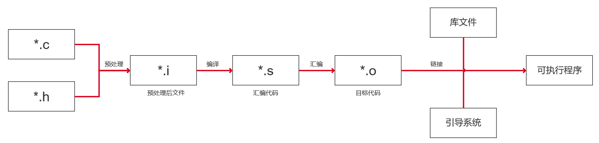
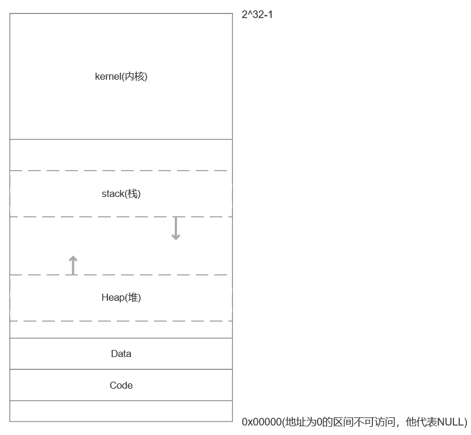

# 面试八股

## c++

### c++程序编译过程



程序经过预处理、编译、汇编、链接成为可执行程序。

**预处理**

- 对全部的#define进行宏展开。
- 处理全部的条件编译指令，比方#if、#ifdef、#elif、#else、#endif;
- 处理 #include 指令，这个过程是递归的，也就是说被包括的文件可能还包括其它文件;
- 删除全部的注释 // 和 /**/
- 加入行号和文件标识
- 保留全部的 #pragma 编译器指令

**编译**

编译会将源代码由文本形式转换成汇编代码，编译过程就是把预处理完的文件进行一系列词法分析、语法分析、语义分析以及优化后生成相应的汇编代码文件。编译后的.s是ASCII码文件。

**汇编**

- 将汇编代码 .s 翻译成机器指令的 .o 或.obj 目标文件。
- 用于将汇编代码转换成机器可以执行的指令，每一个汇编语句几乎都对应一条机器指令。
- 汇编后的.o文件是纯二进制文件。

**链接**

.cpp 文件中的函数引用了另一个 .cpp文件中定义的符号或者调用了某个库文件中的函数。链接是将所有的.o文件和库（动态库、静态库）链接在一起，得到可以运行的可执行文件（Windows的.exe文件或Linux的.out文件）等。链接分为**静态链接**和**动态链接**。

### 静态链接和动态链接

**静态链接**：把目标程序运行时需要调用的函数代码直接链接到了生成的可执行文件中，程序在运行的时候不需要其他额外的库文件，且就算你去静态库把程序执行需要的库删掉也不会影响程序的运行，因为所需要的所有东西已经被链接到了链接阶段生成的可执行文件中。静态库windows以.lib结尾Linux以.a结尾。

**动态链接**：代码被放到动态链接库或共享对象的某个目标文件中，链接程序只是在最终的可执行程序中记录了共享对象的名字等一些信息。在程序执行时，动态链接库的全部内容会被映射到运行时相应进行的虚拟地址的空间。程序在执行阶段需要去寻找相应的函数代码，即在程序运行时才会将程序安装模块链接在一起。在Windows下以.dll为后缀，Linux下以.so为后缀。

**两者对比**：静态链接：浪费空间，每个可执行程序都会有目标文件的一个副本，这样如果目标文件进行了更新操作，就需要重新进行编译链接生成可执行程序（更新困难）；优点就是执行的时候运行速度快，因为可执行程序具备了程序运行的所有内容。

动态链接：节省内存、更新方便，但是动态链接是在程序运行时，每次执行都需要链接，相比静态链接会有一定的性能损失。

查找包

```
find /usr/lib /lib -name "xxx.so"
```


### 内存布局

从高地址到低地址，一个程序由 内核空间、栈区、堆区、BSS段、数据段（data）、代码区组成。

常说的C++ 内存分区：栈、堆、全局/静态存储区、常量存储区、代码区。

可执行程序在运行时会多出两个区域：

- 栈：存放函数的局部变量、函数参数、返回地址等，由编译器自动分配和释放。栈从高地址向低地址增长。是一块连续的空间。栈一般分配几M大小的内存。
- 堆：动态申请的内存空间，就是由 malloc 分配的内存块，由程序员控制它的分配和释放，如果程序执行结束还没有释放，操作系统会自动回收。堆从低地址向高地址增长。一般可以分配几个G大小的内存。
- 在堆栈之间有一个 共享区（文件映射区）。
- 全局区/静态存储区（.BSS 段和 .data 段）：存放全局变量和静态变量，程序运行结束操作系统自动释放，在 C 语言中，程序中未初始化的全局变量和静态变量存放在.BSS 段中，已初始化的全局变量和静态变量存放在 .data 段中，C++ 中不再区分了。常量存储区（.data 段）：存放的是常量，不允许修改，程序运行结束自动释放。
- 代码区（.text 段）：存放程序执行代码的一块内存区域。只读，不允许修改，但可以执行。编译后的二进制文件存放在这里。代码段的头部还会包含一些只读的常量，如字符串常量字面值（注意：const变量虽然属于常量，但是本质还是变量，不存储于代码段）



### 堆和栈的区别

- 申请方式：栈是系统自动分配，堆是程序员主动申请。
- 申请后系统响应：分配栈空间，如果剩余空间大于申请空间则分配成功，否则分配失败栈溢出；申请堆空间，堆在内存中呈现的方式类似于链表（记录空闲地址空间的链表），在链表上寻找第一个大于申请空间的节点分配给程序，将该节点从链表中删除，大多数系统中该块空间的首地址存放的是本次分配空间的大小，便于释放，将该块空间上的剩余空间再次连接在空闲链表上。
- 栈在内存中是连续的一块空间（向低地址扩展）最大容量是系统预定好的，堆在内存中的空间（向高地址扩展）是不连续的。
- 申请效率：栈是有系统自动分配，申请效率高，但程序员无法控制；堆是由程序员主动申请，效率低，使用起来方便但是容易产生碎片。
- 存放的内容：栈中存放的是局部变量，函数的参数；堆中存放的内容由程序员控制。

此题总结：

1、申请方式的不同。 栈由系统自动分配，而堆是人为申请开辟;

2、申请大小的不同。 栈获得的空间较小，而堆获得的空间较大;

3、申请效率的不同。 栈由系统自动分配，速度较快，而堆一般速度比较慢;

4、 存储的内容不同。

栈在函数调用时，第一个进栈的是主函数中后的下一条指令（函数调用语句的下一条可执行语句）的地址，然后是函数的各个参数，在大多数的C编译器中，参数是由右往左入栈的，然后是函数中的局部变量。注意静态变量是不入栈的。 当本次函数调用结束后，局部变量先出栈，然后是参数，最后栈顶指针指向最开始存的地址，也就是主函数中的下一条指令，程序由该点继续运行。

堆：一般是在堆的头部用一个字节存放堆的大小。堆中的具体内容由程序员安排。

### 左值右值

左值和右值是针对表达式而言的，左值是指表达式执行结束后依然存在的持久对象，右值 是指表达式执行结束后就不再存在的临时对象。

能对表达式取地址的，称为左值；不能取地址的，称为右值。 在实际使用过程中，字面值常量、匿名对象（临时对象）、匿名变量（临时变量），都称为右值。右值又被称为即将被销毁的对象。

```c++
//非const引用尝试绑定
int & r1 = a;
int & r2 = 1;//ERROR 

//const引用尝试绑定
const int & r3 = 1;
const int & r4 = a;
```

非const左值引用只能绑定到左值，不能绑定到右值，也就是非const左值引用只能识别出左值。
const左值引用既可以绑定到左值，也可以绑定到右值，也就是表明const左值引用不能区分左值还是右值。

c++11提出了右值引用，右值引用不能绑定到左值，但可以绑定到右值，也就是右值引用能够识别出右值。右值引用既可以是左值（比如：作为函数的参数、有名字的变量），也可以是右值（函数的返回类型）。

应用场景：有了右值引用后，就可以显示定义移动构造函数和移动赋值函数。传统的拷贝构造和赋值函数需要先申请内存再复制，这样效率较低。引入移动构造和移动赋值函数后就可以省去复制的操作，直接“窃取”源对象的资源指针。

### std::move和std::forward

`std::move`函数可以无条件地把对象转为右值引用，让编译器可以调用移动构造/移动赋值。`std::move` 本身不移动数据，只是个**类型转换**。真正的移动动作发生在调用移动构造/赋值函数时。

```c++
#include <iostream>
#include <string>
#include <utility>

int main() {
    std::string s = "hello";
    std::string s2 = std::move(s); // 调用移动构造
    std::cout << "s after move: " << s << "\n"; // s 处于“有效但未定义”的状态
}

```

`std::forward`保持传入参数的“值类别”（左值/右值），把它原封不动地转发给下一个函数。通常和 **万能引用**（`T&&`，也叫转发引用）一起使用。

```c++
#include <iostream>
#include <utility>

void process(int& x) {
    std::cout << "Lvalue reference\n";
}
void process(int&& x) {
    std::cout << "Rvalue reference\n";
}

template<typename T>
void wrapper(T&& arg) {
    process(std::forward<T>(arg)); // 保持原值类别
}

int main() {
    int a = 10;
    wrapper(a);        // 输出: Lvalue reference
    wrapper(20);       // 输出: Rvalue reference
}
```

### RAII技术

RAII技术其本质是利用对象的生命周期来管理资源（内存资源、文件描述符、文件、锁等），因为当对象的生命周期结束时，会自动调用析构函数。

RAII技术具有以下基本特征：

- 在构造函数中初始化资源，或托管资源；
- 在析构函数中释放资源
- 一般不允许复制或赋值
- 提供若然访问资源的方法

利用栈对象的生命周期管理资源，因为栈对象在离开作用域时候，会执行析构函数。

### 深拷贝与浅拷贝

- c++默认的拷贝构造函数是浅拷贝

浅拷贝就是对象的数据成员之间的简单赋值，如你设计了一个类而没有提供它的复制构造函数，当用该类的一个对象去给另一个对象赋值时所执行的过程就是浅拷贝。当数据成员中没有指针时，浅拷贝是可行的；但当数据成员中有指针时，如果采用简单的浅拷贝，则两类中的两个指针将指向同一个地址，当对象快结束时，会调用两次析构函数，而导致指针悬挂现象，所以，此时必须采用深拷贝。

- 深拷贝与浅拷贝的区别就在于深拷贝会在堆内存中另外申请空间来储存数据，而不是一个简单的赋值过程，从而也就解决了指针悬挂的问题。

### string的赋值操作是深拷贝还是浅拷贝

深拷贝，在c++中，std::string的赋值操作是深拷贝，当对一个std::string对象进行赋值操作时，例如：

```c++
std::string str1 = "Hello";
std::string str2;
str2 = str1;
```

这里的赋值操作`str2=str1;`会导致 str2 被赋予 str1 的内容的一个全新副本。这意味着 str2会分配足够的内存来存储 str1 中的所有字符，并将这些字符复制到其新分配的内存中。因此，str1 和 str2 在内存中存储的是不同的字符数组，尽管它们的内容可能相同。

深拷贝确保了赋值操作后，两个 std.string 对象是完全独立的，对其中一个对象的修改不会影响到另一个对象。

相反，浅拷贝(shallow copy)仅复制对象的指针或引用，而不复制所指向的数据本身。这会导致两个对象共享同一块数据，一个对象对数据的修改会影响到另一个对象。幸运的是std:string 的设计避免了这种情况，确保了赋值操作的正确性。

### 什么时候需要重载赋值运算符和拷贝构造函数

重载赋值运算符(operator=)：当一个类需要在对象赋值时执行特定的操作，而不仅仅是简单地复制成员变量的值时，可以重载赋值运算符。这样可以确保赋值操作符按照类的逻辑进行操作，而不是简单地进行浅拷贝。常见的情况包括动态内存分配、资源管理和对象状态的处理重载赋值运算符允许自定义赋值行为。

拷贝构造函数：拷贝构造函数用于创建一个新对象，并将其初始化为已有对象的副本。当对象被传递给函数或作为函数返回值时，拷贝构造函数会被调用。拷贝构造函数的目的是创建一个新对象，并确保该对象与原始对象具有相同的值。如果没有定义拷贝构造函数，编译器会提供个默认的复制构造函数，它会按照成员变量的逐个复制来执行浅拷贝。

### 什么时候会调用拷贝构造函数

1、用一个已经存在的对象初始化另一个新对象

2、当形参是对象，形参与实参进行结合时。

3、当函数的返回值是对象，执行return 语句时。

### 匿名函数

匿名函数定义
```c++
[capture list] (parameter list) -> return type
{
   function body;
};
```

- capture list：捕获列表，指 lambda 所在函数中定义的局部变量的列表，通常为空。

- return type、parameter list、function body：分别表示返回值类型、参数列表、函数体，和普通函数一样。

### 面向对象的三大特性

封装：将具体的实现过程和数据封装成一个函数，只能通过接口进行访问，降低耦合性。

继承：子类继承父类的特征和行为，子类有父类的非 private 方法或成员变量，子类可以对父类的方法进行重写，增强了类之间的耦合性，但是当父类中的成员变量、成员函数或者类本身被 final 关键字修饰时，修饰的类不能继承，修饰的成员不能重写或修改。

多态：多态就是不同继承类的对象，对同一消息做出不同的响应，基类的指针指向或绑定到派生类的对象，使得基类指针呈现不同的表现方式。

### 重载、重写、隐藏

重载：是指**同一可访问区内（例如一个类内）**被声明几个**具有不同参数列（参数的类型、个数、顺序）的同名函数**，根据参数列表确定调用哪个函数，**重载不关心函数返回类型**。

重写(覆盖)：是指派生类中存在重新定义的函数。**函数名、参数列表、返回值类型都必须同基类中被重写的函数一致**，**只有函数体不同**。派生类调用时会调用派生类的重写函数，不会调用被重写函数。重写的基类中被重写的函数**必须有虚函数virtual 修饰**。C++11 引入了 **`override` 关键字**，建议加上，避免写错。

隐藏：是指派**生类的函数屏蔽了与其同名的基类函数**，主要**只要同名函数**，不管参数列表是否相同，基类函数都会被隐藏。**不是多态**，而是编译期名字查找机制。

### 什么是多态

多态：多态就是不同继承类的对象，对同一消息做出不同的响应，基类的指针指向或绑定到派生类的对象，使得基类指针呈现不同的表现方式。在基类的函数前加上 virtual 关键字，在派生类中重写该函数，运行时将会根据对象的实际类型来调用相应的函数。如果对象类型是派生类，就调用派生类的函数；如果对象类型是基类，就调用基类的函数。

实现方法：多态是通过虚函数实现的，虚函数的地址保存在虚函数表中，虚函数表的地址保存在含有虚函数的类的实例对象的内存空间中。

实现过程：

1. 在类中用 virtual 关键字声明的函数叫做虚函数；
2. 存在虚函数的类都有一个虚函数表，当创建一个该类的对象时，该对象有一个指向虚函数表的虚表指针（虚函数表和类对应的，虚表指针是和对象对应）；
3. 当基类指针指向派生类对象，基类指针调用虚函数时，基类指针指向派生类的虚表指针，由于该虚表指针指向派生类虚函数表，通过遍历虚表，寻找相应的虚函数。

### 静态多态和动态多态

**静态多态**：也称为编译期间的多态，编译器在**编译期间完成**的，编译器根据函数实参的类型(可能会进行隐式类型转换)，可推断出要调用那个函数，如果有对应的函数就调用该函数，否则出现编译错误。静态多态主要通过函数重载和模板来实现。函数重载允许在相同的作用域内定义多个名称相同但参数列表不同的函数。在编译时，编译器会根据函数的参数类型和数量来确定调用哪个版本的函数。模板则允许编写通用的代码，并在编译时根据模板参数的具体类型来生成特定类型的代码。这种机制在编译时就确定了函数或类的行为，因此称为静态多态。

**动态多态**（动态绑定）：即运行时的多态，在程序**执行期间**(非编译期)判断所引用对象的实际类型，根据其实际类型调用相应的方法。动态多态主要通过虚函数和虚函数表来实现。在基类中声明虚函数，并在派生类中重写该函数。当通过基类指针或引用来调用虚函数时，会根据对象的实际类型(即运行时类型)来确定调用哪个版本的函数。编译器在编译时插入额外的代码来查找虚函数表并根据对象的虚函数表指针来确定正确的函数地址。这种机制允许在运行时根据对象的实际类型来改变行为，从而实现多态性。

### 虚函数和纯虚函数

虚函数：被 virtual 关键字修饰的成员函数，就是虚函数。

纯虚函数：

- 纯虚函数在类中声明时，加上 =0；
- 含有纯虚函数的类称为抽象类（只要含有纯虚函数这个类就是抽象类），类中只有接口，没有具体的实现方法；
- 继承纯虚函数的派生类，如果没有完全实现基类纯虚函数，依然是抽象类，不能实例化对象。

### 虚函数和虚继承的实现

虚函数的实现主要依赖两个关键概念：虚函数表和虚函数表的指针

**虚函数表**(Virtual Table，简称 vtbl)：每个包含虚函数的类都会生成一个虚函数表。这个表是一个地址表，存储了类中所有虚函数的地址。
**虚函数表的指针**(Virtual Table Pointer，简称 vptr)：每个包含虚函数的类的对象都会包含一个指向其所属类的虚函数表的指针。这个指针通常放在对象内存的最前面。

当通过父类指针或引用来调用虚函数时，程序会首先通过 vptr 找到虚函数表，然后查找并调用对应的虚函数。这样，即使指针或引用实际上指向的是子类对象，也可以正确地调用子类的虚函数实现。

例子：

```c++
class Base {
public:
    virtual void show() { cout << "Base::show\n"; }
};

class Derived : public Base {
public:
    void show() override { cout << "Derived::show\n"; }
};
```

**虚函数表**是编译器为每个包含虚函数的类生成的一张表。里面存放着**该类的虚函数的实际地址**。每个类的虚函数表是**静态生成的**，在编译时确定。

```ini
#Base的虚函数表
vtable_Base = { &Base::show }
#Derived的虚函数表
vtable_Derived = { &Derived::show }
```

每个对象（如果它的类有虚函数）中，都会有一个 **隐藏的成员变量**，指向该类对应的虚函数表，这个指针称为**虚表指针（vptr）**。`vptr` 在对象构造时由编译器自动设置。

```c++
Base b; // b对象里的vptr->vtable_Base
Derived d; // d对象里的vptr->vtable_Derived
```

基类指针如何调用派生类函数

```c++
Base* p = new Derived();
p->show();
```

`p` 是一个 **基类指针**，但它实际指向一个 `Derived` 对象。

`p->show()` 不是直接调用 `Base::show`，而是：

- 编译器生成代码：取出 `p` 对象里的 **vptr**；
- 根据 `vptr` 找到对应的虚函数表；
- 从虚函数表里取出 `show` 的函数地址；
- 跳转到该地址执行函数。

因为 `p` 指向的是 `Derived` 对象，所以它的 `vptr` 指向 `vtable_Derived`，因此调用的是 `Derived::show`。

### 虚函数表的作用和存储的地址

虚函数表是 C++中用于支持动态多态性的数据结构。它存储了类中所有虚函数的地址，并关联到类的一个实例上。每个有虚函数的类(包括从有虚函数的类继承而来的类)都会有一个虚函数表。虚函数表的地址通常存储在对象的内存布局中的固定位置，可以通过对象的指针或引用来访问。

### 虚函数表里存放的内容是什么时候写进去的

虚函数表里的内容是在编译阶段确定的。编译器会遍历类的继承层次结构，找出所有的虚函数并将它们的地址按照一定顺序存放到虚函数表中。每个类对象都包含一个指向其类对应虚函数表的指针，这个指针是在对象构造时由编译器自动设置的。

### 为什么要将析构函数写成虚函数

析构函数一般写成虚函数是为了确保当通过基类指针或引用来删除派生类对象时，能够正确调用派生类的析构函数，从而避免资源泄露和未定义行为。如果不将析构函数声明为虚函数，那么在删除派生类对象时，只会调用基类的析构函数，派生类的析构函数不会被调用，这可能导致派生类特有的资源(如动态分配的内存、打开的文件句柄等)无法被正确释放。

### public继承和private继承

**public继承**

继承方式：
	基类的 **public 成员** → 仍然是派生类的 **public 成员**；
	基类的 **protected 成员** → 仍然是派生类的 **protected 成员**；
	基类的 **private 成员** → 派生类不可直接访问。
语义：`is-a` 关系（“派生类是一个基类”）。
常见用途：面向对象的 **接口复用**。
例子：

```c++
class Animal {
public:
    void eat() { cout << "Eating\n"; }
};

class Dog : public Animal { // Dog 是一个 Animal
public:
    void bark() { cout << "Barking\n"; }
};

int main() {
    Dog d;
    d.eat();   // OK
    d.bark();  // OK
}
```

**private继承**

继承方式：基类的 **public / protected 成员** → 在派生类中都变为 **private**；基类的 **private 成员** → 派生类不可直接访问。

语义：`is-implemented-in-terms-of` 关系（“派生类通过基类实现，而不是基类的一种”）。

常见用途：一种特殊的 **实现复用** 技术（类似组合，但比组合更紧密）。

```c++
class Engine {
public:
    void start() { cout << "Engine started\n"; }
};

class Car : private Engine { // Car 不是 Engine，而是通过 Engine 实现
public:
    void drive() {
        start(); // Car 内部可以用 Engine 的功能
        cout << "Car is driving\n";
    }
};

int main() {
    Car c;
    c.drive();   // OK
    // c.start(); // 错误！Car 用户看不到 Engine 的接口
}

```

### 基类和派生类的构造函数和析构函数的执行顺序

构造函数的执行顺序是从顶层基类开始，逐级向下执行，每个类的构造函数负责初始化自己的成员变量和执行自己的构造逻辑。
析构函数的执行顺序与构造函数相反，从派生类开始，逐级向上执行，每个类的析构函数负责执行自己的清理逻辑。

### c与c++混合编程

在c中调用c++代码和在c++代码中调用c代码，其核心点是名字修饰（Name Mangling）。

**C语言编译器** 不会对函数名做特殊处理，函数名就是符号名。

```c
// C语言中
void hello();
//在目标文件里就是 _hello（不同平台可能略有差异）。
```

**C++编译器** 会对函数名进行 **名字修饰（mangling）**，因为 C++ 支持函数重载、命名空间等。

```c++
//c++中
void hello();
//可能会变成 _Z5hellov 这样的符号。
```

所以，如果不做处理，C 和 C++ **找不到对方的函数符号**，导致链接错误。

**c++调用c代码**

```c
// c_lib.h
#ifndef C_LIB_H
#define C_LIB_H

void c_func(int x);

#endif
```

```c
// c_lib.c
#include <stdio.h>
#include "c_lib.h"

void c_func(int x) {
    printf("C func: %d\n", x);
}
```

```c++
// main.cpp
#include <iostream>

// 关键点：告诉 C++ 编译器用 C 的方式去找符号
extern "C" {
    #include "c_lib.h"
}

int main() {
    c_func(42);
    return 0;
}
```

```bash
gcc -c c_lib.c -o c_lib.o
g++ main.cpp c_lib.o -o main
```

**c调用c++代码**

```c++
// cpp_lib.h
#ifndef CPP_LIB_H
#define CPP_LIB_H

#ifdef __cplusplus
extern "C" {  //告诉c++编译器，被修饰的函数应该用c语言的方式链接，因此不会进行名字修饰
#endif

void cpp_func(int x);

#ifdef __cplusplus
}
#endif

#endif
```

```c++
// cpp_lib.cpp
#include <iostream>
#include "cpp_lib.h"

void cpp_func(int x) {
    std::cout << "C++ func: " << x << std::endl;
}
```

```c
// main.c
#include "cpp_lib.h"

int main() {
    cpp_func(99);
    return 0;
}
```

```bash
g++ -c cpp_lib.cpp -o cpp_lib.o
gcc -c main.c -o main.o
g++ main.o cpp_lib.o -o main   # 必须用 g++ 链接
```

### strcpy、sprintf、memcpy这三个函数的不同之处

**strcpy**

将一个以`'\0'`为结尾的字符串复制到另一个字符串（`\0`也会复制），函数原型：

```c++
char *strcpy(char *dest, const char *src);
```

在使用时必须保证有足够的空间来存储字符串，否则会导致缓冲区溢出，函数本身不会检查目标缓冲区大小。

**sprintf**

格式化字符串并将其存储到指定的缓冲区中，函数原型：

```c++
int sprintf(char *str, const char *format, ...);
```

可以进行格式化，比如整数转字符串、拼接多种类型。写入的结果是 **以 `\0` 结尾的字符串**。同样不检查目标缓冲区大小（**C11 推荐用 `snprintf`**）。

**memcpy**

按字节复制一块内存区域，函数原型：

```c++
void *memcpy(void *dest, const void *src, size_t n);
```

从源地址开始，复制指定数量的**字节数**到目标地址。不关注复制的内容或结构只做简单的复制字节。该函数也不会检查目标缓冲区的大小。

**总结：**

`strcpy` → 只在拷贝字符串时用。

`sprintf` → 需要格式化、拼接各种类型到字符串时用。

`memcpy` → 拷贝任意二进制数据（数组、结构体、缓冲区）时用。

在使用这些函数时，都需要注意目标缓冲区大小，以避免缓冲区溢出或内存虽坏。

### strlen和sizeof的区别

**strlen**用于计算字符串的实际长度，即从字符串的开头到第一个空字符`\0`的位置。这意味着strlen只能用于字符串。

**sizeof**是一个单目运算符，用于计算数据类型或对象所占的空间大小（以字节为单位）。其返回值是字符个数乘以每个字符所占的字节数。

strlen是在**运行时**计算的，sizeof是在**编译时**就能确定。

### 函数指针是什么

函数指针是一个指向函数的指针。在c和c++中，每个函数都有一个地址，函数指针就是存储这个函数地址的变量。例如：

```c
int (*func_ptr)(int,int);
```

这表示`func_ptr`是一个指向函数的指针，这个函数接受两个int类型的参数，并返回一个int类型的值。

### 值传递与地址传递（指针传递）

值传递和指针传递在参数传递时的主要区别在于处理方式和内存管理的不同。

在值传递中，函数的形参是实参的拷贝，即函数内部会创建新的内存空间来存储这个拷贝。这意味着在函数内部对形参的任何修改都不会影响到实参，因为它们是存储在不同内存位置的两个独立变量。值传递是单向的，参数值只能传入函数，不能从函数传出。当函数内部需要修改某些值，并且不希望这个改变影响调用者时，通常使用值传递。

指针传递则不同，它本质上也是值传递，但传递的是变量的地址值，而非变量的实际内容。在函数内部，形参会接收到实参的地址，因此通过形参可以访问和修改实参的值。这是因为地址指向的是同一块内存空间，所以任何对形参的修改都会直接影响到实参。指针传递允许函数修改并返回修改后的值给调用者。

### c++中const关键字的作用

1. 定义常量：可以使用const关键字来声明一个常量，一旦初始化后其值就不能被改变。
2. 常量指针：指针所指向的内容值不能修改，但可以改变指针指向。
3. 指针常量：指针所指向地址固定不能修改，但可以修改指向内容的值。
4. 函数参数：在函数参数中使用const可以确保传递给函数的参数在函数体中不被修改。
5. 类中const数据成员：在类定义中，**const成员变量必须在构造函数的初始化列表中初始化**，并且之后不能被修改。
6. 类中const成员函数：**const成员函数不能修改类的任何成员变量(除非它们被声明为mutable)**。

### c++中static关键字的作用

1. 局部静态变量：当在函数内部声明一个静态局部变量时，该变量的生命周期会持续到程序结束，而不是当函数返回时结束。此外，静态局部变量只初始化一次，而不是每次函数被调用时都初始化。
2. 静态全局变量：当在文件作用域中声明一个静态变量时，该变量作用域被限制再定义它的文件中。这有助于防止全局变量的命名冲突，并隐藏了不需要再其它文件中访问的变量。
3. 静态函数：当在文件作用域中声明一个静态函数时，该函数的作用域被限制在定义它的文件中。静态函数不能在其它文件中通过 extern 声明来访问。
4. 静态数据成员：是 C++中类的一种特殊数据成员，**它属于类本身，而不是类的任何特定对象**。静态数据成员在内存中只占一份空间，并**被该类的所有对象所共享**。每个对象都可以访问这个静态数据成员，且静态数据成员的值对所有对象都是一样的。如果改变它的值，则在各对象中这个数据成员的值都同时改变了。这样可以节约空间，提高效率。
5. 静态成员函数：**静态成员函数只能访问静态成员变量和其他静态成员函数**，而不能直接访问类的非静态成员变量或成员函数。这是因为非静态成员是依赖于对象的，而**静态成员函数可以在没有对象的情况下被调用**。

### class和struct的区别

在C++中，class和struct都可以用来定义类，它们的主要区别体现在成员的默认访问级别上。

1) 默认访问级别：
   对于 class，其成员的默认访问级别是private。这意味着，如果你在 class 中定义了一个成员但没有明确指定其访问级别，那么它将被视为 private 成员，只能在类的内部访问。
   对于struct，其成员的默认访问级别是public。这意味着，如果你在 struct中定义了一个成员但没有明确指定其访问级别，那么它将被视为 pubic 成员，可以在类的外部访问。
2) 继承时的默认访问控制：
   当使用 class 进行继承时，默认的继承方式是 private 继承。当使用 struct 进行继承时，默认的继承方式是 public 继承。
3) 语义上的区别：
   在传统的 C++编程中，class 通常用于定义那些封装了数据并提供了数据操作的类，其中大部分成员是私有的。
   struct则更多地被用作数据结构的定义，其中成员大多是公共的，用于简单地组合数据。

### String的SSO模式

String的SSO(Short String Optimization，短字符串优化)模式是一种针对字符串内存分配的优化策略。其核心思想是在字符串长度较小时，直接在栈上进行内存分配，以减少内存分配和拷贝的开销。具体来说，当字符串的长度小于或等于某个阈值(通常为 15 个字节)时，SSO策略会直接在栈上分配一个小的缓冲区来存储整个字符串。这样，当需要拷贝这样的字符串时只需要复制指针或者少量的数据，而不需要进行复杂的内存分配和拷贝操作。
这种优化策略的主要好处在于提高了小字符串的处理效率，减少了内存管理的开销。然而，当字符串长度超过阈值时，SSO策略将不再适用，此时字符串将采用传统的堆内存分配方式。
需要注意的是，SSO 模式的具体实现可能因编译器和库的不同而有所差异。一些编译器和库可能采用了 SS0 策略来优化字符串处理，而另一些则可能采用其他策略。因此，在实际编程中，了解所使用的编译器和库对字符串的处理方式是非常重要的。
总的来说，SSO 模式是一种针对小字符串的优化策略，通过直接在栈上分配内存来减少内存分配和拷贝的开销，提高了字符串处理的效率。

### c++中的类型转换

大致可分为四大类：静态转换（Static Cast），动态转换（Dynamic Cast），常量转换（Const Cast）和重新解释转换（Reinterpret Cast）。

1. 静态转化：静态转换是最常用的转换方式，用于非多态类型的转换，例如基本数据类型之间的转换、非多态类之间的转换、空指针和整型之间的转换、以及 void*到其他指针类型的转换等。静态转换在编译时进行，不执行任何运行时检查。
   ```c++
   int a = 42;
   double b = static_cast<double>(a);//基本数据类型之间的转换
   ```

2. 动态转换：动态转换主要用于在类继承体系中进行安全的向下和侧向转换。它用于执行运行时类型信息(RTTI)检查，以确保转换的安全性。如果转换不可能成功(例如，将一个基类指针转换为派生类指针，而该基类指针实际上并不指向派生类对象)，则动态转换将返回空指针。
   ```c++
   struct Base { virtual ~Base(){} };
   struct Derived : Base {};
   
   Base* b = new Derived;//基类指针指向派生类对象
   Derived* d = dynamic_cast<Derived*>(b);  // ✅ 成功，基类指针转化为派生类对象指针
   
   Base* b2 = new Base;//基类指针指向基类对象
   Derived* d2 = dynamic_cast<Derived*>(b2); // ❌ 返回 nullptr，基类指针转化派生类指针
   ```

3. 常量转换
   用于增加或去除 `const`、`volatile` 限定符。它允许你修改一个本应为常量的对象或者将一个非常量对象视为常量对象。但是，使用常量转换来修改一个实际上应为常量的对象是不安全的，并且可能导致未定义的行为。

   ```c++
   const int a = 42;
   int* b = const_cast<int*>(&a);//去除const属性，但修改*b是不安全的
   ```

4. 重新解释转换
   最“强硬”的类型转换，用于在 **二进制层面重新解释数据**。几乎可以在不相关的类型之间乱转。可能导致不可移植或未定义行为，用得很少。

   ```c++
   int i = 65;
   char c = reinterpret_cast<char&>(i);  // 强行把 int 当 char
   ```

总结：

1. 静态转换是最常用的转换方式，主要用于非多态类型的转换。
2. 动态转换用于在类继承体系中进行安全的向下和侧向转换，执行运行时类型检查。
3. 常量转换用于添加或删除类型的 const或 volatile 属性，但使用时要小心，避免修改应为常量的对象。
4. 重新解释转换提供了最低级别的转换方式，只是重新解释内存中的位模式，使用时必须格外小心以避免未定义行为。

### 简述malloc和free的实现原理

malloc 和 free 是C语言标准库中用于动态内存分配和释放的函数。它们的实现原理涉及操作系统的内存管理机制以及可能的数据结构来管理已分配和未分配的内存块。

malloc 的实现原理

1. 请求内存大小：malloc函数接受一个参数，表示请求的内存大小(以字节为单位)。
2. 查找空闲内存块:mall0c会维护一个或多个内存池(通常称为堆)，这些内存池包含了可用的(未分配)和已分配的内存块。mal0c会遍历这些内存池，查找一个足够大的空闲内存块来满足请求。
3. 内存块分割：如果找到了一个比请求大小大的空闲内存块，malloc 可能会将其分割成两部分:一部分用于满足当前请求，另一部分保留为新的空闲内存块。
4. 内存块管理：mall0c 通常会为分配的内存块添加一些额外的元数据，如内存块的大小、下一个空闲块的指针等，以便后续的内存分配和释放操作能够高效进行。
5. 返回指针：最后，malloc 返回指向分配的内存块的指针。如果无法找到足够的空闲内存来5)满足请求，malloc 会返回 NULL。

free的实现原理

1. 获取内存块指针：free 函数接受一个指向之前通过 malloc 分配的内存块的指针。
2. 查找内存块：使用传递给 free 的指针，系统会在其维护的内存池结构中查找对应的内存块。这通常涉及遍历内存池，并使用内存块中的元数据来识别正确的内存块。
3. 合并空闲内存块：如果已释放的内存块前后有其他的空闲内存块，free 可能会尝试将这些空闲内存块合并成一个更大的空闲内存块，以提高内存使用效率。
4. 更新内存池状态：free 会更新内存池的状态，标记已释放的内存块为空闲，并可能更新相关的元数据(如空闲块的大小和位置)。
5. 防止悬挂指针：虽然 free 释放了内存，但它并不清除指针本身的值。因此，程序员需要确保在调用 free 后不再使用该指针，以避免悬挂指针(dangling pointer)问题。

### new/delete与malloc/free的区别

new/delete 和 malloc/free 都是 C++ 中用于动态内存管理的操作符和函数，但它们之间存在一些重要的差异。

相同点:

1. 两者都用于在堆上动态分配和释放内存。
2. 在使用完毕后，都需要显式地释放分配的内存，以避免内存泄漏。

不同点:

1. 类型安全性:

   new 和 delete 是C++ 操作符，它们是类型安全的。new 在分配内存时，还会调用对象的构造函数进行初始化;delete 在释放内存时，会调用对象的析构函数进行清理。这确保了对象的状态在生命周期内得到正确的管理

   相比之下，malloc和 free 是C语言的标准库函数，它们在 C++ 中仍然可用，但它们是类型不安全的。malloc 仅仅分配指定大小的内存，并不会调用任何构造函数;free也仅仅释放内存，不会调用析构函数。因此，在使用 malloc和free 时，需要额外注意对象的状态管理。

2. 异常安全性:

   new 操作符在内存分配失败时会抛出 std::bad_alloc 异常，这使得程序员能够更优雅地处理内存分配失败的情况。

   malloc 在内存分配失败时返回 NULL，需要程序员显式地检查返回值以处理错误。

3. 内存对齐:

   new 和 delete 考虑了对象的内存对齐要求，确保对象按照其类型的要求正确地对齐。

   malloc 和 free 则不保证特定的内存对齐，除非明确指定。

4. 效率：

   在某些情况下，malloc和free 可能比 new 和 delete 更快，因为它们不涉及构造函数和析构函数的调用。然而，这种差异通常在现代编译器和优化技术下变得不那么显著。

5. 自定义内存管理

   new 和 delete 可以与自定义的内存分配器一起使用，以实现更复杂的内存管理。

   malloc 和 free 则通常与系统的默认内存分配器一起使用。

### 指针和引用的区别

1. 初始化

   指针不用初始化，但引用必须初始化且初始化后不能再指向其他对象。

2. 内存分配

   指针本身就是变量所以需要为它分配内存空间，引用只是变量的别名不分配额外空间。

3. 空值

   指针可以为nullptr，表示他不指向任何对象。引用不能为空值他必须依托某个对象。

4. 操作

   指针可以进行算数与运算操作指向不同元素，引用则不行。

5. 函数参数

   指针和引用都可用作为函数参数。

6. 返回值

   函数可以返回指针，指向动态分配的内存或堆栈上的对象(但要注意堆栈对象在函数返回后可能不再有效)。
   函数也可以返回引用，但通常用于返回类成员或全局变量的引用。

### 内联函数与宏定义

内联函数和宏定义都是用于优化代码性能的工具，但它们之间存在一些重要的区别：

内联函数:

1. 内联函数是编译器优化的手段，它在编译时将函数体插入到每个调用点，从而避免了函数调用的开销。
2. 内联函数是真正的函数，具有类型检查、作用域、参数列表等特性。
3. 内联函数可以像普通函数一样进行调试。
4. 内联函数如果定义不当，可能会导致代码膨胀，反而降低性能。

宏定义:

1. 宏定义是预处理指令，它在预处理阶段进行文本替换，不经过编译器类型检查。
2. 宏定义没有作用域，定义后在整个文件内都有效(除非使用#undef取消定义。
3. 宏定义可能导致一些难以追踪的错误，比如操作符优先级问题或多次求值问题。
4. 宏定义通常用于定义常量或简单的计算。

### 静态变量什么时候初始化

静态变量的初始化发生在程序开始执行之前，即在 main 函数被调用之前。对于局部静态变量它只会在第一次进入其作用域时进行初始化，之后每次进入该作用域时都不会再次初始化。对于全局静态变量，它在程序加载时就被初始化。

### 拷贝构造函数的调用时机

拷贝构造函数通常在以下几种情况下被调用：

1. 使用一个已存在的对象去初始化一个同类的新对象时。
2. 函数参数是类的对象时，以值传递的方式传递对象。
3. 函数返回值是类的对象时，以值返回的方式返回对象。

### 为什么拷贝构造函数必须传引用不能传值

拷贝构造函数如果传值，那么在调用拷贝构造函数时，会再次调用拷贝构造函数来复制参数，这会导致无限递归。因此，拷贝构造函数通常通过传引用或指针来避免这种情况。而引用可以防止传递过程中的拷贝，确保效率和正确性。

### 模板template

Template 是C++中的一项重要特性，它允许我们编写通用的代码，使得函数、类和数据结构可以在不同的类型上进行操作，从而实现代码的重用和泛化。模板提供了参数化类型的能力可以根据实际需要在编译时生成具体的代码。C++中的模板主要有:函数模板和类模板。使用模板的主要优势是代码的泛化和重用。通过参数化类型，模板可以生成适用于不同类型的代码避免了重复编写相似的代码。模板还提供了类型安全性，因为编译器可以在编译时进行类型检查和错误检查。此外，C++模板还支持模板特化和模板元编程等高级特性。模板特化允许我们为特定的类型提供特定的实现，而模板元编程则允许我们在编译时执行一些计算和逻辑，生成更复杂的代码。模板的代码在编译时进行实例化，因此会增加编译时间和生成的可执行代码的大小。此外，模板的错误信息可能较难理解，因为它们通常在实例化时才会报告错误。因此在使用模板时，要需要注意编写清晰和可读性高的代码，并进行适当的测试和类型检查。

## STL相关

### STL包含哪些内容

容器、算法、迭代器、函数对象、配置器、适配器

### vector的底层实现

vector的底层实现通常是基于动态数组或缓冲区。它使用连续的内存块存储元素，并支持随机vector访问。当元素数量超过当前内存容量时，vector会重新分配更大的内存块，并将原有元素复制到新的内存中。这种方式保证了 vector在尾部添加和访问元素的高效性，但在插入或删除元素时可能需要进行内存的重新分配和数据复制。

### vector和dequeue的区别

vector和 deque 的区别在于内部存储结构和性能特征。vector 是基于动态数组的连续内存块，支持高效的随机访问，但在中间插入/删除元素时效率较低。deque是双端队列，内部由多个分块的连续内存组成，支持高效的两端插入/删除操作，但对随机访问的性能较差。

### vector和list的区别

vector和list的本质区别在于底层数据结构和性能特征。vector使用动态数组实现，支持高效的随机访问，但在插入/删除元素时可能需要进行内存的重新分配和数据复制。list使用双向链表实现，支持高效的插入/删除操作，但对于随机访问的性能较差。

### clear和erase的区别

clear 函数用于清空容器中的所有元素，但不释放容器的内存空间。erase 函数用于从容器中删除指定位置或指定范围的元素，并返回指向下一个有效元素的迭代器。erase 函数可以单个或批量删除元素。

### erase的返回值

erase 函数的返回值是指向删除元素之后的位置的迭代器。如果删除的是最后一个元素，则返回 end()迭代器。如果删除的是多个元素，则返回删除范围的末尾位置的迭代器。如果删除的是单个元素，则返回删除元素的下一个位置的迭代器。

### **序列式容器**

|                              | vector                                                       | deque                                                        | list                                                         |
| ---------------------------- | ------------------------------------------------------------ | ------------------------------------------------------------ | ------------------------------------------------------------ |
| 头文件                       | \#include<vector>                                            | \#include<deque>                                             | \#include<list>                                              |
| 遍历                         | 支持下标和迭代器                                             | 支持下标和迭代器                                             | 只支持迭代器                                                 |
| 底层结构                     | 动态数组（连续内存）                                         | 分段连续的双端队列                                           | 双向链表                                                     |
| 支持随机访问                 | 支持                                                         | 支持                                                         | 不支持                                                       |
| 尾部插入和删除               | push_back与pop_back                                          | push_back与pop_back                                          | push_back与pop_back                                          |
| 头部插入和删除               | 不适用                                                       | push_front与pop_front                                        | push_front与pop_front                                        |
| 中间插入                     | 需要移动大量元素，插入元素导致迭代器失效                     | 所有迭代器失效；引用/指针仍然有效                            | 完美支持                                                     |
| 清空元素                     | clear(清空元素，元素个数为0)与shrink_to_fit(缩减到刚刚好)    | clear(清空元素，元素个数为0)与shrink_to_fit(缩减到刚刚好)    | clear(清空元素，元素个数为0)                                 |
| 获取容器中元素个数和空间大小 | size()和capacity()                                           | size()和capacity()                                           | size()和capacity()                                           |
| 特殊操作                     | 无                                                           | 无                                                           | 排序函数sort，移除重复元素（必须链表本身有序）unique，逆置链表中的元素reverse，合并链表的函数merge，从一个链表转移元素到另一个链表splice |
| 原地构造并插入               | emplace与在 任意位置 插入（需要迭代器）emplace_back（固定在 末尾 插入） | emplace与在 任意位置 插入（需要迭代器）emplace_back（固定在 末尾 插入） | emplace与在 任意位置 插入（需要迭代器）emplace_back（固定在 末尾 插入） |

### STL中vector删除其中的元素迭代器如何变化

当从 vector 中删除元素时，迭代器可能会失效。具体来说，删除元素后，指向被删除元素及其之后元素的迭代器都会失效，因为删除操作可能导致 vector 内部元素的重新排列或内存重新分配。因此，在删除元素后，任何之前获取的迭代器都不应再使用。如果需要继续遍历 vector应该使用新的迭代器或者通过其他方式获取有效的迭代器。

vector 的扩容策略通常是成倍增长，例如当需要更多空间时，可能会将容量翻倍。这种策略可以减少扩容操作的次数，从而提高性能。每次扩容都需要分配新的内存并将现有元素复制到新内存中，这是一个相对昂贵的操作。因此，通过成倍增长容量，可以减少这种操作的频率，从而提高整体性能。

关于释放空间，vector在删除元素时通常不会立即释放其占用的所有内存。这是因为频繁地分配和释放小块内存可能导致性能下降。相反，vector会保留一些额外的容量以应对未来的增长这可以通过成员函数如 shrink to ft 来手动触发释放多余的空间，但请注意这并不保证一定会释放所有额外空间，因为实现可能会保留一些容量以优化性能。

### **关联式容器**

|                | set                                                          | multset                                                      | map                                                          | multmap                                                      |
| -------------- | ------------------------------------------------------------ | ------------------------------------------------------------ | ------------------------------------------------------------ | ------------------------------------------------------------ |
| 底层实现       | 红黑树                                                       | 红黑树                                                       | 红黑树                                                       | 红黑树                                                       |
| 存储元素       | key值                                                        | key值                                                        | key-value 键值对                                             | key-value 键值对                                             |
| 排列顺序       | 升序                                                         | 升序                                                         | key值升序                                                    | key值升序                                                    |
| 关键字是否唯一 | key值唯一                                                    | key值不唯一                                                  | key值唯一                                                    | key值不唯一                                                  |
| 查找函数       | count（返回元素的数目）与find函数（返回查找后的迭代器的位置） | count（返回元素的数目）与find函数（返回查找后的迭代器的位置） | count（返回元素的数目）与find函数（返回查找后的迭代器的位置） | count（返回元素的数目）与find函数（返回查找后的迭代器的位置） |
| 插入元素       | insert，需要判断返回值                                       | insert                                                       | insert，需要判断返回值                                       | insert                                                       |
| 删除元素       | erase删除某个位置元素                                        | erase删除某个位置元素                                        | erase删除某个位置元素                                        | erase删除某个位置元素                                        |
| 修改           | 不支持修改                                                   | 不支持修改                                                   | 不支持修改                                                   | 不支持修改                                                   |
| 下标访问       | 不支持                                                       | 不支持                                                       | 支持                                                         | 不支持                                                       |

### map和set是如何实现的，为什么采用红黑树实现

map 和 set在 STL 中通常使用红黑树来实现。红黑树是一种自平衡的二叉搜索树，它通过对树进行着色和旋转操作来保持树的平衡，从而确保查找、插入和删除操作的时间复杂度为对数级别。

红黑树能够同时实现 map和 set这两种容器，是因为它们都需要存储键值对(对于map)或唯一键(对于set)，并且需要按照键的顺序进行访问。红黑树的特性使得它能够在 O(log n)的时间复杂度内完成这些操作。对于map，键作为红黑树的节点，值则作为节点的附加信息;对于set，键本身就是红黑树的节点。

红黑树保证了元素的顺序性，这对于需要按照特定顺序访问元素的场景非常有用。红黑树的平衡性确保了操作的时间复杂度为对数级别，这在处理大量数据时非常高效相对于哈希表，红黑树不需要计算哈希值，因此可以避免哈希冲突带来的性能开销。相对于链表，红黑树在查找和插入操作上具有更好的性能。

### **无序关联式容器**

无序关联式容器的底层实现使用的是哈希表。

**哈希函数**：是一种根据关键码key去寻找值的数据映射的结构，即：根据key值找到key对应的存储位置。

```c++
size_t index = H(key)
```

**哈希函数构造**

1、直接定址法：  H(key) = a * key + b 

2、平方取中法： key^2 = 1234^2 = 1522756 ------>227 

3、数字分析法：H(key) = key % 10000； 

4、除留取余法：H(key) = key mod p  (p <= m, m为表长)

**哈希冲突**

就是对于不一样的key值，可能得到相同的地址,即:H(key1) = H(key2)

**解决冲突的方法**

链地址法 (推荐使用这种，这也是STL中使用的方法)

**装填因子**

装载因子 a = (实际装载数据的长度n)/(表长m)

 a越大，哈希表填满时所容纳的元素越多，空闲位置越少，好处是提高了空间利用率，但是增加了哈希碰 撞的风险，降低了哈希表的性能，所以平均查找长度也就越长；但是a越小，虽然冲突发生的概率急剧下 降，但是因为很多都没有存数据，空间的浪费比较大，经过测试，装载因子的大小在[0.5~0.75]之间比 较合理，特别是0.75

**四种无序关联容器**

`unordered_set`、`unordered_multiset`、`unordered_map`、`unordered_multimap`

## c++11新特性

### c++11有哪些新特性

C++11引入了许多新的语言特性和库，下面是其中一些我了解并使用过的特性:

- 类型推导：C++11 引入了 auto 关键字，可以根据变量的初始化表达式自动推导出变量的类型。这样可以简化代码，减少类型冗余，并且在使用模板时更加方便。
- 智能指针：C++11引入了unique ptr、shared ptr和weak_ptr等智能指针类型，用于管理动态分配的内存资源。智能指针可以自动处理内存的释放，减少内存泄漏和悬空指针的风险，并提供更安全和方便的内存管理方式。
- lambda 表达式：是一种定义匿名函数的方式，可以在需要函数对象的地方使用，如算法函数、函数对象和回调函数等。lambda 表达式可以简化代码，使得函数对象的定义和使用更加灵活和便捷。
- 范围 for循环：C++11引入了范围 for循环，可以方便地遍历容器或可迭代的对象。范围 for循环可以简化遍历代码的编写，并且提供了更安全和易读的遍历方式。
- 移动语义：C++11 引入了右值引用和移动语义的概念。移动语义允许对象的资源(如动态分配的内存)在移动(如赋值和函数调用)时被转移而不是复制，从而提高性能和效率。
- 初始化列表(Initializer Lists)：C++11 允许使用初始化列表来初始化对象，包括数组、容器和自定义类型等。初始化列表提供了一种简洁和直观的初始化方式，并且可以避免一些初始化相关的问题。

### lambda函数

```c++
[capture](params) opt->returnType{
    body;
}
```

capture是捕获列表，params为参数列表，returnType为返回值类型，body为函数体。

**捕获列表**

`[]`：不捕获任何变量

`[&]`：捕获外部作用域中所有变量，并作为引用在函数体内使用（按引用捕获）。

`[=]`：捕获外部作用域中所有变量，并作为副本在函数体内使用 (按值捕获)，**拷贝的副本在匿名函数体内部是只读的**。

`[=,&foo]`：按值捕获外部作用域中所有变量,并按照引用捕获外部变量 foo。

`[bar]`：按值捕获bar变量，同时不捕获其他变量。

`[&bar]`：按引用捕获bar变量，同时不捕获其他变量。

`[&,bar]`：其他变量按引用捕获，bar变量按值捕获。

`[this]`：捕获当前类的this指针，让lambda表达式拥有和之前类成员相同的访问权限，如果已使用`&`或`=`默认添加此选项。

**参数列表**

和普通函数参数列表一样，如果没有则不用写。

**opt选项**

可以省略。

mutable：可以修改按值传递进来的拷贝。

exception：指定函数抛出的异常。

**returnType返回类型**

可以省略。

**函数体**

不能省略

### 智能指针

`unique_ptr<T>`是一个独占所有权的智能指针：

- 每个unique_ptr拥有一个资源（比如通过 `new` 分配的对象）
- 所有权不能被复制，只能**移动**（使用std::move）
- 当 `unique_ptr` 被销毁时，它会自动 `delete` 所管理的资源

适用于管理需要唯一所有权的资源。

`shared_ptr`就是共享所有权的智能指针，可以进行复制或赋值，但复制或赋值时，并不是真正拷贝对象，而只是将引用计数加1了。**共享所有权**：多个 `shared_ptr` 可以指向同一个对象。

内部通过 **引用计数** 管理资源：

- 创建时计数 +1
- 拷贝构造/赋值时计数 +1
- 析构时计数 -1，若为 0 → 自动释放资源。

适用于多个对象需要共享同一资源的生命周期。

`shared_ptr`会有循环引用的问题，例如：

```c++
struct B; // 前向声明
struct A {
    std::shared_ptr<B> bptr;
};
struct B {
    std::shared_ptr<A> aptr;
};

int main() {
    auto a = std::make_shared<A>();
    auto b = std::make_shared<B>();
    a->bptr = b;
    b->aptr = a;
    // ❌ 循环引用：a 和 b 的引用计数永远不为 0，内存泄漏
}
```

解决方法：使用`weak_ptr`，**弱引用**：不会增加 `shared_ptr` 的引用计数。

`weak_ptr`不能直接访问对象，必须先调用 `lock()` 转为 `shared_ptr`。

- 如果资源还在，返回有效 `shared_ptr`。
- 如果资源已释放，返回空指针。

```c++
struct B; 
struct A {
    std::shared_ptr<B> bptr;
};
struct B {
    std::weak_ptr<A> aptr; // 弱引用，不增加引用计数
};
```

## Linux

### 创建软链接的命令是什么？

```sh
ln -s [target] [link_name]
```

[target] 是要创建软链接指向的目标文件或目标的路径。

[link_name]是新建的软连接的名称或路径。

### /proc文件夹下放的是什么

/proc文件夹是一个特殊的虚拟文件系统，它在Linux系统中用于提供关于运行中进程和系统内核状态的信息。在/proc文件夹下存放着一系列以数字命名的目录和一些他叔文件，这些目录和文件代表系统中运行的进程以及一些系统的状态信息。

**进程信息**：每个运行中的进程都有一个对应的以数字命名的目录，例如/proc/1234，其中1234是进程的PID。在这个目录下可以找到关于进程的各种信息，如命令行参数、环境变量、文件描述符、进程状态等。

**系统信息**：一些特殊文件和目录包含了关于系统硬件和内核状态的信息，如 /proc/cpuinfo 包含了 CPU 的信息，/proc/meminfo 包含了内存的信息，/proc/version 包含了内核版本信息等。

**其他信息**：还有一些其他的文件和目录，提供了一些与进程和系统相关的杂项信息，如proc/cmdline 包含了内核启动参数，/proc/sys 包含了一些系统参数和配置等。

总的来说，/proc 文件夹是一个非常有用的工具，可以用于获取系统状态信息、监控进程活动以及进行系统调优和诊断。

### Linux下有哪些文件类型

在 Linux 系统中，文件类型可以分为以下几种：

**普通文件(Regular File)**：这是最常见的文件类型，包含了文本文件、二进制文件、图像文件等。普通文件可以通过文本编辑器或其他应用程序打开和编辑。

**目录(Directory)：**目录是一种特殊的文件类型，用于组织和存储其他文件和目录。它包含了其他文件和目录的列表。

**符号链接(Symbolic Link)**：也称为软链接，它是一个特殊类型的文件，包含了指向另一个文件或目录的路径。软链接类似于 Windows 中的快捷方式，可以跨文件系统指向不同位置的文件或目录。

**设备文件(Device File)：**设备文件用于与系统中的硬件设备或其他特殊设备进行通信。它们分为字符设备文件和块设备文件两种类型。字符设备文件用于顺序访问设备，如键盘、鼠标等块设备文件用于随机访问设备，如硬盘、闪存驱动器等。

**管道(Named Pipe)：**管道是一种用于进程间通信的特殊文件类型，它允许一个进程将输出发送到另一个进程的输入。

**套接字(Socket)：**套接字也是一种用于进程间通信的特殊文件类型，主要用于网络通信和本地进程间通信。套接字可以在不同计算机之间进行通信，也可以在同一台计算机的不同进程之间进行通信。

这些是在 Linux 系统中常见的文件类型，每种类型都有其特定的用途和特性。

### Linux查看内存、磁盘、端口、进程、线程的命令有哪些

free：显示系统的内存使用情况，包括空闲内存、已用内存等。

top：实时显示系统的资源使用情况，包括内存、CPU 等。

查看磁盘:

df：显示文件系统的磁盘空间使用情况，包括磁盘总容量、已用空间、可用空间等

du: 显示目录或文件的磁盘使用情况，包括该目录下所有文件的磁盘占用情况。

查看端口：

netstat：显示网络状态信息，包括已经建立的连接、监听的端口等。

ss：显示套接字信息，包括已经建立的连接、监听的端口等。

Isof：显示打开的文件和进程信息，可以用来查看网络端口对应的进程。

查看进程：
ps：显示当前运行的进程列表，包括进程的 PID、状态、CPU 使用情况等。

top：实时显示系统的进程列表和资源使用情况，包括 CPU、内存等。

pgrep：根据进程名査找进程的 PID。

查看线程:

ps -eLf：显示所有线程的详细信息,top:在顶部的任务列表中显示线程信息。这些命令可以帮助您监视和管理系统资源、进程和网络连接。

### gdb调试工具

gdb是GNU Debugger的缩写，是一个功能强大的调试工具，用于调试c、c++等程序。以下是gdb的基本使用方法：

启动gdb：

```sh
gdb [可执行文件路径]
```

设置断点：

```sh
break [行号]
```

或者可与i设置某个函数入口：

```sh
break [函数名]
```

运行程序：

```sh
run # r
```

执行程序：

```sh
continue
```

单步执行：

```sh
step
```

下一步执行：

```sh
next
```

查看变量名：

```sh
print [变量名]
```

查看堆栈信息：

```sh
backtrace
```

退出gdb

```sh
quit
```

### 内存泄漏怎么检查，怎么避免？

内存泄漏是指程序在动态分配内存后未能正确释放内存，导致程序持续占用内存而不释放，最终耗尽系统资源的情况。下面是检查和避免内存泄漏的一些方法：

**检查内存泄漏**：
使用内存检査工具：像 Valgrind、AddressSanitizer等工具可以帮助检测内存泄漏，它们会在程序执行时跟踪内存分配和释放情况，并检查是否有未释放的内存块。

```sh
#安装Valgrind
sudo apt install valgrind
#编译程序确保编译程序时加入调试信息 -g选项
g++ -g test.cc -o test
#使用Valgrind运行程序，使用如下指令
valgrind --tool=memcheck --leak-check=full --show-leak-kinds=all --log-file=valgrind_log ./testProgram
```

`--tool=memcheck`：使用memcheck工具检测内存错误。

`--leak-check=full`：全面检测内存泄漏。

`--show-leak-kinds=all`：显示所有类型的内存泄漏信息。

`--log-file=valgrind_log`：将日志信息输出到文件。

**检查代码**：仔细检查代码，确保每次动态分配内存后都有相应的释放操作。尤其要注意在循环或条件分支中的内存释放操作是否正确执行。

**使用 RAII(资源获取即初始化)**：在 C++ 中，使用 RAII管理资源是一种良好的做法。通过使用智能指针、容器等 RAII 类型，可以确保资源在不再需要时自动释放。检查文件描述符、句柄等资源的释放: 除了内存，还要确保其他资源(如文件描述符、网络连接等)在不再使用时正确释放。

**避免内存泄漏**：
正确释放内存: 在使用 malloc、calloc、new 等动态分配内存的地方一定要在不再需要时使用 free、delete 等函数进行释放。

**使用智能指针**：在 C++ 中，尽量使用智能指针(如 std..unique ptr、std.shared ptr)来管理动态分配的内存，以避免手动释放内存时的错误。避免循环引用: 如果使用了智能指针的共享所有权机制(如 std.shared ptr)，要注意避免循环引用，否则可能导致内存泄漏。

**及时释放资源**：及时释放不再需要的资源，尤其是在长时间运行的服务程序中，要确保定期清理资源，避免资源积累导致的内存泄漏。注意异常情况处理: 在发生异常时，要确保及时释放已经分配的资源，以防止异常情况导致的资源泄漏。

通过以上方法，可以有效地检查和避免内存泄漏问题，提高程序的稳定性和可靠性。

### 什么是coredump文件

Core dump 文件（核心转储文件）是在程序异常终止（如段错误、非法操作等）时由操作系统生成的一种文件，用于保存程序异常终止时的内存状态信息。它包含了程序崩溃时的内存映像、堆栈信息、寄存器状态等，可以帮助开发人员分析程序崩溃的原因。

调试 core dump 文件通常使用调试工具，如 GDB (GNU Debugger)。以下是使用 GDB 调试core dump文件的基础步骤：

启动GDB：

在终端中输入以下命令启动GDB，并指定core dump文件和相关的执行文件：

```sh
gdb [可执行文件路径][core dump文件路径]
```

分析堆栈信息：

使用bt命令查看堆栈信息，显示导致程序崩溃的函数调用堆栈：

```sh
bt
```

查看寄存器状态：

使用info registers命令查看寄存器状态，了解程序崩溃时CPU寄存器的值：

```sh
info registers
```

查看变量值：

使用print命令查看待定变量的值，了解程序崩溃变量的状态：

```sh
print [变量名]
```

分析内存映像：

使用x命令查看内存映像，了解程序崩溃时内存的状态：

```sh
x/[长度格式][内存地址]
```

定位问题：

结合堆栈信息、寄存器状态、变量值等信息，分析程序崩溃的原因，并定位代码中可能存在的问题。

通过分析core dump文件，可以在程序崩溃后重新调试程序，帮助开发人员定位和解决程序崩溃问题。

### 零拷贝技术

零拷贝（Zero-Copy）是一种**提高数据传输效率**的技术，主要用于操作系统内核与用户空间之间的数据传输场景。它的核心思想是：**避免数据在内核空间和用户空间之间的多次复制**，通过减少 CPU 的数据搬运开销，提升 I/O 性能。

传统的拷贝流程：以一次 `read` + `write`（从磁盘读数据到用户程序，再通过网络发出去）为例：

1. **磁盘 → 内核缓冲区**：DMA 将磁盘数据拷贝到内核空间的 page cache。
2. **内核缓冲区 → 用户缓冲区**：CPU 将数据拷贝到用户空间。
3. **用户缓冲区 → 内核 socket 缓冲区**：CPU 再次拷贝回内核，用于网络发送。
4. **内核 socket 缓冲区 → 网卡**：DMA 将数据传给网卡，最终发出。

👉 总共发生 **4 次拷贝**（两次 DMA，两次 CPU 拷贝）。CPU 占用率高，效率较低。

零拷贝的优化思路是减少或者消除CPU参与的数据拷贝。

**mmap + write**

通过 `mmap()` 将内核缓冲区直接映射到用户空间，省去 **内核 → 用户** 的一次拷贝。

拷贝次数减少到 **3 次**。

**sendfile**

Linux 提供的 `sendfile()` 系统调用，数据从内核页缓存直接传递到 socket buffer，省去用户空间的拷贝。

### mmap的应用场景有哪些？

`mmap()`(内存映射)是一种将文件或其他对象映射到进程的地址空间的系统调用。它的应用场景非常广泛，包括但不限于以下几个方面:

文件 I/O：mmap() 可以用于文件 IO 操作，将文件映射到进程的地址空间中，使得文件的内容可以直接通过内存访问而无需通过 read/write 等系统调用进行数据传输。这样可以提高文件读写的效率，尤其是对于大文件和频繁读写的文件。

内存共享：多个进程可以使用 `mmap()` 将同一个文件映射到它们各自的地址空间中，实现内存共享。这样可以节省内存空间，减少数据的复制，提高进程间通信的效率。

匿名内存映射： `mmap()`还可以用于创建匿名内存映射区域，即不与任何文件关联的内存映射这种技术通常用于创建共享内存区域，实现进程间通信或共享数据。

高性能计算：`mmap()` 在高性能计算领域中也有广泛的应用，例如在大规模数据处理、数据分析、图像处理等场景中，可以通过内存映射技术实现高效的数据访问和处理。

数据库：许多数据库系统(如 SQLite)使用 mmap()来管理数据库文件，以提高读取和写入数据的性能，并简化文件管理和缓存管理。

总的来说，mmap()是一种强大的系统调用，可以用于各种不同的应用场景，提高系统的性能和效率，简化代码实现。

## 进程和线程

### 进程和线程的区别

线程(Thread)和进程(Process)是操作系统中的两个重要概念，它们之间有以下区别:

**资源分配:**

进程是操作系统进行资源分配和调度的基本单位，每个进程拥有独立的地址空间、文件描述符堆栈等资源。

线程是进程的执行单元，多个线程可以共享同一个进程的地址空间和其他资源，包括堆、全局变量、打开的文件等。

**调度和切换:**

进程之间的切换需要保存和恢复完整的上下文信息，包括内存映像、寄存器状态、打开的文件等，切换成本较高。

线程之间的切换只需要保存和恢复部分上下文信息，如寄存器状态和栈指针等，切换成本较低。

**并发性:**

不同进程之间的并发执行是通过操作系统的时间片轮转调度实现的，进程之间的通信需要使用进程间通信机制(如管道、消息队列、共享内存等)。

同一个进程内的多个线程可以并发执行，线程之间可以直接共享同一进程的地址空间和其他资源，因此线程之间的通信成本较低，可以通过共享内存等机制进行通信。

**资源开销:**

创建和销毁进程的开销比较大，因为需要分配和释放独立的地址空间、文件描述符等资源。

创建和销毁线程的开销相对较小，因为线程共享了进程的地址空间和其他资源，只需要分配和释放线程的栈空间、线程控制块等少量资源。

总的来说，进程和线程都是并发执行的基本单位，但线程比进程更轻量级，具有更低的切换销和更高的并发性，因此在线程间共享数据和协同工作方面更加灵活和高效。然而，线程的共享资源可能会增加编程的复杂性和线程安全的难度，需要开发人员注意并发控制和同步机制的设计。

### 中断与异常的区别

中断(Interrupt)和异常(Exception)是计算机系统中用于处理异常事件的两种机制，它们之间的区别如下：

**引发原因：**
中断是由外部设备或硬件触发的异步事件，例如定时器中断、I/0 设备完成等。异常是由程序执行过程中出现的非预期事件或错误触发的，例如除零错误、内存访问越界等。

**处理方式：**
中断是一种与程序执行异步并发的机制，当中断事件发生时，CPU会立即暂停正在执行的程序，并跳转到相应的中断处理程序进行处理。
异常是在程序执行过程中出现的错误或异常情况，CPU 会立即停止当前指令的执行，并跳转到异常处理程序进行处理。

**处理程序:**

中断处理程序通常是由操作系统或设备驱动程序提供的，用于响应中断事件并执行相应的处理罗辑。
异常处理程序通常是由操作系统或运行时环境提供的，用于捕获和处理程序执行过程中的错误或异常情况。

**优先级:**

中断通常具有不同的优先级，并且可以被屏蔽或禁用，以便系统能够在多个中断事件发生时进行适当的处理。
异常通常是在程序执行过程中即时触发的，其优先级可能较高，并且不能被屏蔽或禁用。

**触发时机:**

中断是由硬件事件或外部设备触发的，并且可以在任何时间发生。
异常是由程序执行过程中的错误或异常情况触发的，通常发生在特定的程序指令执行时。

总的来说，中断和异常都是处理计算机系统中异常事件的重要机制，但它们的引发原因、处理方式、处理程序和触发时机等方面有所不同。理解和处理好中断和异常对于保证系统的稳定性和可靠性至关重要。

### 进程间通信的方式有哪些

进程间通信(Inter-Process Communication，IPC)是不同进程之间进行数据交换和通信的一种机制。常见的进程间通信方式包括以下几种：

**管道(Pipe)：**
管道是一种半双工的通信方式，用于在父进程和子进程之间进行通信。它是一种单向通信机制父进程可以向管道中写入数据，子进程可以从管道中读取数据，反之亦然。
命名管道(Named Pipe)：命名管道是一种特殊的管道，它允许不相关的进程之间进行通信。与普通管道不同，命名管道在文件系统中有一个路径名，并且可以在多个进程之间共享数据。

**消息队列(Message Queue)：**
消息队列是一种通过消息传递进行通信的方式，允许进程之间发送和接收消息，每个消息都有个特定的类型和长度，接收进程可以选择性地接收特定类型的消息。

**信号量(Semaphore):**
信号量是一种用于进程间同步和互斥的机制。它可以用来控制多个进程对共享资源的访问，防止竞态条件和数据不一致问题。

**共享内存(Shared Memory)：**
共享内存是一种让多个进程共享同一块内存空间的方式使得它们可以直接读写共享内存区域而无需进行数据复制。共享内存是一种高效的进程间通信方式，但需要额外的同步机制来保证数据的一致性和完整性。

**套接字(Socket):**
套接字是一种通用的进程间通信机制，用于在网络上进行通信。它可以用于在同一台主机上的不同进程之间进行通信，也可以用于在不同主机上的进程之间进行通信。

**信号(Signal)：**
信号是一种异步通信机制，用于向进程发送各种事件通知。进程可以注册信号处理函数来处理收到的信号，以便进行相应的处理。

以上是常见的进程间通信方式，每种方式都有其适用的场景和特点，开发人员可以根据具体的需求选择合适的进程间通信方式。

### 线程间通信的方式有哪些

线程间通信(Thread Communication)是多线程编程中的重要概念，用于实现不同线程之间的数据共享和同步。常见的线程间通信方式包括以下几种：

**共享内存**：
多个线程可以共享同一块内存区域，通过读写共享内存来进行通信。但需要注意线程之间的竞态条件和数据一致性问题，需要使用互斥锁、读写锁等同步机制来保护共享内存的访问。

**互斥锁(Mutex)**：
互斥锁是一种用于多线程编程中的同步机制，用于保护共享资源的访问，防止多个线程同时访问共享资源导致的数据竞争和数据不一致问题。线程在访问共享资源之前需要先获取互斥锁，访问完成后释放互斥锁。

**条件变量(Condition Variable)：**
条件变量是一种同步机制，用于在线程之间进行通信和同步。它通常与互斥锁一起使用，当共享资源的状态满足特定条件时，线程可以通过条件变量等待通知，当条件不满足时，线程可以通过条件变量等待在条件上。当条件满足时，其他线程可以通过条件变量发送信号来通知等待的线程。

**信号量(Semaphore)**：
信号量是一种计数器，用于多线程编程中的同步和互斥。它可以控制同时访问共享资源的线程数量，防止资源的过度使用和竞争。线程可以通过信号量进行等待和释放，当信号量计数大于零时，线程可以继续执行，否则线程将被阻塞等待。

**屏障(Barrier)**：
屏障是一种同步机制，用于在多线程编程中实现多个线程的同步点。当所有线程到达屏障点时它们将被阻塞，直到所有线程都到达后才能继续执行。屏障可用于实现线程间的同步和协调。

**消息队列(Message Queue)**：
消息队列是一种线程间通信的方式，用于在多个线程之间发送和接收消息。每个线程都可以通过消息队列发送消息，其他线程可以从消息队列中接收消息，并根据消息的内容执行相应的操作。

以上是常见的线程间通信方式，每种方式都有其适用的场景和特点，开发人员可以根据具体的需求选择合适的线程间通信方式。

### 同步、异步和阻塞、非阻塞

- 同步和异步是指程序的执行方式。同步指的是调用者发出一个请求，被调用者进行处理，处理完毕后返回结果给调用者，期间调用者会一直等待;而异步则是调用者发出请求后不等待，而是继续执行其他操作，被调用者在处理完毕后通知调用者或者通过回调函数来处理结果。
- 阻塞和非阻塞则是指调用者在等待结果时的状态。阻塞是指调用者在等待结果时会被挂起，不能执行其他操作;非阻塞则是指调用者在等待结果时仍然可以执行其他操作，不会被挂起。

### 进程的状态

- 新建(New):进程被创建但尚未执行。
- 就绪(Ready):进程已经准备好执行，但还未开始执行。
- 运行(Running):进程正在执行。
- 阻塞(Blocked):进程因等待某事件而暂停执行。
- 终止(Terminated):进程执行完毕。

### 什么是孤儿进程？什么是僵尸进程？怎么避免僵尸进程？

- 孤儿进程是指父进程退出，而子进程还在运行的进程。解决方法是让子进程被init进程接管。
- 僵尸进程是指进程已经终止，但其父进程尚未对其进行善后处理，导致其占用系统资源。解决方法是父进程调用 wait 或 waitpid 函数来等待子进程的终止，并处理子进程的退出状态。

### 写时拷贝

写时拷贝是一种内存管理技术，用于在多进程共亨内存时节省内存开销。当多个进程共亨同一块内存时，只有当其中一个进程试图修改这块内存时，系统才会进行实际的拷贝操作，以确保每个进程拥有自己的独立副本。

### 自旋锁

自旋锁是一种同步机制，用于保护共享资源，避免多个线程同时访问导致数据不一致。当一个线程尝试获取自旋锁时，如果锁已被其他线程持有，该线程不会被挂起，而是直循环等待，直到获取到锁为止。

### 什么是死锁？死锁产生的条件？怎么解决死锁问题？

死锁是指多个进程或线程因竞争资源而造成的相互等待的状态。死锁产生的条件包括互斥、占有且等待、不可抢占和循环等待。解决方法包括资源预分配、破坏环路、加锁顺序等。

## 网络编程

### 简述七层模型和四层模型模式

- 七层模型是指 OS 参考模型，包括物理层、数据链路层、网络层、传输层、会话层、表示层和应用层，每一层都有特定的功能和责任。
- 四层模型是指 TCP/IP 参考模型，包括网络接口层、网络层、传输层和应用层，它对应了 OS 模型中的数据链路层、网络层、传输层和应用层。

### 七层模型每层的协议

数据链路层：实现节点之间的数据传输，如 ARP、PPP

网络层：实现数据在网络中的传输和路由选择，如IP、ICMP

传输层：提供端到端的数据传输服务，如 TCP、UDP

会话层：管理应用之间的会话，如TLS、SSL

表示层：处理数据的表示格式，如 JPEG、ASCII。

应用层：提供应用程序与网络通信的接口，如 HTTP、FTP

### 请描述一下从输入URL到显示页面的全过程

- DNS 解析：将 URL 解析为 IP 地址。
- TCP 连接：通过建立 TCP 连接与服务器进行通信。
- HTTP 请求：发送 HTTP 请求给服务器。
- 服务器处理请求：服务器接收到请求后处理并返回响应。
- 浏览器渲染：浏览器接收到响应后解析并渲染页面。

### 简述socket编程的流程

- 创建 socket：调用 socket 函数创建一个套接字。
- 绑定地址：将套接字绑定到一个地址上。
- 监听连接：如果是服务器端，调用 listen 函数监听连接请求。
- 接受连接：如果是服务器端，调用 accept 函数接受客户端的连接请求。
- 发送和接收数据：通过 send 和 recv 函数发送和接收数据。
- 关闭连接：使用 close 函数关闭连接。

### write阻塞的原因有哪些

接收缓冲区满：当接收方的接收缓冲区已满时，写操作被阻塞，直到接收方读取数据释放空间。

网络拥塞：当网络拥塞时，发送数据可能会被阻塞，直到网络状态改善。

### 多路复用：select、poll、epoll的区别？epoll的底层如何实现的？

select和poll采用轮询的方式来处理多个文件描述符，效率低下。

epoll使用事件通知的方式，当文件描述符就绪时，内核就会通知应用程序，效率较高。

epoll底层采用红黑树来管理文件描述符，通过事件注册和就绪列表来实现高效的I/O多路复用。

### epoll触发模式

epoll有两种触发模式：水平触发和边缘触发。

**水平触发：**默认情况就是水平触发，只要文件描述符上面的事件条件存在就会不断的通知你，比如一个套接字的接收缓冲区有数据没读完，`epoll_wait` 会持续返回该事件。会重复通知，可能增加系统调用的次数。

**边缘触发：**通过`EPOLL`标志开启。只有状态发生变化时才通知一次。比如套接字缓冲区从空到有数据他会触发一次，即使你没有一次性把数据读完他也不会再通知你。所以边缘触发需要配合非阻塞`read()`或`wirte()`使用。因为如果没有数据可以读或者没有空间写`read()`或`write()`就会阻塞等待有数据来或者有空间，程序就会卡在这里。当设置成非阻塞时，没有数据读或空间写`read()`或`write()`会立即返回 `-1` 并设置 `errno = EAGAIN`，这时你才知道“当前数据读/写完了”，可以安全退出循环，等待下次事件。

```c++
int flags = fcntl(fd, F_GETFL, 0);
fcntl(fd, F_SETFL, flags | O_NONBLOCK);//设置非阻塞
// ET 模式下，必须循环读取，直到 EAGAIN
while (1) {
    ssize_t n = read(fd, buf, sizeof(buf));//如果设置阻塞，没有数据读时会卡在这里
    if (n > 0) {
        // 处理数据
    } else if (n == 0) {
        // 对端关闭
        close(fd);
        break;
    } else {
        if (errno == EAGAIN || errno == EWOULDBLOCK) {
            // 数据读完，退出循环
            break;
        } else {
            // 其他错误
            close(fd);
            break;
        }
    }
}
```

### 调用send函数发送数据不全怎么办

可以循环发送数据直到发送完为止。

可以检查send函数的返回值，判断实际发送字节数，然后继续发送未发送的数据。

### TCP和UDP的区别

TCP是面向连接的可靠传输协议，提供数据的可靠性和顺序性，适用于需要可靠传输的场景。UDP是面向无连接的不可靠传输协议，不保证数据的可靠性和顺序性，适用于实时性要求高的场景。

TCP提供流式传输，数据没有边界；而UDP提供数据包传输，数据有边界。

### TCP粘包问题

粘包问题是指，发送方连续发送的数据到达接收方时被粘在一起，导致接收方无法正确解析数据。解决方法包括使用消息边界（例如在消息头部字段添加消息长度信息）、使用特定分隔符（如`\r\r`）等。

### 三次握手与四次挥手

**三次握手：**

第一次握手：客户端向服务器发送SYN报文，进入SYN_SEND状态。

第二次握手：服务器收到SYN报文后，返回SYN+ACK报文给客户端，并进入SYN_RECV状态。

第三次握手：客户端收到SYN+ACK报文后，发送ACK报文给服务器，双方进入ESTABLISHED状态。


**四次挥手：**

第一次挥手：客户端发送FIN报文给服务器，并进入FIN_WAIT_1状态。

第二次挥手：服务器接收到FIN报文后，发送ACK报文给客户端，进入CLOSE_WAIT状态。

第三次挥手：服务器发送FIN报文给客户端，进入LAST_ACK状态。

第四次挥手：客户端收到FIN报文后，发送ACK报文给服务器，双方进入CLOSED状态。

### TCP的超时重传机制

TCP的超时机制是为了监测连接是否断开，以及重传丢失的数据。超时机制包括重传超时(RTO)、持续超时等。

### 三次握手的真正目的

确认双方的通信能力：通过三次握手，客户端和服务器可以确认彼此的通信能力，包括双方是否能够收发数据包、是否能够正确处理数据包等。

同步双方的初始序列号：在 TCP 协议中，序列号用于标识每个数据包的顺序和唯一性。在三次握手的过程中，双方会交换初始序列号(Sequence Number)，以便后续的数据传输能够正确地按序进行。

协商 TCP 连接参数：除了确认通信能力和同步序列号外，三次握手还可以用于协商 TCP 连接的一些参数，如窗口大小、最大报文长度等，以便双方可以在连接建立后进行更高效的数据传城。

### 为什么TIME_WAIT状态需要经过2MSL才能返回到CLOSE状态

TIME_WAIT 状态是为了确保最后一个 ACK 报文能够到达，以防止对端收到了最后一ACK后立即关闭连接，导致连接未完全关闭。2MSL(Maximum Segment Lifetime)是为了确保网络中所有的报文都已经消失，以防止新的连接误认为是之前的连接。

### 如何根据IP获取对方的MAC地址

可以使用 ARP(Address Resolution Protocol)协议来根据 IP 地址获取对应的 MAC 地址，发送 ARP 请求广播包，然后接收对方的 ARP 应答。

### http和htttps的区别

HTTP 是超文本传输协议，数据传输是明文的，不安全;而HTTPS是在 HTTP 的基础上加入了 SSL/TLS加密传输，数据传输是加密的，更安全。

HTTP 默认端囗号是 80，而 HTTPS默认端囗号是 443。

## 数据结构与算法

###  链表

#### 红黑树的思想，红黑树的特点，红黑树和平衡二叉树的区别？红黑树的查找为什么市O（logN）？

红黑树是一种自平衡的二叉查找树，它在每个节点上增加了一个额外的表示节点颜色的属性(红色或黑色)，并且满足一定的性质来确保树的平衡性。红黑树的特点包括:节点颜色: 每个节点要么是红色，要么是黑色。

- **根节点:** 根节点是黑色的。
- **叶子节点(NIL 节点):** 叶子节点是指树的最底层，且不包含任何数据的节点。红黑树中的叶子节点通常被表示为 NIL 节点，并且是黑色的。
- **红色节点特性:** 红色节点的父节点和子节点必须为黑色。
- **黑色节点特性:** 从根节点到叶子节点的每条路径上，黑色节点的数量必须相同。

红黑树和平衡二又树的区别在于:平衡二叉树要求左右子树的高度差不能超过1，因此可能需要进行更频繁的旋转和调整来保持平衡，而红黑树通过限制节点的颜色和路径上的黑色节点数量来实现自平衡。红黑树的插入和删除操作相对平衡二叉树更加高效。

红黑树的查找复杂度为 O(logn)，这是因为红黑树是一种近似平衡的二叉查找树，它保证了从根节点到叶子节点的最长路径的长度不超过最短路径的两倍。因此，红黑树的高度最多是对数级别的。在红黑树中，查找操作从根节点开始，每次比较将搜索空间减半，因此查找的时间复杂度是 O(logn)。

#### 负载均衡算法

轮询(Round Robin): 将请求依次分配给每台服务器，按照事先设定的顺序轮流进行分配。优点是简单、均匀，适用于负载相对均衡的情况。

加权轮询(Weighted Round Robin): 在轮询的基础上，给每台服务器设置一个权重值，根据权重值的大小决定分配请求的比例。可以根据服务器的性能和负载情况动态调整权重值，以实现更灵活的负载均衡。

随机(Random): 随机选择一台服务器来处理每个请求。优点是简单，适用于负载较为均匀的情况，但不太适合对服务器性能要求较高的场景。

最少连接(Least Connections): 将请求分配给当前连接数最少的服务器。适用于处理连接持续时间不同的情况，能够有效地均衡负载，但需要实时统计每台服务器的连接数。

IP 哈希(IP Hash): 根据请求的 IP 地址进行哈希计算，将同一个IP 地址的请求始终分配给同台服务器。适用于需要保持会话一致性的场景，如用户登录状态。

#### 海量数据Top K问题

解决海量数据 Top K问题的一种常见方法是使用堆(Heap)。具体步骤如下:构建一个大小为 K的小顶堆(或者大顶堆)，堆中存放当前找到的前 K个元素。遍历数据集，将每个元素与堆顶元素进行比较:如果当前元素比堆顶元素大(或者小，取决于是找出最大还是最小的 K个元素)，则将堆顶元素替换为当前元素，并对堆进行一次调整，以保持堆的性质。

如果当前元素比堆顶元素小(或者大)，则不做任何操作。

最终堆中剩余的 K个元素就是所要找到的 Top K元素。

#### 有损压缩和无损压缩算法

无损压缩算法:
无损压缩算法是指通过压缩数据，使其占用的存储空间更小，但压缩后的数据能够完全还原为京始数据，不会丢失任何信息。因此，无损压缩适用于那些要求数据完整性和精确性的场景，如文本文件、程序代码等。常见的无损压缩算法有：
Huffman 编码: 通过构建变长编码表，将频率较高的字符用较短的编码表示，从而实现压缩。
Lempel-Ziv 算法系列(如 LZ77、LZ78、LZW 等): 利用字符串重复出现的特点，使用短的代号来表示长字符串，从而实现压缩。
Run-Length Encoding(RLE): 将连续出现的重复字符序列用一个字符和其重复次数来表示以减少重复字符的存储量。

有损压缩算法:
有损压缩算法是指通过舍弃部分数据的精确信息，以换取更高的压缩率。因此，有损压缩压缩后的数据不能完全还原为原始数据，可能会产生一定程度的信息损失。有损压缩适用于那些对数据的精确性要求不是特别高的场景，如音频、视频、图像等。常见的有损压缩算法有：
JPEG:用于压缩图像文件的有损压缩算法，通过去除图像中的高频信息和颜色信息的精度来实现压缩。
MP3: 用于压缩音频文件的有损压缩算法，通过去除音频中的听觉上不敏感的频率和声音的精度来实现压缩。
H.264/AVC: 用于压缩视频文件的有损压缩算法，通过去除视频中的冗余信息、运动信息和空间信息的精度来实现压缩。

无损压缩和有损压缩算法各有其适用的场景，选择合适的压缩算法取决于数据的特点和应用需

#### 三个有序序列查找公共部分

要查找三个有序序列的公共部分，你可以采用归并排序中合并两个有序序列的思想。具体来说你可以使用三个指针分别指向三个序列的起始位置，然后逐步比较并移动这些指针来找到公共的元素。

```c++
#include <iostream>
#include <vector>
std::vector<int> findCommonElements(const std::vector<int>& arr1,const std::vector<int>& arr2,const std::vector<int>& arr3){
	std::vector<int> commonElements;
	int i=0, j=0, k=0:
	int n1=arr1.size(),n2 =arr2.size(),n3 = arr3.size();
	while (i< n1 &&j< n2 && k< n3){
		if (arr1[i] == arr2[] && arr2[i] == arr3[k]){
		commonElements.push back(arr1[i]);
			i++
			j++
			K++
		}else if (arr1[i] < arr2[]){
			i++;
		}else if (arr2[] < arr3[k]) {
			j++;
		}else {
			k++;
        }
    }
	return commonElements;
}
int main() {
    std::vector<int> arr1={1,3,5,7,9};
    std::vector<int> arr2 ={2,3,4,7,10}
    std::vector<int> arr3 ={3,6,7,8,11}
    std::vector<int> common = findCommonElements(arr1,arr2,arr3);
    std::cout << "Common elements are: "
    for(int num :common){
    	std:cout << num << " "
    }
       std:cout << std:endl;
	return 0;
}
```

#### 合并两个有序数组或链表

```c++
#include<iostream>
#include<vector>
using namespace std;
using std::vector;

vector<int> mergeArray(const vector<int>& arr1,const vector<int>& arr2){
    int i=0, j=0;
    int len1 = arr1.size();//5
    int len2 = arr2.size();//7
    vector<int> mergeArray;
    while(i < len1 && j < len2){
        if(arr1[i]<=arr2[j]){
            mergeArray.push_back(arr1[i]);
            i++;
        }else{
            mergeArray.push_back(arr2[j]);
            j++;
        }
    }
    if(i < len1){
        while(i<len1){
            mergeArray.push_back(arr1[i]);
            i++;
        }
    }
    if(j < len2){
        while(j<len2){
            mergeArray.push_back(arr2[j]);
            j++;
        }
    }
    return mergeArray;
}

int main(){
    vector<int> arr1 = {1,3,5,7,9};
    vector<int> arr2 = {2,4,5,6,10,11,13};
    vector<int> arr3 = mergeArray(arr1,arr2);
    for(auto e: arr3){
        cout<<e<<" ";
    }
    cout<<endl;
	return 0;
}
```

#### 将奇数放在数组前面，偶数放在数组后面

双指针

#### 余弦相似度计算

余弦相似度（Cosine Similarity）是文本、向量相似度计算中最常用的算法之一，它度量的是**两个向量在向量空间中的夹角余弦值**。

给定两个向量$A = (a_1,a_2,...,a_n),B = (b_1,b_2,...,b_n)$，余弦相似度定义为：$\frac{A * B}{||A||*||B||}$

```c++
#include <iostream>
#include <vector>
#include <cmath>
#include <stdexcept>
using namespace std;

double cosineSimilarity(const vector<double>& A, const vector<double>& B) {
    if (A.size() != B.size()) {
        throw invalid_argument("向量维度不一致！");
    }
    double dot = 0.0;   // 点积
    double normA = 0.0; // A 的模长平方
    double normB = 0.0; // B 的模长平方
    
    for (size_t i = 0; i < A.size(); i++) {
        dot += A[i] * B[i];
        normA += A[i] * A[i];
        normB += B[i] * B[i];
    }
    
    if (normA == 0.0 || normB == 0.0) {
        throw invalid_argument("零向量不能计算余弦相似度！");
    }
    
    return dot / (sqrt(normA) * sqrt(normB));
}

int main() {
    vector<double> v1 = {1, 2, 3};
    vector<double> v2 = {2, 3, 4};
    
    try {
        double sim = cosineSimilarity(v1, v2);
        cout << "余弦相似度: " << sim << endl;
    } catch (const exception& e) {
        cerr << "错误: " << e.what() << endl;
    }
    
    return 0;
}

```

#### 如何判断单链表是否有环

快慢指针：

- 定义两个指针 `slow` 和 `fast`，初始都指向链表头。
- `slow` 每次走一步，`fast` 每次走两步。
- 如果链表中有环，`fast` 一定会在环内追上 `slow`（两者相遇）。
- 如果链表无环，`fast` 或 `fast->next` 会先变成 `nullptr`。

```c++
struct ListNode {
    int val;
    ListNode* next;
    ListNode(int x) : val(x), next(nullptr) {}
};

bool hasCycle(ListNode* head) {
    if (!head || !head->next) return false;
    ListNode* slow = head;
    ListNode* fast = head;

    while (fast && fast->next) {
        slow = slow->next;
        fast = fast->next->next;
        if (slow == fast) return true;  // 相遇，说明有环
    }
    return false; // fast 到达链表尾，说明无环
}

```

#### 反转单链表

- 用三个指针：`prev`、`cur`、`next`。
- 每次把 `cur->next` 指向 `prev`，然后三指针整体前移。

```c++
struct ListNode {
    int val;
    ListNode* next;
    ListNode(int x) : val(x), next(nullptr) {}
};

ListNode* reverseList(ListNode* head) {
    ListNode* prev = nullptr;
    ListNode* cur = head;
    while (cur) {
        ListNode* next = cur->next; // 暂存下一个节点
        cur->next = prev;           // 反转指针
        prev = cur;                 // prev 前进
        cur = next;                 // cur 前进
    }
    return prev; // 新的头结点
}
```

#### 怎么判断单链表是否相交？

单链表相交，尾结点必定相同

```c++
#include <iostream>
using namespace std;

struct ListNode {
    int val;
    ListNode* next;
    ListNode(int x) : val(x), next(nullptr) {}
};

// 判断链表是否相交
bool isIntersect(ListNode* headA, ListNode* headB) {
    if (!headA || !headB) return false;

    ListNode* pA = headA;
    while (pA->next) {
        pA = pA->next;
    }

    ListNode* pB = headB;
    while (pB->next) {
        pB = pB->next;
    }
    return pA == pB;
}
```

#### B树和B+树的特点及应用场景

B树是多路平衡查找树每个节点有多个孩子，非叶子节点既存储键（索引）也存储数据；叶子节点也存储数据。所有叶子节点都在同一层。

B+树的非叶子节点只存储索引，不存储数据。所有叶子节点通过指针相连，形成有序表，便于顺序访问和范围查询。任何查询必须走到叶子节点，路径一致。

#### hashmap的实现思路和方法

HashMap基于数组+哈希函数+冲突解决策略的数据结构，提供平均情况下O(1)的插入、删除、查找。

#### Hash表处理冲突的方式有什么？

拉链法（Separate Chaining）

开放寻址法（Open Addressing）

#### 什么是一致性哈希

一致性哈希就是把数据和节点映射到同一个环上，通过顺时针寻找节点存储，节点变动时只影响局部数据，从而实现低成本的扩缩容。

当需要存储或查找数据时，一致性哈希算法通过哈希算法计算数据的哈希值，并将其映射到环上的一个位置。然后，算法会顺时针找到第一个大于等于该位置的节点，将数据存储在该节点上。这种方式确保了当节点加入或离开系统时，只有少量数据需要重新映射，大部分数据仍然可以在原来的位置上找到，从而减少了数据的迁移量。

#### LRU实现原理

LRU（Least Recently Used，最近最少使用），其核心思想是缓存容量有限时，淘汰掉“最近最少使用”的数据。每次访问数据，标记为最近使用过。缓存满时，移除最久未使用的数据。

#### 邻接矩阵是什么

邻接矩阵是一种图的存储方式，用一个二维矩阵（通常是`n*n`，`n`为顶点数）来表示图中顶点之间边的关系。

### 树

#### 用c++实现树的深度优先遍历

```c++
//节点结构
struct TreeNode{
    int val;
    TreeNode *left;
    TreeNode *right;
    TreeNode(int x):val(x),left(NULL),right(NULL){}
};
```

先序：

```c++
void preorderTraversal(TreeNode* root){
    if(root == NULL){
        return;
    }
    cout<<root->val<<" ";//访问根节点
    preorderTraversal(root->left);//左子树
    preorderTraversal(root->right);//右子树
}
```

中序：

```c++
void inorderTraversal(TreeNode* root){
    if(root == NULL){
        return;
    }
    inorderTraversal(root->left);//左子树
    cout<<root->val<<" ";//根节点
    inorderTraversal(root->right);//右子树
}
```

后序：

```c++
void postorderTraversal(TreeNode* root){
    if(root == NULL){
        return;
    }
    postorderTraversal(root->left);//左子树
    postorderTraversal(root->right);//右子树
    cout<<root->val<<" ";//根节点
}
```

#### 用c++实现树的层次遍历

二叉树的层次遍历采用队列来实现。每一层的节点都一次入队然后出队并访问该节点，同时将其左右子节点入队。当队列为空时，就完成了一次遍历。

```c++
#include<iostream>
#inclue<queue>
using namespace std;

struct TreeNode{
    int val;
    TreeNode *left;
    TreeNode *right;
    TreeNode(int x):val(x),left(NULL),right(NULL){}
};

void levelOrder(TreeNode* root){
    if(root == NULL){
        return;
    }
    queue<TreeNode*> q;
    q.push(root);
    while(!q.empty()){
        TreeNode* node = q.front();
        q.pop();
        cout<<node->val<<" ";
        if(node->left){
            q.push(node->left);
        }
        if(node->right){
            q.push(node->right);
        }
    }
}

int main(){
    // 构建一个二叉树进行测试
	TreeNode* root = new TreeNode(1);
    root->left = new TreeNode(2);
    root->right = new TreeNode(3);
    root->left->left = new TreeNode(4);
    root->left->right = new TreeNode(5);
    root->right->left = new TreeNode(6);
    root->right->right = new TreeNode(7);
    cout <<"层次遍历结果为:"
    levelOrder(root);
    cout << endl;
    return 0;
}
```

#### 二叉树镜像翻转

二叉树的镜像翻转是指将二叉树的左右子树互换

```c++
struct TreeNode{ 
    int val;
    TreeNode *left;
    TreeNode *right;
    TreeNode(int x):val(x),left(NULL),right(NULL){}
};
```

```c++
void mirrot(TreeNode* root){
    if(root == NULL){
        return;
    }
    TreeNode* temp = root->left;
    root->left = root->right;
    root->right = temp;
    
    mirror(root->left);
    mirror(root->right);
}
```

#### 假设数组为`{3,5,7,4,6,2,1}`，构建一个二叉排序树，并输出排序结果，用c++实现。

```c++
struct TreeNode{ 
    int val;
    TreeNode *left;
    TreeNode *right;
    TreeNode(int x):val(x),left(NULL),right(NULL){}
};
```

```c++
#include<iostream>
using namespace std;
TreeNode* insert(TreeNode* root,int val){
    if(root == nullptr){
        return new TreeNode(val);
    }
    if(val < root->val){
        root->left = insert(root->left,val);
    }else if(val > root->val){
        root->right = insert(root->right,val);
    }
    return root;
}
void inorderTraversal(TreeNode* root){
    if(root == nullptr){
        return;
    }
    inorderTraversal(root->left);
    cout<<root->val<<" ";
    inorderTraversal(root->right);
}
void freeTree(TreeNode* root){
    if(root == nullptr){
        return;
    }
    freeTree(root->left);
    freeTree(root->right);
    delete root;
}
int main(){
    int arr[] = {3,5,7,4,6,2,1};
    int n = sizeof(arr)/sizeof(arr[0]);
    TreeNode* root = nullptr;
    for(int i = 0;i<n;i++){
        root = insert(root,arr[i]);
    }
    cout<<"Sorted array:";
    inorderTraversal(root);
    cout<<endl;
    
    //后序遍历，释放二叉树内存
    freeTree(root);
    return 0;
}
```

### 排序

#### c++实现冒泡排序

```c++
#include <iostream>
#include <vector>
void bubbleSort(std::vector<int>& arr){
    int n = arr.size();
    for(int i=0;i<n-1;i++){
        for(int j = 0;j < n-i-1;j++){
            if(arr[j]>arr[j+1]){
                std::swap(arr[j],arr[+1]);
            }
        }
    }
}

int main(){
    std::vector<int> arr = {64,34,25,12,22,11,90};
    bubbleSort(arr);
    for(int num:;arr){
        std::cout<<num<<" ";
    } 
    std::cout<<std::endl;
    return 0;
}
```

#### c++实现归并排序

```c++
#include<iostream>
#include<vector>

//合并两个有序数组
void merge(std::vector<int>&  arr,int left,int mid,int right){
    
    int n1 = mid -left +1;
    int n2 = right - mid;
    
    std::vector<int> leftArr(n1);
    std::vector<int> rightArr(n2);
    
    for(int i=0;i<n1;i++){
        leftArr[i]=arr[left+i];
    }
    
    fot(int j=0;j<n2;j++){
        rightArr[j]=arr[mid+1+j];
    }
    int i=0;j=0;k=left;
    while(i<n1&&j<n2){
        if(leftArr[i]<=rightArr[j]){
            arr[k]=leftArr[i];
            i++;
        }else{
            arr[k]=rightArr[i];
            j++;
        }
        k++;
    }
    while(i<n1){
        arr[k]=leftAArr[i];
        i++;
        k++;
    }
    while(j<n2){
        arr[k]=rightArr[j];
        j++;
        k++;
    }
}
void mergeSort(std::vector<int>& arr,int left,int right){
    if(left<right){
        int mid = left + (right-left)/2;
        mergeSort(arr,left,mid);
        mergeSort(arr,mid+1,right);
        merge(arr,left,mid,right);
    }
}
int main(){
    std::vsctor<int> arr = {64,34,25,12,22,11,90};
    int n = arr.size();
    mergeSort(arr,0,n-1);
    for(int num:arr){
        std::cout<<num<<" ";
    }
    std::cout<<endl;
    return 0;
}
```

#### c++实现快速排序

```c++
#include<iostream>
#include<vector>

void swap(int& a,int& b){
    int temp = a;
    a = b;
    b = temp;
}

// 分区函数（Lomuto 分区法）
int partition(vector<int>& arr, int low, int high) {
    int pivot = arr[high];  // 选择最后一个元素作为基准
    int i = low - 1;        // i 指向小于 pivot 的部分末尾

    for (int j = low; j < high; j++) {
        if (arr[j] < pivot) {
            i++;
            swap(arr[i], arr[j]);
        }
    }
    swap(arr[i + 1], arr[high]);
    return i + 1;
}

// 快速排序
void quickSort(vector<int>& arr, int low, int high) {
    if (low < high) {
        int pi = partition(arr, low, high);
        quickSort(arr, low, pi - 1);  // 排左边
        quickSort(arr, pi + 1, high); // 排右边
    }
}

int main() {
    vector<int> arr = {10, 7, 8, 9, 1, 5};
    int n = arr.size();
    quickSort(arr, 0, n - 1);

    cout << "排序结果: ";
    for (int x : arr) cout << x << " ";
    cout << endl;
    return 0;
}
```

