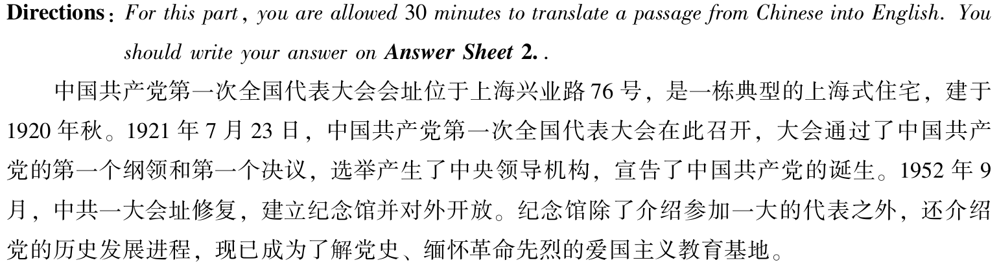

~~~
    _______________(照抄原文主题句).This issue has sparked widespread discussion in recent years. From my perspective,it is advisable for_______[younster/young people/humans]to________[主张/行动],provided that they intends to achieve personal growth and success in the long run.
    
    Living in an era of [information/rapid development and intense competition],young people need to___[主题相关形容词，如: independent / rational / resilient],which enables(主语是复数时，关系从句的动词应该是 “enable”) them to cope with challenges and seize opportunities effectively.A typical example is  [me / one of my friends / a famous figure].[I / He / She][简述具体经历，体现主题], which strongly proves the importance of [主题名词] in real life.
    
    Only when___[younster/young people/humans]truly realize the value of____,can they gain long-term benefits both mentally and practically.As a college student,I am convinced that it is of great necessity for students to_______.
~~~

~~~
	Recently with the development of science and techonlogy,the phenomenon that___has aroused wide concern.
~~~


>rather than 而不是
>
>a growing number of = an increasing number of = more and more 越来越多
>
>place importance on sth. = attach importance to sth. = give priority to sth. = put too much emphasis on = to place sufficient emphasis on 关注/重视某事
>
>because of = due to = as a result of 由于
>
>lead to = cause = bring out 引起、导致
>
>chasing 追求
>
>gradually逐渐
>
>as ... as 和...一样
>place as much importance on A as on B 重视A也重视B
>
>Living in an era of social media and visual culture 生活在社交媒体和视觉文化的时代
>Living in an era of intense academic and social pressure 生活在学业和社会压力巨大的时代
>Living in an era of diversity and open communication 生活在多元化和开放交流的时代
>Living in an era of information explosion 生活在信息爆炸的时代
>Living in an era of fast-paced life 生活在快节奏的时代
>Living in an era of rapid economic development 生活在经济快速发展的时代
>
>work and study 工作学习
>
>excedding = too much 过度
>
>ample = enough/adequate/sufficient
>
>obstacle 障碍
>
>realize 意识到
>
>Effective Ways 有效途径
>
>hamper = hinder/impair 阻碍
>
>bear in mind = keep in mind = remember = not forget 牢记
>
>negative influences/hazards/demerits
>消极影响/危害/缺点
>
>postive effects/advantages/merits
>积极影响/优势/优点
>
>as a matter of affact 事实上
>
>a vast majority of people 大部分人
>
>ordinary individuals 普通人
>
>significant importance 很重要的
>
>conquer/overcome 克服
>
>developing concrete skills 培养实用技能
>
>enhancing their personal capabilities 提高个人能力
>
>inner qualities and personal abilities 内在品质和个人能力
>
>be able to 能够做某事
>
>a valuable personal trait 宝贵的个人品质
>
>a sign of strong interpersonal competence 人际交往能力的标志
>
>foster/cultivate/develop 培养
>
>participate 参加
>
>master 掌握
>
>the ability to ...的能力
>
>so as to gain...从而获得
>
>avoid 避免
>
>unable to/inability to 不能
>
>pay attention to the improvement of one's own abilities 注重自身能力的提高

*For this part,you are allowed 30 minutes to write an essay than begins with the sentence "People are now increasingly aware of the danger of 'appearance anxiety' or being obsessed with one's looks." You can make comments,cite examples or use your personal experiences to develop your essay.You should write at least 150 words but not more than 200 words.*

~~~
	People are now increasingly aware of the danger of "appearance anxiety" or being obsessed with one's looks. From my perspective, it is advisable for young people to improve their individual abilities rather than focus excessively on physical appearance, provided that they intend to gain sufficient personal achievements.

	Living in an era of information explosion, social media often spreads the view that appearance is important. As a matter of fact, the vast majority of people are ordinary individuals. For us, appearance is not of significant importance. Young people need to place importance on developing concrete skills and enhancing their personal capabilities, which enables them to cope with challenges and seize opportunities effectively. A typical example is one of my friends: she used to feel anxious because she thought she was not pretty enough. Anxiety had a negative impact on both her academic performance and daily life. Finally, on the advice of another friend, she gradually realized that appearance is not the most important thing and shifted her attention from appearance to study.

	Only when young people truly realize that inner qualities and personal abilities are more important than physical appearance can they gain long-term benefits, both mentally and in life. As a college student, I am convinced that it is of great necessity for students to develop themselves rather than focus too much on their looks.
~~~

*For this part,you are allowed 30 minutes to write an essay than begins with the sentence "Today there is a growing awareness that mental well-being needs to be given as much attention as physical health" You can make comments,cite examples or use your personal experiences to develop your essay.You should write at least 150 words but not more than 200 words.*

~~~
	Today, there is a growing awareness that mental well-being deserves no less attention than physical health. From my perspective, it is advisable for young people to place equal importance on mental health, as doing so plays a crucial role in achieving personal growth and long-term success.

	Living in a fast-paced era, people face increasing pressure not only from physical demands but also from mental stress. In fact, mental burdens can sometimes be even harder to endure than physical ones. Therefore, it is essential for individuals to prioritize their mental well-being, which enables them to cope with challenges and seize opportunities more effectively. For example, one of my friends used to feel anxious because he feared he wouldn't be able to find a decent job. This anxiety had a negative impact on both his academic performance and daily life. Eventually, with encouragement from others, he managed to overcome his anxiety through regular exercise and open communication.

	Only when young people truly recognize the importance of mental health can they enjoy long-term benefits both mentally and practically. As a college student, I firmly believe that it is of great necessity for students to attach sufficient importance to their mental well-being in order to thrive in both academic and future professional life.
~~~

*For this part,you are allowed 30 minutes to write an essay than begins with the sentence "When faced with differing opinions,we should try to reach agreement through friendly discussion and reasonable argument" You can make comments,cite examples or use your personal experiences to develop your essay.You should write at least 150 words but not more than 200 words.*

~~~
	When faced with differing opinions, we should try to reach an agreement through friendly discussion and reasonable argument. From my perspective, friendly communication and reasonable argument are effective ways to resolve differences in teamwork tasks. It is important to learn to get along with others in a friendly way, provided that people intend to achieve personal growth and long-term success.

	Living in an era of rapid economic development, people often need to work with others to accomplish their goals. In fact, the ability to cooperate in a friendly and effective way is not only a valuable personal trait but also a sign of strong interpersonal competence. College students need to cultivate their teamwork skills and the ability to resolve differences, which enable them to cope with challenges in their future careers. For example, one of my friends often participated in club activities and worked with other members to complete tasks. This experience helped him perform well in his job.

	Only when young people truly realize the importance of cooperating with others in a friendly manner and developing the ability to resolve differences can they gain long-term benefits, both mentally and practically. As a college student, I am convinced that it is of great necessity for students to attach great importance to teamwork skills.
~~~

*For this part,you are allowed 30 minutes to write an essay than begins with the sentence "It is widely accepted that an important goal of education is to help students learn how to learn." You can make comments,cite examples or use your personal experiences to develop your essay.You should write at least 150 words but not more than 200 words.*

~~~
	It is widely accepted that an important goal of education is to help students learn how to learn. From my perspective, it is advisable for young people to place importance on mastering effective learning methods during their studies, provided that they intend to achieve personal growth and long-term success.

	Living in an era of rapid economic development, mastering how to learn is even more important than learning itself. Young people need to summarize effective learning strategies from their study and work experiences so as to gain the ability to acquire new knowledge quickly, which enables them to cope with challenges and seize opportunities effectively. A typical example is one of my friends. He places great emphasis on mastering efficient learning techniques and applying them in practice, which has helped him achieve outstanding academic performance.

	Only when young people truly realize that knowing how to learn is more important than learning itself can they gain long-term benefits in both work and life. As a college student, I am convinced that it is of great necessity for students to attach importance to learning how to learn.
~~~

## 六级翻译

### 修饰后置

#### 介词短语

> 简单的修饰和时间、地点用介词短语修饰。

**过中秋节的习俗于唐代早期在中国各地开始流行。**
**The custom of celebrating/spending Mid-Autumn festival became popular throughout China in the early Tang dynasty.**

**另一个则是乡村生活的种种乐趣，画有渔夫在湖上打渔，农夫在山上砍柴采药，或是书生坐在松树下吟诗作画。**
**The other is various recreations of rural life：fishermen fish on the lake;farmers cut firewood or collect herbs on the hills,or scholars compose poems or paint under pine trees.**

#### 定语从句

> 当修饰中包含动词时使用定语从句，定语从句包括限制性定语从句和非限制性定语从句。
>
> 限制性定语从句主要修饰的是人或物。

**对于那些<u>月薪较低却渴望在大城市拥有一套属于自己的体面、舒适的栖身之所</u>的人来说，高昂的房价是<u>他们无法承受</u>的负担。**

划横线的部分是句子中带动词的修饰成分，都需要采用定语从句。
**For those people <u>who earn less but eager to own a decent and comfortable place of their own in a big city</u>,the high housing price is a heavy burden that <u>they cannot afford</u>.**

> 非限制性定语从句修饰的是事。
>
> 非限制性定语从句的运用很广泛，最常用的是：当题目中出现“这，该，其”这样的字眼，指代前面说的那件事情，我们就要想到用非限制性定语从句。

**大学生之间的竞争也越来越激烈，<u>这导致任何一名大学生找到工作的机会都变小了</u>。**
划线部分就用非限制性定语从句
**The competition among graduates has become more and more fierce,which results in the fact that the chance that any individual graduate finds a job has decreased.**

**中国人自古以来就在中秋时节庆祝丰收，<u>这与北美地区庆祝感恩节的习俗十分相似</u>。**
**Since ancient times,the Chinese people usually celebrate harvest in the Mid-Autumn,which is similar to the custom of celebrating Thanksgiving in the North America.**

#### 同位语

> 插入语一般作为一种形式，是同位语的一种，同位语的作用是解释说明名词的。也就是说，我们一般可以用插入语的形式解释说明名词。

**旅游业是最近二十年来在世界各地迅速发展的一个行业，现在正引起中国公众越来越大的注意。**
**Tourism,a fast developing industry for the last two decades all over the world,now draws more and more attention of Chinese public.**

### 多动句

> 所谓多动句，就是一个句子中出现多个动词。汉语中不存在所谓谓语动词和非谓语动词，而英语中是有明显区分的，并且一个句子有且只有一个谓语动词。正常来说，有三种方式，分别是连词and；非谓语动词；以及其他连词。
>
> 绝大多数的多动句都是使用非谓语动词的方式来处理多动句。哪个动词离主语近，哪个就处理成谓语动词，其他动词全部处理成非谓语动词。把靠近主语最近的那个动词作为谓语动词，其他部分作为非谓语动词即可，要注意主动的处理成现在分词-ing，被动要处理成过去分词-ed，表示目的的，处理成动词不定式to do。

**政府已设定目标减少污染，提高能源效率，改善得到教育和医保的机会，并扩大社会保障。**
**The government has set goals to reduce pollution,enhance energy efficiency,improve opportunities to get education and medical insurance,and expand the social security.**

**鉴于这一状况，政府近来采取了一系列的措施来防止房价过快增长，包括提高利率及增加房产税等。**
**For this reason，the government has taken a series of measures to prevent the housing price from raising too fast,including raising interest rates and increasing taxes on real estate etc.**

### 无主句

> 在英语中，句子中必须要有主语，所以我们的处理方式一般是使用“变被动”

**至今已有约120个中文词加进了牛津英语词典，成了英语语言的一部分。**
**So far,about 120 Chinese words have been added to Oxford English Dictionary,becoming a part of the English language.**

**另有850亿元用于新建或升级城市垃圾处理和污水（sewage）处理设施，加上300亿元投资未来三年的植树造林（forestation）**
**Another 85 billion yuan will be used to build or upgrade the facilities for treatment of urban garbage and sewage and additional 30 billion yuan will be invested in forestation in the next three years.**

> 当主语不是人，且句子中出现“有，存在”等这样的字眼，我们就用there be句式

**宴席通常至少有一道汤，可以最先或最后上桌。**
**There usually is at least one soup in the feast,which can be served at the beginning or at last.**

**中国地方戏种类很多，其中京剧（Peking Opera）是一个具有代表性的剧种。**
**There are many kinds of local operas in China,one of which is Peking Opera,a representative one.**

### 时态

| 时间         | 一般时    | 进行时          | 完成时          | 完成进行时            |
| ------------ | --------- | --------------- | --------------- | --------------------- |
| **现在**     | do / does | am/is/are doing | have/has done   | have/has been doing   |
| **过去**     | did       | was/were doing  | had done        | had been doing        |
| **将来**     | will do   | will be doing   | will have done  | will have been doing  |
| **过去将来** | would do  | would be doing  | would have done | would have been doing |

一般常用的只有八种。

## 2021年12月（一）

### 作文


~~~
	Recently with the development of science and technology,the phenomenon that young people are unable to recognize false information on the Internet has aroused wide concern.From my perspective,it is advisable for young people to improve the ability to recognize false information, thus avoid being impacted by fake online information. 
	Living in an era of information,an increasing number of young people spend a lot of time on the Internet and browsing a varity of information.As a matter of fact,over 90 percent of information is unreliable on the Internet.Therefore,young people need to maintain critical thinking and make rational judgments when browsing the Internet,which prevents them from being misled by false content.On the other hand, it is necessary for young people to decrease the amount of time they spend on the Internet and place more importance on real life.
	Only when young people truly learning to keep independent thinking when browsing Internet, can they gain real effective of knowledge for them.To conclude,when surfing the Internet, we should be alert and bear in mind that the Inernet is just a virtual world.
~~~

### 翻译



~~~
	The site of the First National Congress of the Communist Party of China is located at 76 Xingye Road, Shanghai. It is a typical Shanghai-style residence, built in the autumn of 1920.In 1921.7.23.,the First National Congress of the Communist Party of China was hold in here.The meeting through the first program and first resolution of Communist Party of China,meanwhile elect center lead institution and declared Communist Party of China was birth.1952.9,the site of the First National Congress of the Communist Party of China was restored and built the museum open to outside.Museum not only introduce who partcipate the First National Congress of the Communist Party of China,but also introduce the history of Communist Party of China's development progress.Nowaday,the museum is become a basic education of know the history of Communist Party of China and remember the revolutionary martyrs.
~~~

~~~
	The site of the First National Congress of the Communist Party of China is located at No. 76 Xingye Road, Shanghai. It is a typical Shanghai-style residence, built in the autumn of 1920. On July 23, 1921, the First National Congress of the Communist Party of China was held here. At the meeting, the Party’s first program and resolution were adopted, the central leadership was elected, and the founding of the Party was declared. In September 1952, the site was restored and turned into a memorial museum open to the public. The museum not only introduces the delegates who attended the Congress, but also presents the Party’s historical development. Today, it has become a patriotic(爱国主义) education base for learning about the Party’s history and commemorating(纪念) revolutionary(革命) martyrs(烈士).
~~~

>be located at 位于...
>
>Communist Party of China 中国共产党
>
>Congress 国会、代表大会、议会
>
>National Congress of the Communist  Party of China 中国共产党全国代表大会
>
>adopt 采纳、接受、通过
>
>turn into 转变
>
>memorial museum 纪念馆
>
>delegates 代表

### 阅读

>regularly 规律地、定期地
>
>engage 聘用、聘请、参加
>
>candidate 候选人、求职者
>
>screening 筛选、检查
>
>tempting 诱人的、有诱惑力
>
>hiring 招聘
>
>incorporating 合并、纳入、结合
>
>inappropriately 不合适、不适当
>
>unethical 不道德的
>
>essentially 本质上
>
>scrutinizing 仔细检查、审查
>
>reveal 揭露
>
>ruin 毁灭、毁掉
>
>be lawfully considered 被合法考虑
>
>toxic 有毒的、有危害的
>
>stain 污染、玷污
>
>reputation 声誉
>
>delicate 精致的、微妙的、脆弱的、易碎的
>
>stipulate 规定
>
>supply 供应、补充、满足
>
>invasive 入侵
>
>moral 道德
>
>sensational 轰动的、夸张的
>
>complicate 复杂化
>
>detrimental 有害的、不利的
>
>magnified 放大、夸大
>
>legitimate 合法的
>
>navigate 导航、浏览
>
>comply 遵从、服从
>
>consulting 咨询
>
>accurate 准确的
>
>bolstering 支持、鼓励、增加
>
>transparency 透明度
>
>exactly 精确的、准确的
>
>articulating 清楚阐明
>
>emerging 新兴的
>
>misconceptions 误解
>
>opposite 相反
>
>eroding 侵蚀
>
>stigma 污名、耻辱
>
>supposition 推测

## 2021年12月（二）

### 作文


~~~
	Recently,the phenomenon that star chasing is prevalent among many teenagers has aroused wide concern.From my perspective,it is advisable for teenagers not to place importance on star chasing,provided that they intends to achieve personal growth and success in the long run.
	Living in an era of advanced social media,teenagers being able to see the various of stars. 
~~~

### 翻译


```
	Yanan is located at the north of Shanxi province,middle in yellow river,it is an area of chinese revolutionary.Zedong Mao and other revolutionist was living and fighting in here thirteen years.The War of Resistance Against Japanese Aggression and war of liberation was led by them，the spirit of Yanan was cultivated and made a great contribuation for chinese revolutionary.A site of Yanan is the largest quantity,the most wide distribute and the most hight grade.Yanan is patriotic(爱国主义) ,traditional of revolutionnary and the spirit of Yanan education base.Yanan has 9 revolutionnary of memoral museum,it store's many zhonggonggongyang and revolutionist goods in Yanan,thus has "chinese revoluationary museum city" title.
```

```
	Yan'an is located at the northern part of Shaanxi Province, situated in the middle reaches of the Yellow River. It is a sacred place of the Chinese revolution. Mao Zedong and other revolutionary leaders lived and fought here for thirteen years. They led the War of Resistance Against Japanese Aggression and the War of Liberation, cultivated the "Yan'an Spirit", and contributed greadtly to the Chinese revolution. The old revolutionary sites in Yan'an are the largest in number, most widely distributed and ranks the highest level in China. It is a national education base for patriotism, revolutionary traditions, and the Yan'an Spirit. Yan'an has nine revolutionary memorial halls, which collect a large number of important items left by the Central Committee of Commmunist Party of China and the old generation of revolutionists during the Yan'an period. Therefore, it enjoys the repution of "the City of Chinese Revolution Museums."
```

>the northern part of 北部
>
>situated in 地处...
>
>sacred place 圣地
>
>the War of Resistance Against Japanese Aggression  抗日战争
>
>the War of Liberation 解放战争
>
>the largest in number 数量最大
>
>enjoys the repution of 享有美誉
>
>Patriotism 爱国主义
>
>memorial halls 纪念馆

### 阅读

>rationality 理性
>
>enlightenment 启蒙运动
>
>endangered 濒临灭绝
>
>the advent of ...的出现
>
>discourse 话语，论述，交谈
>
>exposition 解释，阐述；展览会;探讨
>
>pleasure 快乐，满足
>
>uncoverlies 揭露
>
>overgenalizations 以偏概全
>
>abuse 滥用、虐待
>
>assertion 断言
>
>generalization 概括
>
>dominance 主导地位
>
>fundamentally 从根本上说
>
>religion 宗教
>
>sensationalism 耸人听闻
>
>proposition 观点，主张
>
>commercial 商业
>
>intellectual 知识分子
>
>colonized 殖民
>
>refocuse 重新聚集
>
>engage 从事，聘请，聘用
>
>celebrities 名人
>
>approval 赞同
>
>render 使成为
>
>proportion
>
>workforce
>
>dysfunction 功能失效
>
>employer 雇主
>
>employee 员工
>
>entitlement
>
>workplace 职场

## 2021年12月（一）

### 作文


### 翻译


~~~
	Jing'gang'shan is located at the junction of Hunan province and Jiangxi province.It is enjoys repution of "chinese's red revoluation crade" because it great revolution history.On October 1927,Zedong Mao, De Zhu and other revolutionary leaders led Chinese worker and farmer red army came to here.They started hardly fighting,created the first place of countryside revoluation,set the fire of chinese revolution and adopted the revolution road of "countryside besiege city,army gain power",which has chinese special.Chinese revoluation step to victory from here.Jing'Gang'Shan has 100 numbers sites of revolution,it became a "no wall's revolution historical museum ".It is a important education base for patriotism and revolution traditional education.
~~~

~~~
	Jinggangshan is located at the junction of Hunan and Jiangxi provinces. It is known as the "cradle of the Chinese revolution" because of its glorious revolutionary history.In October 1927, Mao Zedong, Zhu De, and other revolutionary leaders led the Chinese Workers' and Peasants' Red Army to this area, where they launched a hard and extraordinary struggle.They established the first rural revolutionary base, ignited the spark of the Chinese revolution, and pioneered a revolutionary path with Chinese characteristics—encircling the cities from the countryside and seizing power through armed struggle. From here, the Chinese revolution moved toward victory.With more than 100 revolutionary sites,Jinggang Mountain has now become a "revolutionary history museum without walls" as well as an important education base for patriotism and revolutionary traditions.
~~~

>is known as 被誉为
>
>cradle 摇篮
>
>peasant 农民
>
>extraordinary 非凡的

### 阅读

>
>
>

## 2022年6月

### 翻译


~~~
	The Nanjing Yangtze River Bridge is the first railway and highway bridge on Yangtze River designed by China and constructed with domestic materials.The upper four-lane highway bridge is 4,589 meters long, and the lower double-track railway bridge is 6,772 meters long.The railhway bridge connects the original two railways line, Tianjin - Pukou and Shanghai - Nanjing,it reducing the time for trains to cross the river from one and a half hours in the past to two minutes now.The bridge is an important hub for south and north transportation and also one of the scenic spots in Nanjing.
	The completion of the Nanjing Yangtze River Bridge marks a leap in China's bridge construction,greatly facilitating the exchange of materials and the movement of people between the two banks of the Yangtz River, and playing a significant role in promoting economic development and improving people's lives.
~~~

>domestic 国产的
>
>constructed with 由...制造
>
>material 材料
>
>hub 枢纽
>
>transportation 交通
>
>scenic spots 景点
>
>marks 标志着
>
>symbolizes 象征
>
>leap 飞跃
>
>facilitating 使方便

### 阅读

>detrimental 有害的
>
>implication 影响
>
>conducive to 有益于
>
>indispensable 不可或缺的
>
>composition 作品，成分构成
>
>depreciate 贬值，降低
>
>deplete 大量减少
>
>precious 珍贵的
>
>constraint 限制，束缚，拘束，局限
>
>consult 咨询
>
>discipline 纪律，训练，科目
>
>prevent 证实
>
>unintentional 无意识的，非故意的
>
>specialty 专业
>
>incorporate 包含，合并
>
>absurd 荒谬的，愚蠢的
>
>claimed 宣传的，生称
>
>baffling 令人困惑的，阻碍
>
>principles 原理，原则
>
>colleague 同僚，同事
>
>angles 角度
>
>craves 渴望
>
>imperative 极其重要的，必要的
>
>automatically 自然的，无意识的
>
>appropriate 合适的，相称的
>
>credential 资格，资格证书
>
>analogy 类比，类似
>
>track of 跟踪，记录
>
>intricate 错综复杂的
>
>duly 适当的
>
>rigorous 严密的，严格的
>
>eliminate 淘汰，剔除
>
>jargon 行话，术语


